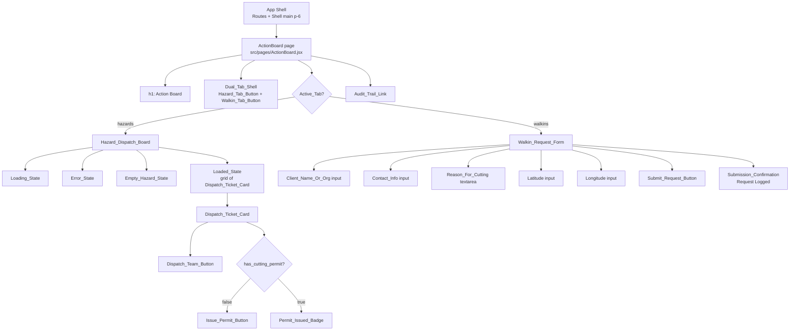
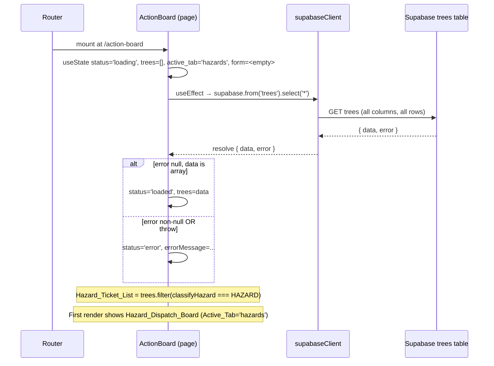
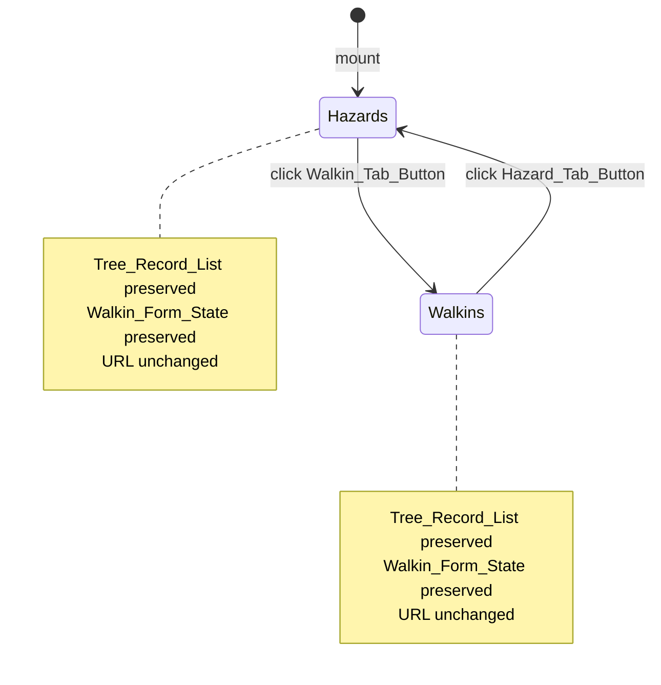
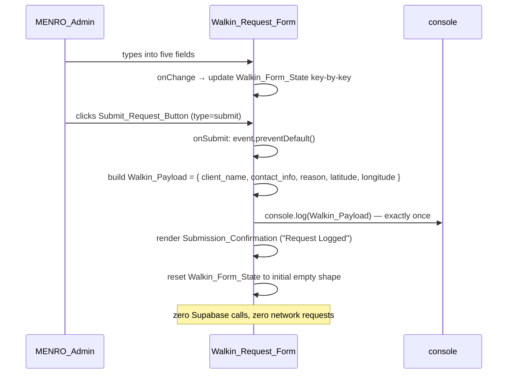

# Design Document

## Overview

Phase 5 replaces the placeholder `src/pages/ActionBoard.jsx` with a data-driven `Action_Board_Page` that mounts at the already-registered `/action-board` route inside the App_Shell. The page is organised as a **Dual_Tab_Shell** — two tab buttons driven by a single `useState` union (`'hazards' | 'walkins'`) — with a per-tab sub-view and a shared `Audit_Trail_Link` footer.

The design reuses the Phase 4 classifiers (`classifyHazard`, `classifyPermit`) as pure filters over the `trees` table, and mirrors the fetch-on-mount lifecycle already proven by `InventoryView.jsx` and `CommandCenter.jsx`. All four Phase 5 action handlers — `Dispatch_Team_Button`, `Issue_Permit_Button`, `Submit_Request_Button`, `Audit_Trail_Link` — are explicit `console.log` stubs that issue **zero** Supabase mutations and **zero** network requests.

Key design decisions:

1. **Local state only.** The `Active_Tab`, the `Tree_Record_List`, the fetch `status`, and the `Walkin_Form_State` all live in the `Action_Board_Page` via `useState`. No context, no router hooks, no URL params, no storage (Requirement 4.11–4.14, 13.12).
2. **No new dependencies.** The dual-tab shell is conditional rendering driven by a union value. The walk-in form is a native controlled `<form>` with `useState`. No tab library, form library, toast library, modal library, or date-picker library is introduced (Requirement 1).
3. **Reuse, don't reimplement.** `classifyHazard` and `HAZARD_STATUS` are imported from `src/lib/hazardStatus.js`; the Hazard_Flags OR is never inlined (Requirement 5.2). `classifyPermit` and `PERMIT_STATUS` are imported from `src/lib/permitStatus.js` where permit-status branding is needed (Requirement 1.2). `src/types.js`, `src/supabaseClient.js`, and `src/App.jsx` are left untouched (Requirement 13.11).
4. **Fetch contract parity.** The `Action_Board_Fetch` issues exactly one `supabase.from('trees').select('*')` on mount — same contract as the Inventory_Fetch — and never issues any mutation or query against any table other than `trees` (Requirement 3).
5. **Visual parity with Phase 4.** Dispatch_Ticket_Cards reuse the `bg-white rounded-lg shadow-sm border border-slate-200` card shell, the Permit_Issued_Badge reuses the amber palette from the Phase 4 Permit_Pill, and the page inherits the App_Shell's `p-6` padding rather than applying its own (Requirement 12).

## Architecture

### Component Tree



`Dual_Tab_Shell`, `Hazard_Dispatch_Board`, `Dispatch_Ticket_Card`, `Walkin_Request_Form`, and `Audit_Trail_Link` are **internal sub-components of `ActionBoard.jsx`**. They may be extracted into named functions inside the same file for readability, but they are not exported and do not live in `src/components/`. This keeps the Phase 5 diff scoped to a single page file plus its test file (Requirement 13.10, 13.11).

### Mount Lifecycle



### Tab Switching (No Refetch, No URL Change)



Per Requirement 4.10–4.14 and 13.12, tab switching mutates only the `activeTab` `useState` slot. It never re-issues the `Action_Board_Fetch`, never calls `navigate`, and never touches `useSearchParams`, `useLocation`, `window.history`, `sessionStorage`, or `localStorage`.

### Form Submit Cycle



## Components and Interfaces

All components described below live inside `src/pages/ActionBoard.jsx`. The file has exactly one default export — `ActionBoard` — which is the `Action_Board_Page` component. No new files are introduced in `src/components/` or `src/lib/`.

### `ActionBoard` (default export)

**Props:** none. The page is mounted directly by the router route entry registered in `src/App.jsx`.

**Local state (via `useState`):**

| State slot | Type | Initial value | Purpose |
| --- | --- | --- | --- |
| `status` | `'loading' \| 'error' \| 'loaded'` | `'loading'` | Discriminated union gating which render branch of the `Hazard_Dispatch_Board` is shown. Mirrors the Phase 4 `InventoryView` state machine. |
| `trees` | `TreeRecord[]` | `[]` | The `Tree_Record_List` — every row returned by the `Action_Board_Fetch`, stored unshaped per Requirement 3.4. |
| `errorMessage` | `string` | `''` | Human-readable message surfaced in the `Error_State`. |
| `activeTab` | `'hazards' \| 'walkins'` | `'hazards'` | The `Active_Tab` union driving the `Dual_Tab_Shell`. Single `useState` slot per Requirement 4.11. |
| `form` | `{ client_name, contact_info, reason, latitude, longitude }` (all strings) | all `''` | The `Walkin_Form_State`. Preserved across tab switches (Requirement 4.10). |
| `submissionConfirmed` | `boolean` | `false` | Gates rendering of the `Submission_Confirmation` ("Request Logged") text. |

**Effects:**

- On mount (single `useEffect` with `[]` dependency array), issue `supabase.from('trees').select('*')` exactly once, resolve into `{ status, trees, errorMessage }`. A `cancelled` sentinel prevents state updates after unmount, mirroring the pattern in `InventoryView.jsx` and `CommandCenter.jsx`.

**Render shape (top to bottom):**

1. `<h1>` with text `Action Board` (Requirement 2.5).
2. `Dual_Tab_Shell` — two `<button>` elements.
3. Exactly one of `Hazard_Dispatch_Board` or `Walkin_Request_Form`, gated by `activeTab`.
4. `Audit_Trail_Link` — a single activatable control at the bottom.

The page does not wrap itself in an outer `p-6` container; that padding is applied by the App_Shell's `<main>` element (Requirement 2.4, 12.2).

### `Dual_Tab_Shell` (internal)

Not a separate component in the file — a small JSX fragment at the top of `ActionBoard`'s return tree. Renders two buttons:

```jsx
<div role="tablist" className="...">
  <button type="button" onClick={() => setActiveTab('hazards')}
          className={activeTab === 'hazards' ? ACTIVE_TAB_CLASS : INACTIVE_TAB_CLASS}>
    🚨 Hazard Management & Permits
  </button>
  <button type="button" onClick={() => setActiveTab('walkins')}
          className={activeTab === 'walkins' ? ACTIVE_TAB_CLASS : INACTIVE_TAB_CLASS}>
    📋 Public Walk-in Requests
  </button>
</div>
```

The `ACTIVE_TAB_CLASS` and `INACTIVE_TAB_CLASS` Tailwind constants at the top of the file distinguish the selected tab via weight, border, and colour (Requirement 4.9). The tab labels are the exact required strings (Requirement 4.2, 4.3).

### `Hazard_Dispatch_Board` (internal)

Rendered only when `activeTab === 'hazards'`. Has four render branches switched on `status` and `hazardTickets.length`:

- `status === 'loading'` → loading banner (Requirement 3.5).
- `status === 'error'` → `role="alert"` error banner rendering `errorMessage` (Requirement 3.6).
- `status === 'loaded'` and `hazardTickets.length === 0` → `Empty_Hazard_State` banner (Requirement 5.7).
- `status === 'loaded'` and `hazardTickets.length > 0` → responsive grid of `Dispatch_Ticket_Card` (Requirement 5.4, 5.6).

`hazardTickets` is derived inline from `trees` via:

```js
const hazardTickets = trees.filter((t) => classifyHazard(t) === HAZARD_STATUS.HAZARD);
```

The filter is applied client-side against the already-fetched `Tree_Record_List`; the Supabase query itself continues to select every row (Requirement 5.3). `filter` preserves relative order, satisfying the Hazard_Ticket_List ordering requirement from the glossary. Each card is keyed by `tree.id` (Requirement 5.5).

The grid uses Tailwind utilities such as `grid grid-cols-1 md:grid-cols-2 xl:grid-cols-3 gap-4` for responsive layout (Requirement 5.6, 12.1).

### `Dispatch_Ticket_Card` (internal)

Rendered once per `Tree_Record` in the `Hazard_Ticket_List`. Each card:

- Uses the `bg-white rounded-lg shadow-sm border border-slate-200` shell (Requirement 6.10, 12.3).
- Displays the `tree_id` as the prominent card identifier (larger/heavier text), showing `—` when `tree_id` is `null` (Requirement 6.1, 12.5).
- Displays `species`, `dbh`, `assigned_to` as labelled attributes, with `assigned_to` falling back to `—` when `null` (Requirement 6.2–6.4).
- Does **not** render `latitude`, `longitude`, `scientific_name`, `species_type`, individual Hazard_Flags, `dateCaptured`, `task_status`, or `photo_url` (Requirement 6.5).
- Always renders a `Dispatch_Team_Button` with visible text exactly `Dispatch Team` (Requirement 6.6).
- When `tree.has_cutting_permit === false` → renders `Issue_Permit_Button` with text `Issue Permit` and no `Permit_Issued_Badge` (Requirement 6.7).
- When `tree.has_cutting_permit === true` → renders `Permit_Issued_Badge` with text `Permit Issued` in the amber palette and no `Issue_Permit_Button` (Requirement 6.8, 6.9, 12.4).

The `has_cutting_permit` branching is expressed as a ternary in JSX:

```jsx
{tree.has_cutting_permit
  ? <span className={PERMIT_ISSUED_BADGE_CLASS}>Permit Issued</span>
  : <button type="button" onClick={() => handleIssuePermit(tree)}
            className={ISSUE_PERMIT_BUTTON_CLASS}>
      Issue Permit
    </button>}
```

`PERMIT_ISSUED_BADGE_CLASS` reuses the amber/yellow tokens from the Phase 4 Permit_Pill — e.g. `inline-flex items-center rounded-full bg-amber-50 px-2.5 py-0.5 text-xs font-medium text-amber-700` — so the Action_Board and the Central_Inventory agree on permit-status colour (Requirement 12.4).

### Handler Stubs

All four handlers live as small named functions inside `ActionBoard`, each prefixed with an explicit source-level comment identifying it as a Phase 5 stub that a later phase must replace with real Supabase calls (Requirements 7.5, 9.7, 10.6).

```js
// PHASE 5 STUB: Dispatch_Team_Button handler — a later phase must replace
// this console.log with a real Supabase update on the `trees` table.
function handleDispatchTeam(tree) {
  console.log('Dispatch Team', tree.tree_id);
}

// PHASE 5 STUB: Issue_Permit_Button handler — a later phase must replace
// this console.log with a real Supabase update on the `trees` table.
function handleIssuePermit(tree) {
  console.log('Issue Permit', tree.tree_id);
}

// PHASE 5 STUB: Submit_Request_Button handler — a later phase must replace
// this console.log with a real Supabase insert into a walk-in requests table.
function handleSubmitWalkin(event) {
  event.preventDefault();
  const payload = {
    client_name: form.client_name,
    contact_info: form.contact_info,
    reason: form.reason,
    latitude: form.latitude,
    longitude: form.longitude,
  };
  console.log(payload);
  setSubmissionConfirmed(true);
  setForm(INITIAL_FORM_STATE);
}

// PHASE 5 STUB: Audit_Trail_Link handler — a later phase must replace this
// console.log with the real ghost-log viewer filtered to
// `task_status = 'Cancelled'` Tree_Record rows.
function handleAuditTrail() {
  console.log('View Ghost Log / Cancelled Tasks (Audit Trail)');
}
```

None of these handlers invoke `supabase.from`, `fetch`, `navigate`, `history.pushState`, or `history.replaceState` (Requirements 7.3, 7.4, 9.6, 10.5, 13.1–13.3).

### `Walkin_Request_Form` (internal)

Rendered only when `activeTab === 'walkins'`. The form is a single `<form onSubmit={handleSubmitWalkin}>` containing, in order:

| Field | Control | `Walkin_Form_State` key | Requirement |
| --- | --- | --- | --- |
| Client_Name_Or_Org | `<input type="text">` | `client_name` | 8.3 |
| Contact_Info | `<input type="text">` | `contact_info` | 8.4 |
| Reason_For_Cutting | `<textarea>` | `reason` | 8.5 |
| Latitude | `<input type="text">` | `latitude` | 8.6 |
| Longitude | `<input type="text">` | `longitude` | 8.7 |

Every field has a visible `<label>` associated via `htmlFor`/`id`. Every field is controlled — `value={form[key]}` and `onChange={(e) => setForm(prev => ({ ...prev, [key]: e.target.value }))}` — so all five mount as controlled inputs with defined values (Requirement 8.8, 8.9). The `Submit_Request_Button` is `<button type="submit">Submit Official Request</button>` (Requirement 8.10).

After a submit, `submissionConfirmed === true` drives rendering of an inline `Submission_Confirmation` element with exact text `Request Logged` next to (not replacing) the form (Requirement 9.4, 9.8).

The `submissionConfirmed` flag is reset to `false` when the user next types into any field, so a second submission reruns the confirmation cleanly. The form fields, the submit button, and the confirmation message all remain rendered while `submissionConfirmed` is `true` (Requirement 9.8).

### `Audit_Trail_Link` (internal)

A single `<button type="button" onClick={handleAuditTrail}>` rendered below the Active_Tab sub-view (i.e. it follows the conditional `Hazard_Dispatch_Board` / `Walkin_Request_Form` block, so it's visible in both tabs — Requirement 2.6, 10.1). The visible text is exactly `View Ghost Log / Cancelled Tasks (Audit Trail)` (Requirement 10.2). Its Tailwind styling is visually distinct from the four in-content buttons — for example, a subdued underlined link-style button using `text-slate-500 hover:text-slate-700 underline` — to mark it as a secondary entry point (Requirement 10.3).

## Data Models

Phase 5 introduces **no new data models**. Every data structure touched by the Action_Board is already defined elsewhere in the codebase.

### `TreeRecord` (unchanged from `src/types.js`)

`ActionBoard` reads every row returned by `Action_Board_Fetch` as a `TreeRecord` and stores the rows unshaped (Requirement 3.4). The fields `ActionBoard` actually reads are:

| Field | Type | Used by |
| --- | --- | --- |
| `id` | `string` (UUID) | React key on `Dispatch_Ticket_Card` (Requirement 5.5) |
| `tree_id` | `string \| null` | Prominent card identifier + `handleDispatchTeam` / `handleIssuePermit` log argument (Requirement 6.1, 7.1, 7.2) |
| `species` | `string` | Labelled card attribute (Requirement 6.2) |
| `dbh` | `string` | Labelled card attribute (Requirement 6.3) |
| `assigned_to` | `string \| null` | Labelled card attribute with `—` fallback (Requirement 6.4) |
| `has_cutting_permit` | `boolean` | Drives `Issue_Permit_Button` vs `Permit_Issued_Badge` (Requirement 6.7, 6.8) |
| `is_leaning`, `has_powerline_conflict`, `is_decayed`, `is_root_problem` | `boolean` | Read **only** by `classifyHazard` — never inlined in `ActionBoard` (Requirement 5.2) |

`ActionBoard` does not mutate `TreeRecord`, does not rename fields, does not drop fields, and does not re-shape rows before storing them (Requirement 3.4). `src/types.js` is not modified (Requirement 13.11).

### `Walkin_Payload`

The one new in-memory shape introduced by Phase 5. It is a plain JS object — **not** a typedef exported from `src/types.js`, since its only consumer in Phase 5 is a `console.log` call (Requirement 13.11 forbids modifying `src/types.js`).

```js
/** @typedef {Object} WalkinPayload
 *  @property {string} client_name
 *  @property {string} contact_info
 *  @property {string} reason
 *  @property {string} latitude
 *  @property {string} longitude
 */
```

All five values are strings — the `Latitude` and `Longitude` inputs are plain `<input type="text">` controls whose raw string values pass through unparsed (Requirement 8.6, 8.7). No numeric coercion, no validation, no trimming is applied (Requirement 13.5).

### `Walkin_Form_State`

The backing React state for the controlled form. Identical shape to `Walkin_Payload`, always initialised and reset to:

```js
const INITIAL_FORM_STATE = Object.freeze({
  client_name: '',
  contact_info: '',
  reason: '',
  latitude: '',
  longitude: '',
});
```

Keys are fixed at mount and never added or removed — only values change (Requirement 8.8).

### `Active_Tab`

A discriminated union of exactly two string literals:

```js
/** @typedef {'hazards' | 'walkins'} ActiveTab */
```

Stored in a single `useState` slot initialised to `'hazards'` (Requirement 4.4, 4.11). Not persisted anywhere outside React state.

### `status` (fetch state machine)

A discriminated union mirroring Phase 4 `InventoryView`:

```js
/** @typedef {'loading' | 'error' | 'loaded'} ActionBoardStatus */
```

The `Empty_Hazard_State` is derived from `status === 'loaded' && hazardTickets.length === 0` rather than a fourth status value, keeping the union tight and matching the Phase 4 precedent (Requirement 5.7).


## Correctness Properties

*A property is a characteristic or behavior that should hold true across all valid executions of a system — essentially, a formal statement about what the system should do. Properties serve as the bridge between human-readable specifications and machine-verifiable correctness guarantees.*

The following properties capture the universal invariants of the `Action_Board` that vary meaningfully with input. Acceptance criteria that reduce to fixed UI strings, router wiring, Tailwind class tokens, or structural/architectural constraints are covered by example-based tests in the Testing Strategy section rather than by property-based tests, per the classification in the prework analysis.

### Property 1: Hazard filter correctness and empty-state consistency

*For any* `TreeRecord[]` returned by the mocked `Action_Board_Fetch`, the number of `Dispatch_Ticket_Card` elements rendered by the `Hazard_Dispatch_Board` is exactly equal to the number of rows in the list for which `classifyHazard(row) === HAZARD_STATUS.HAZARD`, and the set of `tree_id` values projected onto those cards is exactly equal to the set of `tree_id` values of those filtered rows. When that count is zero, the `Empty_Hazard_State` banner is rendered and no card is rendered.

**Validates: Requirements 3.3, 3.4, 5.1, 5.4, 5.7**

### Property 2: Dispatch_Ticket_Card preserves Tree_Record field values

*For any* `Hazard_Tree_Record` rendered as a `Dispatch_Ticket_Card`, the card's DOM contains the exact source-row value for each of `tree_id`, `species`, `dbh`, and `assigned_to`, where `null` values of `tree_id` and `assigned_to` are rendered as the literal dash character `—`.

**Validates: Requirements 6.1, 6.2, 6.3, 6.4**

### Property 3: Dispatch_Ticket_Card hides out-of-scope Tree_Record fields

*For any* `Hazard_Tree_Record` with distinctive, non-colliding values in the out-of-scope fields, the rendered `Dispatch_Ticket_Card` DOM does not contain any of the source-row values for `latitude`, `longitude`, `scientific_name`, `species_type`, the four individual `Hazard_Flags` booleans, `dateCaptured`, `task_status`, or `photo_url`.

**Validates: Requirements 6.5**

### Property 4: Dispatch_Ticket_Card permit branching

*For any* `Hazard_Tree_Record`, the rendered `Dispatch_Ticket_Card` contains a `Dispatch_Team_Button` with visible text `Dispatch Team`, and contains exactly one of the following two elements matched to `has_cutting_permit`: when `has_cutting_permit === true` the card contains a `Permit_Issued_Badge` with visible text `Permit Issued` and does not contain an `Issue_Permit_Button`; when `has_cutting_permit === false` the card contains an `Issue_Permit_Button` with visible text `Issue Permit` and does not contain a `Permit_Issued_Badge`.

**Validates: Requirements 6.6, 6.7, 6.8**

### Property 5: Dispatch_Team_Button logs tuple with tree_id

*For any* `Hazard_Tree_Record`, activating the `Dispatch_Team_Button` on that record's `Dispatch_Ticket_Card` results in exactly one `console.log` invocation, whose two arguments are the string `'Dispatch Team'` and the record's `tree_id` field (including when that field is `null`).

**Validates: Requirements 7.1**

### Property 6: Issue_Permit_Button logs tuple with tree_id

*For any* `Hazard_Tree_Record` whose `has_cutting_permit` field is `false`, activating the `Issue_Permit_Button` on that record's `Dispatch_Ticket_Card` results in exactly one `console.log` invocation, whose two arguments are the string `'Issue Permit'` and the record's `tree_id` field (including when that field is `null`).

**Validates: Requirements 7.2**

### Property 7: No Supabase mutations and no cross-table queries

*For any* sequence of `MENRO_Admin` activations against the `Action_Board_Page`'s buttons — including any mix of `Dispatch_Team_Button`, `Issue_Permit_Button`, `Submit_Request_Button`, `Audit_Trail_Link`, and tab-switch activations — no call is ever made to `supabase.from(...).insert`, `.update`, `.upsert`, or `.delete`, and every call to `supabase.from(...)` is invoked with the string `'trees'` and no other table name.

**Validates: Requirements 3.7, 3.8, 7.3, 7.4, 9.6, 13.1, 13.2, 13.3**

### Property 8: Tab-switching state and URL invariants

*For any* finite sequence of `Hazard_Tab_Button` and `Walkin_Tab_Button` activations starting from the initial mount, after the final activation: (a) the rendered sub-view matches the last-activated tab — the `Hazard_Dispatch_Board` is rendered and the `Walkin_Request_Form` is not when the last tab was Hazard, and vice versa; (b) the total number of calls to `supabase.from('trees').select('*')` is exactly one, regardless of the number of tab switches; (c) `window.location.pathname`, `window.location.search`, and `window.location.hash` are bit-equal to their values immediately after mount; and (d) any value typed into a `Walkin_Form_Field` during a prior `walkins` visit is still displayed in that field when the `walkins` tab is active again within the same mount.

**Validates: Requirements 4.5, 4.6, 4.7, 4.8, 4.10, 4.13**

### Property 9: Unique Tree_Record `id` values produce no React key-collision warnings

*For any* `TreeRecord[]` whose `id` values are pairwise distinct, rendering the `Hazard_Dispatch_Board` after the `Action_Board_Fetch` resolves with that list produces zero `console.error` invocations whose first argument contains the substring `"key"` (case-insensitive).

**Validates: Requirements 5.5**

### Property 10: Walk-in submit-and-clear cycle preserves payload and resets form

*For any* `Walkin_Payload` of five strings `{ client_name, contact_info, reason, latitude, longitude }`, switching to the `walkins` tab, typing each string into its corresponding `Walkin_Form_Field`, and activating the `Submit_Request_Button` results in: (a) exactly one `console.log` invocation whose single argument is an object deeply equal to the typed `Walkin_Payload`; (b) a rendered `Submission_Confirmation` element with visible text exactly equal to `Request Logged`; (c) every one of the five `Walkin_Form_Fields` rendering with its displayed value equal to the empty string; (d) the five `Walkin_Form_Fields` and the `Submit_Request_Button` still present in the DOM; and (e) the URL (`window.location.pathname`, `.search`, `.hash`) unchanged from its value before the submit.

**Validates: Requirements 8.9, 9.1, 9.2, 9.3, 9.4, 9.5, 9.8**

## Error Handling

Phase 5 has exactly one observable error path — the `Action_Board_Fetch` failing. The page introduces no new error conditions of its own because every user-facing action is a `console.log` stub with no failure mode, no network request, and no validation step.

### Fetch Error (`Action_Board_Fetch` returns `{ error: … }` or throws)

Per Requirement 3.6, the `Hazard_Dispatch_Board` must transition to an `Error_State` that:

- Renders a visible error banner using a `role="alert"` element.
- Surfaces the Supabase error's `message` field (or a sensible default when no message is provided).
- Renders zero `Dispatch_Ticket_Card` elements.

The implementation treats both resolution paths as errors — a resolved `{ data: null, error: { message } }` shape *and* a rejected promise thrown out of `supabase.from('trees').select('*')`. A `try/catch` inside the `useEffect` plus an `if (error) …` branch on the resolved value covers both, mirroring the Phase 4 `InventoryView.jsx` pattern:

```js
try {
  const { data, error } = await supabase.from('trees').select('*');
  if (cancelled) return;
  if (error) {
    setErrorMessage(error.message ?? 'Unknown Supabase error');
    setStatus('error');
    return;
  }
  setTrees(Array.isArray(data) ? data : []);
  setStatus('loaded');
} catch (e) {
  if (cancelled) return;
  setErrorMessage(e?.message ?? 'Unexpected error loading the Action Board.');
  setStatus('error');
}
```

The `cancelled` sentinel handles the race where the component unmounts mid-fetch — the `useEffect` cleanup flips `cancelled = true` so a late-arriving resolution does not call `setState` on an unmounted component (this prevents the familiar React warning).

### Non-array resolved `data`

If Supabase ever resolves with `data` that is not an array (e.g. `null`), the page falls back to an empty `trees` list rather than throwing. This matches the Phase 4 `InventoryView` behaviour and keeps the page in a benign `Empty_Hazard_State` instead of crashing.

### Stubbed handler "errors"

All four action stubs (`handleDispatchTeam`, `handleIssuePermit`, `handleSubmitWalkin`, `handleAuditTrail`) have no failure mode in Phase 5: they only invoke `console.log`. They do not throw, do not `await` anything, and do not schedule any asynchronous work. Error handling for their real Supabase replacements is explicitly deferred to later phases (Requirement 13.1–13.3, handler-comment requirements 7.5, 9.7, 10.6).

### Form validation

Per Requirement 13.5, the `Walkin_Request_Form` performs no client-side validation beyond the browser's native HTML form handling — and in Phase 5 no `required`, `pattern`, or `type="number"` attributes are applied to the `Latitude` / `Longitude` / `Contact_Info` inputs. Empty or malformed `Walkin_Form_Field` values still flow into the `Walkin_Payload` as empty strings and are still logged by the submit stub. The form is therefore tolerant of any input shape, which also makes the submit-and-clear property (Property 10) well-defined over arbitrary string inputs.

## Testing Strategy

Phase 5 uses a **dual testing approach** consistent with Phase 4:

- **Example-based unit tests** cover fixed UI elements, route wiring, handler log formats, Tailwind class tokens, and deterministic state-branch rendering (Loading_State, Error_State).
- **Property-based tests** cover the ten correctness properties above, each configured to run a minimum of 100 iterations, each tagged with a comment referencing its design-document property.

### Test framework and conventions

The existing stack is reused with **no new dependencies** (Requirement 1.1, 11.13):

- Runner: `vitest --run` (already in `package.json`).
- DOM: `@testing-library/react` (`render`, `screen`, `fireEvent`, `cleanup`, `waitFor`). The codebase does not include `@testing-library/user-event`, so `fireEvent` is used throughout (Requirement 11.12).
- PBT library: `fast-check` (already in `devDependencies`).
- Matchers: `@testing-library/jest-dom`.
- Supabase mock: the `vi.hoisted` + `vi.mock('../supabaseClient.js', …)` pattern established by `src/pages/CommandCenter.test.jsx` and `src/pages/Inventory.test.jsx` (Requirement 11.3).

### New test file

`src/pages/ActionBoard.test.jsx` is the sole new test file introduced by Phase 5. It contains both the example-based tests and the property-based tests for the Action_Board.

### Supabase mocking

The hoisted spy pattern:

```js
const {
  selectSpy, insertSpy, updateSpy, upsertSpy, deleteSpy, fromSpy,
} = vi.hoisted(() => {
  const selectSpy = vi.fn();
  const insertSpy = vi.fn();
  const updateSpy = vi.fn();
  const upsertSpy = vi.fn();
  const deleteSpy = vi.fn();
  const fromSpy = vi.fn(() => ({
    select: selectSpy, insert: insertSpy, update: updateSpy,
    upsert: upsertSpy, delete: deleteSpy,
  }));
  return { selectSpy, insertSpy, updateSpy, upsertSpy, deleteSpy, fromSpy };
});

vi.mock('../supabaseClient.js', () => ({
  supabase: { from: fromSpy },
}));
```

The `insertSpy` / `updateSpy` / `upsertSpy` / `deleteSpy` handles power Property 7 — asserting that no mutation spy is ever called across any sequence of user actions.

### Minimum test fixture (Requirement 11.3–11.6)

A shared fixture exposes exactly one `Hazard_Tree_Record` and one `Safe_Tree_Record`:

```js
const HAZARD_TREE = { /* id, tree_id, is_leaning: true, has_cutting_permit: false, … */ };
const SAFE_TREE   = { /* id, tree_id, all hazard flags false, has_cutting_permit: true, … */ };
```

The example-based Hazard_Dispatch_Board tests resolve `selectSpy` with `[HAZARD_TREE, SAFE_TREE]` and assert exactly one card is rendered (the hazard one), confirming the `Safe_Tree_Record` is filtered out client-side.

### console.log spy lifecycle (Requirement 11.7)

A `beforeEach` spies on `console.log` via `vi.spyOn(console, 'log').mockImplementation(() => {})`; a matching `afterEach` calls `mockRestore()`. This mirrors the Inventory `beforeEach`/`afterEach` in `Inventory.test.jsx` and ensures log assertions never leak between tests.

### Arbitraries for property tests

The existing `src/test/arbitraries.js` already exports `treeRecordArb` and `treeRecordWithAnyCoordsArb`. The Action_Board property tests reuse `treeRecordArb` directly. Two lightweight local arbitraries are defined inside `src/pages/ActionBoard.test.jsx` for the new properties:

- `hazardTreeArb` — a `treeRecordArb` projection where at least one of the four `Hazard_Flags` is forced to `true`, used by Properties 2, 3, 4, 5, 6.
- `tabClickSequenceArb` — `fc.array(fc.constantFrom('hazards', 'walkins'), { maxLength: 20 })`, used by Properties 7 and 8.
- `walkinPayloadArb` — `fc.record({ client_name: fc.string(), contact_info: fc.string(), reason: fc.string(), latitude: fc.string(), longitude: fc.string() })`, used by Property 10.

No new module exports are added to `src/test/arbitraries.js`; the Action_Board-specific arbitraries live in the test file itself so the Phase 4 `arbitraries.js` diff stays empty (Requirement 13.11-adjacent — the test arbitraries module was not declared off-limits, but keeping the diff tight simplifies review).

### Property test conventions

- **Minimum iterations.** Each `fc.assert(fc.asyncProperty(…), { numRuns: 100 })` runs 100 samples by default. For heavier properties that re-render the whole page on every sample, `numRuns` may drop to 25 (matching the `cap of 25` used in `CommandCenter.test.jsx`'s heavy property tests); the default is 100.
- **Cleanup.** Each property test calls `cleanup()` inside a `finally` block after each rendered sample to reset the DOM between runs (matching `CommandCenter.test.jsx`).
- **Spy resets.** Each sample calls `selectSpy.mockReset()` before enqueuing its resolution, so spy-call counts are local to the sample.
- **Tags.** Each property test is preceded by a comment of the form:

  ```js
  // Feature: action-board, Property <N>: <property text>
  ```

  matching Requirement 11 + the Property Test Configuration convention.

### Example test inventory (non-PBT)

These example-based tests round out the coverage the properties don't express, mapping one-to-one with Requirement 11's enumerated assertions:

1. **Route + heading** — Render `<App>` at `MemoryRouter(/action-board)` and assert `screen.getByRole('heading', { level: 1, name: 'Action Board' })` (Requirements 2.3, 2.5).
2. **App_Shell padding inheritance** — Assert `<main>` at `/action-board` has `p-6` and the page's outer element does not apply `p-6` twice (Requirement 2.4, 12.2).
3. **Fetch contract** — After mount resolves with `{ data: [], error: null }`, assert `fromSpy` called once with `'trees'` and `selectSpy` called with `'*'` (Requirement 3.2).
4. **Loading indicator** — Leave `selectSpy` pending (`new Promise(() => {})`), assert the loading indicator renders and zero cards render (Requirement 3.5).
5. **Error banner** — Resolve with `{ data: null, error: { message: 'network down' } }`, assert the `role="alert"` banner renders and zero cards render (Requirement 3.6).
6. **Tab labels and order** — Assert the two tab buttons exist with the exact emoji-prefixed labels, in order Hazard-then-Walkin (Requirements 4.1, 4.2, 4.3).
7. **Initial tab** — On first mount, assert `Hazard_Dispatch_Board` is rendered and `Walkin_Request_Form` is not (Requirement 4.4).
8. **Active-tab visual distinction** — Assert the active tab carries a className distinct from the inactive tab (Requirement 4.9).
9. **Mocked fetch — filter demonstration** — With `[HAZARD_TREE, SAFE_TREE]` resolved, assert exactly one card and that it reflects `HAZARD_TREE` (Requirement 11.4).
10. **Tab switching (example-based)** — After clicking `Walkin_Tab_Button` then `Hazard_Tab_Button`, assert the Hazard_Dispatch_Board is rendered and the Walkin_Request_Form is not; and vice versa (Requirement 11.5). Complements the property-based Tab Invariants (Property 8).
11. **Permit branding fixture** — Assert the `HAZARD_TREE` card (has_cutting_permit=false) shows the `Issue Permit` button and no badge; render another fixture where that record has has_cutting_permit=true and assert the amber `Permit Issued` badge renders and the button does not (Requirement 11.6).
12. **Dispatch_Team_Button fixture log** — Click the button on the rendered `HAZARD_TREE` card; assert `console.log` called once with `'Dispatch Team'` and the fixture's `tree_id` (Requirement 11.8). Complements Property 5 (which covers arbitrary tree_ids).
13. **Issue_Permit_Button fixture log** — Click the `Issue Permit` button on a fixture with `has_cutting_permit === false`; assert `console.log` called once with `'Issue Permit'` and the fixture's `tree_id` (Requirement 11.9). Complements Property 6.
14. **Walk-in form fixture submit cycle** — Switch to `walkins`, fill each field with a fixed string, click submit; assert `console.log` called once with the deep-equal payload, the `Request Logged` text appears, and every field's value is the empty string (Requirement 11.10). Complements Property 10.
15. **Audit_Trail_Link** — Assert button exists with the exact label; click it and assert `console.log` called once with a single string argument identifying the audit-trail intent (Requirements 10.2, 10.4, 11.11).
16. **Empty hazard state** — Resolve the fetch with a list of only `Safe_Tree_Record` rows; assert zero cards and the empty-state banner (Requirement 5.7, complements Property 1).
17. **Tailwind card shell and badge palette** — Assert the card outer `className` contains `bg-white`, `rounded-lg`, `shadow-sm`, and `border-slate-200`; assert the `Permit_Issued_Badge` span `className` matches `/bg-amber-/` or `/bg-yellow-/` (Requirements 6.10, 12.3, 6.9, 12.4).

### Property test inventory

Each property maps to a single `it(...)` block using `fc.asyncProperty`, resetting `selectSpy` and calling `cleanup()` between runs. The tag comment above each test references the design property number.

| # | Property | Tag line | Min iterations |
| --- | --- | --- | --- |
| 1 | Hazard filter correctness + empty-state | `Feature: action-board, Property 1: Hazard filter correctness and empty-state consistency` | 100 |
| 2 | Card preserves Tree_Record fields | `Feature: action-board, Property 2: Dispatch_Ticket_Card preserves Tree_Record field values` | 100 |
| 3 | Card hides out-of-scope fields | `Feature: action-board, Property 3: Dispatch_Ticket_Card hides out-of-scope Tree_Record fields` | 100 |
| 4 | Permit branching | `Feature: action-board, Property 4: Dispatch_Ticket_Card permit branching` | 100 |
| 5 | Dispatch_Team_Button log | `Feature: action-board, Property 5: Dispatch_Team_Button logs tuple with tree_id` | 100 |
| 6 | Issue_Permit_Button log | `Feature: action-board, Property 6: Issue_Permit_Button logs tuple with tree_id` | 100 |
| 7 | No Supabase mutations | `Feature: action-board, Property 7: No Supabase mutations and no cross-table queries` | 100 |
| 8 | Tab invariants | `Feature: action-board, Property 8: Tab-switching state and URL invariants` | 25 (heavy re-render) |
| 9 | React key stability | `Feature: action-board, Property 9: Unique Tree_Record id values produce no React key-collision warnings` | 25 (heavy re-render) |
| 10 | Walkin submit-and-clear | `Feature: action-board, Property 10: Walk-in submit-and-clear cycle preserves payload and resets form` | 100 |

### Phase 4 baseline preservation (Requirement 11.1)

After Phase 5 is complete, `npm test` must pass every test in the Phase 1-through-4 baseline (140 tests across 17 files). The Phase 5 diff is scoped to:

- `src/pages/ActionBoard.jsx` (content replacement, not file creation).
- `src/pages/ActionBoard.test.jsx` (new file).
- No other source file is modified (Requirement 13.10, 13.11).
- No `package.json` / `package-lock.json` changes (Requirement 1.1, 11.13).

A CI or local verification loop should run:

```bash
npm test
```

and confirm the total test count increases strictly by the number of new tests added in `src/pages/ActionBoard.test.jsx` (with every previously passing test still passing).
