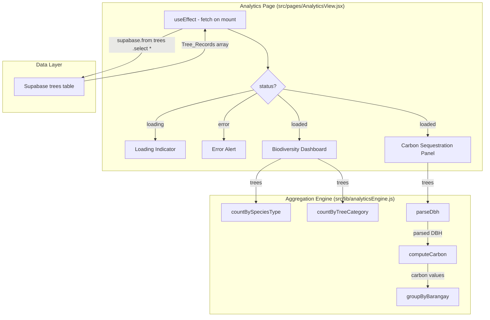

# Design Document: Analytics & Reports Engine

## Overview

The Analytics & Reports Engine replaces the placeholder `AnalyticsView.jsx` with a data-driven analytics page at the `/analytics` route. It fetches all tree records from Supabase on mount, pipes them through a set of pure aggregation functions in `src/lib/analyticsEngine.js`, and renders the results as two stacked panels: a Biodiversity Dashboard (progress bars) and a Carbon Sequestration & Stand Table (multi-level grouped table).

The design follows established project patterns:
- **State machine**: `idle → loading → loaded | error` (same as InventoryView)
- **Pure functions in `src/lib/`**: All aggregation logic is side-effect-free and independently testable (same as `hazardStatus.js`, `permitStatus.js`)
- **No new dependencies**: All visualizations use Tailwind CSS utility classes and inline `width` styles
- **Supabase fetch pattern**: Single `supabase.from('trees').select('*')` on mount with cancellation guard

### Key Design Decisions

| Decision | Rationale |
|----------|-----------|
| Single `analyticsEngine.js` module for all pure functions | Keeps aggregation logic co-located; mirrors `hazardStatus.js` pattern but with multiple exports |
| `tree_category` and `barangay` fields treated as optional strings | These fields are not in the current `types.js` TreeRecord typedef; the aggregation functions must handle `undefined`/`null` gracefully |
| Carbon formula as a trivial multiply (`dbh * 1.5`) | Requirements specify this as a Phase 6 stub; isolating it in a named function allows future replacement |
| Progress bars via inline `width` + Tailwind `bg-*` classes | Preserves Dependency_Invariant; matches existing project pattern for visual indicators |

## Architecture



### Data Flow

1. `AnalyticsView` mounts → sets `status = 'loading'` → calls `supabase.from('trees').select('*')`
2. On success → sets `trees` state, `status = 'loaded'`
3. Biodiversity Dashboard calls `countBySpeciesType(trees)` and `countByTreeCategory(trees)` → renders progress bars
4. Carbon Panel calls `parseDbh` + `computeCarbon` for each tree, then `groupByBarangay` → renders multi-level table

## Components and Interfaces

### AnalyticsView (Page Component)

**Location**: `src/pages/AnalyticsView.jsx`

**Responsibilities**:
- Owns the fetch-on-mount state machine
- Renders loading/error/loaded branches
- Delegates computation to `analyticsEngine.js` pure functions
- Renders Biodiversity Dashboard and Carbon Sequestration Panel

**State Shape**:
```javascript
const [status, setStatus] = useState('loading');    // 'loading' | 'error' | 'loaded'
const [trees, setTrees] = useState([]);             // TreeRecord[]
const [errorMessage, setErrorMessage] = useState(''); // string
```

**Render Branches**:
- `status === 'loading'` → loading indicator (`role="status"`)
- `status === 'error'` → error alert (`role="alert"`) with `errorMessage`
- `status === 'loaded'` → stacked layout: Biodiversity Dashboard above Carbon Panel

### Aggregation Engine (Pure Functions Module)

**Location**: `src/lib/analyticsEngine.js`

**Exports**:

```javascript
/**
 * Count trees by species_type field.
 * @param {TreeRecord[]} trees
 * @returns {{ Endemic: number, Invasive: number }}
 */
export function countBySpeciesType(trees) { ... }

/**
 * Count trees by tree_category field.
 * Categories: 'Fruit', 'Timber', 'Ornamental'.
 * Records with undefined/null/unrecognized tree_category are counted under 'Other'.
 * @param {TreeRecord[]} trees
 * @returns {{ Fruit: number, Timber: number, Ornamental: number, Other: number }}
 */
export function countByTreeCategory(trees) { ... }

/**
 * Parse a DBH string to a float. Returns 0 for non-numeric/empty/null values.
 * @param {string|null|undefined} dbhString
 * @returns {number}
 */
export function parseDbh(dbhString) { ... }

/**
 * Compute carbon sequestration estimate from a parsed DBH value.
 * Formula: DBH_float × 1.5
 * @param {number} dbhFloat - Non-negative parsed DBH value
 * @returns {number}
 */
export function computeCarbon(dbhFloat) { ... }

/**
 * Group tree records by barangay, computing per-group carbon totals.
 * Each record is augmented with its computed carbon value before grouping.
 * Records with undefined/null barangay are grouped under 'Unknown'.
 * @param {TreeRecord[]} trees
 * @returns {Array<{ barangay: string, totalCarbon: number, records: Array<{ species: string, dbh: string, carbon: number }> }>}
 */
export function groupByBarangay(trees) { ... }

/**
 * Compute percentage of a count relative to a total.
 * Returns 0 when total is 0 (avoids division by zero).
 * @param {number} count
 * @param {number} total
 * @returns {number} Percentage value (0-100)
 */
export function computePercentage(count, total) { ... }
```

## Data Models

### Input: TreeRecord (from Supabase)

The existing `TreeRecord` type from `src/types.js` plus two additional fields that may be present on Supabase rows but are not yet in the typedef:

| Field | Type | Notes |
|-------|------|-------|
| `species_type` | `'Endemic' \| 'Invasive'` | Already in types.js |
| `tree_category` | `string \| undefined` | NOT in current types.js; may be `'Fruit'`, `'Timber'`, `'Ornamental'`, or absent |
| `barangay` | `string \| undefined` | NOT in current types.js; geographic grouping field |
| `dbh` | `string` | Already in types.js; parsed to float for carbon calc |

### Output: Biodiversity Counts

```javascript
// Species type distribution
{ Endemic: number, Invasive: number }

// Tree category distribution
{ Fruit: number, Timber: number, Ornamental: number, Other: number }
```

### Output: Barangay Groups

```javascript
[
  {
    barangay: string,        // Group key (or 'Unknown')
    totalCarbon: number,     // Sum of carbon values in group
    records: [
      { species: string, dbh: string, carbon: number },
      ...
    ]
  },
  ...
]
```

## Correctness Properties

*A property is a characteristic or behavior that should hold true across all valid executions of a system — essentially, a formal statement about what the system should do. Properties serve as the bridge between human-readable specifications and machine-verifiable correctness guarantees.*

### Property 1: Species type count partition

*For any* array of Tree_Records, the sum of `countBySpeciesType(trees).Endemic` and `countBySpeciesType(trees).Invasive` SHALL equal the length of the input array, and each count SHALL equal the number of records whose `species_type` matches that key.

**Validates: Requirements 4.1, 4.3, 4.4**

### Property 2: Tree category count partition

*For any* array of Tree_Records (with optional `tree_category` field), the sum of all values in the object returned by `countByTreeCategory(trees)` SHALL equal the length of the input array, and each count SHALL equal the number of records whose `tree_category` matches that key (with unrecognized/missing values counted under 'Other').

**Validates: Requirements 4.2, 4.3, 4.4**

### Property 3: DBH parsing correctness

*For any* string value, `parseDbh(s)` SHALL return `parseFloat(s)` when `parseFloat(s)` produces a finite number, and SHALL return `0` otherwise.

**Validates: Requirements 7.1, 7.2, 7.3**

### Property 4: Carbon formula correctness

*For any* non-negative finite float `d`, `computeCarbon(d)` SHALL return exactly `d * 1.5`.

**Validates: Requirements 7.4, 7.5**

### Property 5: Barangay grouping partition

*For any* array of Tree_Records, `groupByBarangay(trees)` SHALL produce groups where: (a) every record appears in exactly one group, (b) the sum of all group record counts equals the input array length, and (c) every record in a group has a `barangay` value matching the group's key (or the record's barangay is null/undefined and the group key is 'Unknown').

**Validates: Requirements 8.1, 8.3, 8.4**

### Property 6: Barangay group carbon sum

*For any* array of Tree_Records, for each group returned by `groupByBarangay(trees)`, the `totalCarbon` value SHALL equal the sum of `computeCarbon(parseDbh(record.dbh))` for every record in that group.

**Validates: Requirements 8.2**

## Error Handling

| Scenario | Handling |
|----------|----------|
| Supabase fetch returns `error` object | Set `status = 'error'`, display `error.message` in alert |
| Supabase fetch throws exception | Catch, set `status = 'error'`, display `e.message` |
| Component unmounts during fetch | Cancellation guard (`cancelled = true`) prevents state updates |
| `dbh` field is non-numeric string | `parseDbh` returns `0`; carbon computes to `0` |
| `dbh` field is `null` or `undefined` | `parseDbh` returns `0` |
| `tree_category` field is missing/null | `countByTreeCategory` counts under `'Other'` |
| `barangay` field is missing/null | `groupByBarangay` groups under `'Unknown'` |
| Empty trees array (loaded but no data) | All aggregation functions return zero counts / empty groups; progress bars render at 0% width |
| Division by zero in percentage calc | `computePercentage` returns `0` when total is `0` |

## Testing Strategy

### Dual Testing Approach

**Unit tests** (example-based):
- Component render states (loading, error, loaded)
- Supabase mock integration (hoisted `vi.mock` pattern)
- Progress bar count verification
- Multi-level table structure verification
- Button presence and click handlers (stub buttons)
- Edge cases: empty array, single record, all same barangay

**Property tests** (universal, via `fast-check`):
- All 6 correctness properties above
- Minimum 100 iterations per property
- Tag format: `Feature: analytics-reports-engine, Property N: <title>`

### Property-Based Testing Configuration

- **Library**: `fast-check` (already in devDependencies)
- **Iterations**: 100 per property (configured via `{ numRuns: 100 }`)
- **Arbitraries**: Extend `src/test/arbitraries.js` with:
  - `treeRecordWithCategoryArb` — adds `tree_category` field (one of `'Fruit'`, `'Timber'`, `'Ornamental'`, or `undefined`)
  - `treeRecordWithBarangayArb` — adds `barangay` field (random string or `undefined`)
  - `treeRecordFullArb` — combines both additional fields for full analytics testing
  - `numericDbhStringArb` — generates valid numeric strings for DBH
  - `nonNumericDbhStringArb` — generates strings that `parseFloat` cannot parse

### Test File Structure

| File | Tests |
|------|-------|
| `src/lib/analyticsEngine.test.js` | Pure function unit tests + all 6 property tests |
| `src/pages/AnalyticsView.test.jsx` | Component render tests with mocked Supabase |

### Supabase Mock Pattern

Following the established `vi.mock` hoisting pattern used in other page tests:

```javascript
vi.mock('../supabaseClient.js', () => ({
  supabase: {
    from: () => ({
      select: () => Promise.resolve({ data: mockTrees, error: null }),
    }),
  },
}));
```

Mock data: 4-5 Tree_Records across 2 barangays with varied species_type, tree_category, and DBH values.
