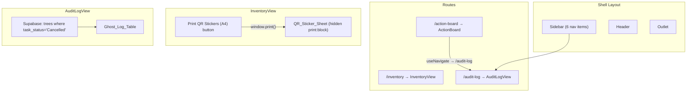

# Design Document: Audit Trail & QR Stickers

## Overview

This design covers Phase 7 of the Tree Inventory Web App, which adds two capabilities:

1. **Batch QR Sticker Generator** — Replaces the `console.log` stub in `InventoryView.handlePrintQr` with a print-only CSS Grid layout that renders one credit-card-sized QR sticker per tree record. The sticker sheet is invisible on screen (`hidden print:block`) and becomes visible only when `window.print()` is invoked.

2. **Audit Log View** — A new page at `/audit-log` that fetches and displays cancelled tree records in a Ghost Log table. The existing "View Ghost Log" button in ActionBoard is wired to navigate to this route, and a 6th sidebar nav item is added.

Both features reuse the existing Supabase fetch pattern, Tailwind styling conventions, and the loading/error/loaded state machine established in earlier phases.

## Architecture



### Key Architectural Decisions

| Decision | Rationale |
|----------|-----------|
| Use `window.print()` + print-only CSS instead of PDF generation | Requirement 2.2 explicitly forbids PDF libraries; native print keeps bundle small |
| `qrcode.react` as the only new dependency | Requirement 1.1 constrains new deps to this single library |
| AuditLogView as a standalone page (not a modal) | Requirement 5.1 specifies a dedicated route at `/audit-log` |
| Supabase filter `task_status.eq('Cancelled')` server-side | Reduces payload size vs. fetching all records and filtering client-side |
| Reuse `treeRecordArb` from `src/test/arbitraries.js` for PBT | Existing arbitrary already models the full Tree_Record shape |

## Components and Interfaces

### New Components

#### 1. `QrStickerSheet` (inline in InventoryView)

Rendered at the bottom of `InventoryView`, below the table. Not a separate file — stays inline to keep the diff scoped.

```jsx
// Props: { trees: TreeRecord[] }
// Renders: CSS Grid of QR stickers, hidden on screen, visible in print
```

**Responsibilities:**
- Render a `<div className="hidden print:block">` wrapper
- Map each tree to a `QrSticker` cell
- Use CSS Grid with auto-fill columns sized to ~85mm × 54mm

#### 2. `QrSticker` (inline in InventoryView)

A single sticker cell within the grid.

```jsx
// Props: { tree: TreeRecord }
// Renders: LGU logo placeholder + Tree ID label + QRCodeSVG from qrcode.react
```

**Responsibilities:**
- Render an `LGU_Logo_Placeholder` div (empty placeholder for future logo)
- Render `Tree ID: {tree.tree_id ?? '—'}`
- Render `<QRCodeSVG value={tree.tree_id ?? ''} size={80} />`

#### 3. `AuditLogView` (new file: `src/pages/AuditLogView.jsx`)

Full page component registered at `/audit-log`.

```jsx
// State: { status: 'loading'|'error'|'loaded', trees: TreeRecord[], errorMessage: string }
// Fetch: supabase.from('trees').select('*').eq('task_status', 'Cancelled')
```

**Responsibilities:**
- Fetch cancelled records on mount (single query, zero mutations)
- Render loading/error/loaded states following existing patterns
- Render `Ghost_Log_Table` in loaded state
- Render empty-state message when no cancelled records exist

### Modified Components

#### 4. `Sidebar.jsx`

- Add `History` icon import from `lucide-react`
- Add 6th entry to `NAV_ITEMS`: `{ to: '/audit-log', label: 'Audit Log', Icon: History }`

#### 5. `ActionBoard.jsx`

- Import `useNavigate` from `react-router-dom`
- Replace `handleAuditTrail` console.log stub with `navigate('/audit-log')`

#### 6. `InventoryView.jsx`

- Import `QRCodeSVG` from `qrcode.react`
- Replace `handlePrintQr` console.log stub with `window.print()`
- Add QR sticker sheet section at the bottom of the component

#### 7. `App.jsx`

- Import `AuditLogView`
- Add `<Route path="audit-log" element={<AuditLogView />} />` inside the Shell route

## Data Models

### Tree_Record (existing — no changes)

The existing `TreeRecord` type from `src/types.js` is used unchanged. Key fields for this feature:

| Field | Type | Usage |
|-------|------|-------|
| `id` | `string` | React key |
| `tree_id` | `string \| null` | QR code value, sticker label, table display |
| `species` | `string` | Ghost Log table column |
| `assigned_to` | `string \| null` | Ghost Log table column (null → "—") |
| `dateCaptured` | `string` | Ghost Log table column |
| `task_status` | `'Pending' \| 'Acknowledged' \| 'Executed' \| 'Cancelled'` | Filter predicate for Audit Log |

### QR Sticker Data Flow

```
TreeRecord[] (from Supabase fetch in InventoryView)
  → map to QrSticker components
    → tree.tree_id ?? '' → QRCodeSVG value prop
    → tree.tree_id ?? '—' → Tree_ID_Label text
```

### Audit Log Data Flow

```
Supabase query: trees.select('*').eq('task_status', 'Cancelled')
  → TreeRecord[] (only cancelled records)
    → Ghost_Log_Table rows
      → tree.tree_id, tree.species, tree.assigned_to ?? '—', tree.dateCaptured
```


## Correctness Properties

*A property is a characteristic or behavior that should hold true across all valid executions of a system — essentially, a formal statement about what the system should do. Properties serve as the bridge between human-readable specifications and machine-verifiable correctness guarantees.*

### Property 1: QR sticker count equals tree record count

*For any* array of Tree_Records (including empty arrays), the QR_Sticker_Sheet SHALL render exactly as many QR_Sticker elements as there are Tree_Records in the input array.

**Validates: Requirements 3.4**

### Property 2: QR sticker content correctness

*For any* Tree_Record, the rendered QR_Sticker SHALL contain: (a) an LGU_Logo_Placeholder element, (b) a Tree_ID_Label displaying "Tree ID: {tree_id}" when tree_id is non-null or "Tree ID: —" when tree_id is null, and (c) a QRCodeSVG component with value equal to tree_id when non-null or empty string when null.

**Validates: Requirements 4.2, 4.3, 4.4, 4.5**

### Property 3: Ghost Log table row count with Cancelled badge

*For any* array of cancelled Tree_Records, the Ghost_Log_Table SHALL render exactly as many table rows as there are records, and each row SHALL contain a Cancelled_Badge element.

**Validates: Requirements 8.2, 8.3**

### Property 4: Null assigned_to renders placeholder

*For any* Tree_Record where `assigned_to` is null, the Ghost_Log_Table row for that record SHALL display the placeholder character "—" in the Assigned Arborist column.

**Validates: Requirements 8.5**

## Error Handling

### InventoryView (QR Sticker Sheet)

| Scenario | Handling |
|----------|----------|
| Tree list is empty (loading/error state) | QR_Sticker_Sheet renders zero stickers; `hidden` class keeps it invisible regardless |
| `tree_id` is null | Label shows "Tree ID: —", QR code value is empty string (renders blank QR) |
| `window.print()` blocked by browser | No special handling — browser's native behavior applies |

### AuditLogView

| Scenario | Handling |
|----------|----------|
| Supabase returns `{ error }` | Transition to `error` state, display `error.message ?? 'Unknown Supabase error'` |
| Supabase throws exception | Catch, transition to `error` state, display `e?.message ?? 'Unexpected error loading audit log.'` |
| Supabase returns non-array `data` | Guard with `Array.isArray(data) ? data : []`, transition to `loaded` |
| Empty result set | Transition to `loaded`, render empty-state message: "No cancelled records found." |
| Component unmounts during fetch | `cancelled` flag prevents `setState` after unmount (same pattern as InventoryView) |

### ActionBoard Navigation

| Scenario | Handling |
|----------|----------|
| `/audit-log` route not registered | Would render NotFound — prevented by route registration in App.jsx |
| Navigation called before component mount | `useNavigate` is stable after mount; button is only clickable post-render |

## Testing Strategy

### Testing Framework

- **Unit/Integration tests**: Vitest + React Testing Library (existing)
- **Property-based tests**: fast-check (already in devDependencies)
- **Test environment**: jsdom (configured in vite.config.js)

### Dual Testing Approach

#### Example-Based Tests (unit/integration)

| Component | Test Cases |
|-----------|-----------|
| `Sidebar` | Renders exactly 6 nav links; `/audit-log` link present with correct label |
| `InventoryView` | Print button calls `window.print()`; QRCodeSVG elements present in DOM; button text unchanged |
| `ActionBoard` | Audit trail button navigates to `/audit-log` (no console.log) |
| `AuditLogView` | Loading state renders indicator; Error state renders message; Loaded state renders table; Empty state renders message; Supabase called with `.eq('task_status', 'Cancelled')`; Single query, zero mutations |
| `App` routing | `/audit-log` path renders AuditLogView |

#### Property-Based Tests

| Property | Test Configuration |
|----------|-------------------|
| Property 1: Sticker count | Generate random-length arrays of `treeRecordArb`, render QR sheet, assert sticker count = array length. Min 100 iterations. |
| Property 2: Sticker content | Generate single `treeRecordArb` (with nullable tree_id), render sticker, assert logo placeholder + correct label text + correct QR value. Min 100 iterations. |
| Property 3: Ghost Log row count | Generate random-length arrays of `treeRecordArb` (filtered to task_status='Cancelled'), render table, assert row count = array length and each row has badge. Min 100 iterations. |
| Property 4: Null placeholder | Generate `treeRecordArb` with `assigned_to = null`, render Ghost Log row, assert "—" in arborist column. Min 100 iterations. |

### Property Test Configuration

- Library: `fast-check` (v4.7.0, already installed)
- Minimum iterations: 100 per property
- Arbitraries: Reuse `treeRecordArb` from `src/test/arbitraries.js`
- Tag format: `Feature: audit-trail-qr-stickers, Property {N}: {title}`

### Test File Organization

| File | Purpose |
|------|---------|
| `src/pages/AuditLogView.test.jsx` | Unit + property tests for AuditLogView |
| `src/pages/Inventory.test.jsx` | Add QR sticker tests to existing file |
| `src/pages/ActionBoard.test.jsx` | Add navigation test to existing file |
| `src/components/Sidebar.test.jsx` | Update count assertion to 6 |
| `src/App.test.jsx` | Add /audit-log route test |

### Supabase Mocking Pattern

All tests follow the existing `vi.mock` hoisted spy pattern:

```js
vi.mock('../supabaseClient.js', () => ({
  supabase: {
    from: vi.fn(() => ({
      select: vi.fn(() => ({
        eq: vi.fn(() => Promise.resolve({ data: mockData, error: null })),
      })),
    })),
  },
}));
```

### Test Baseline

The existing 192-test baseline must remain green. New tests add to this count without breaking existing assertions.
