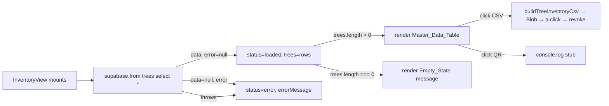
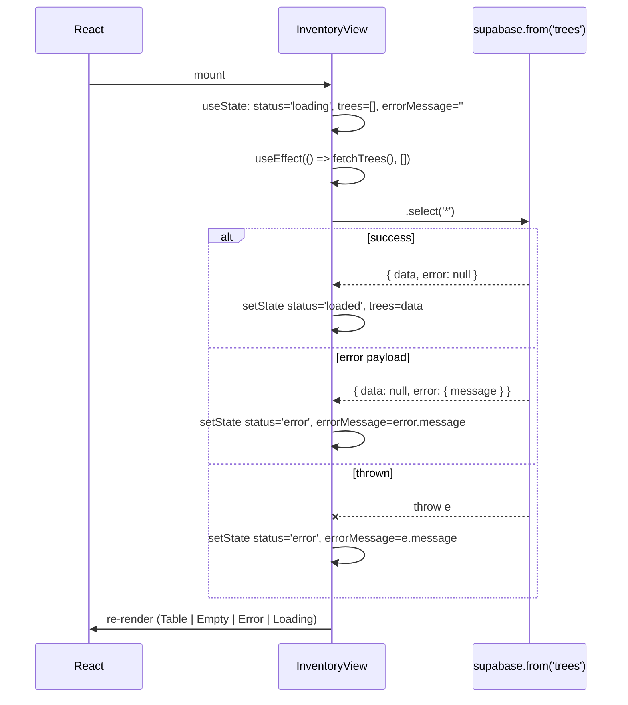
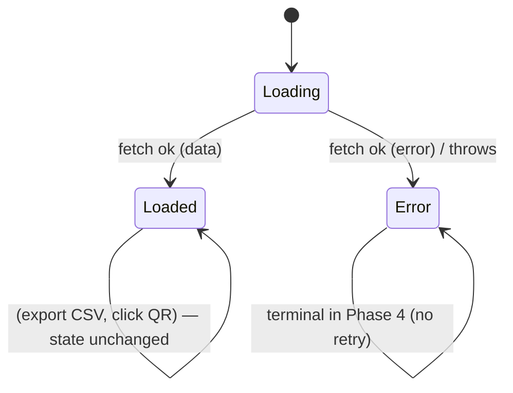

# Design Document

## Overview

Phase 4 replaces the `src/pages/InventoryView.jsx` placeholder with a data-driven Inventory_Page that:

1. Reads every row of the Supabase `trees` table on mount (`supabase.from('trees').select('*')`).
2. Classifies each row through two new pure functions under `src/lib/` — `classifyHazard` (red "Hazard" / green "Safe") and `classifyPermit` (yellow "Approved" / plain "None").
3. Renders the rows in a dense Tailwind-styled Master_Data_Table with six columns.
4. Exposes two right-aligned toolbar buttons: a native-browser CSV_Export and a console-logging Batch_QR_Print_Button stub.

Everything in Phase 4 is client-only and zero-dependency: the CSV export is built from a pure string-builder module, wrapped in a `Blob`, and handed to a programmatically-clicked hidden `<a>` element.

### Key design decisions

| Decision | Choice | Rationale |
|---|---|---|
| **State machine shape** | Single `status: 'loading' \| 'error' \| 'loaded'` discriminated union + `trees: TreeRecord[]` + `errorMessage: string` | Rules out invalid combinations (e.g., loading + data). Empty_State is *derived* from `status === 'loaded' && trees.length === 0`, not a fourth status value, because emptiness is a property of the `trees` array rather than of the fetch lifecycle. |
| **CSV builder location** | `src/lib/treeCsv.js` exporting `buildTreeInventoryCsv(records)` as a pure function | Mirrors the Phase 3 `pinColor.js` / Phase 2 `markerIcons.js` pattern: anything testable in isolation lives under `src/lib/`. Pure function ⇒ trivially unit-testable without rendering the component. |
| **CSV filename** | Static `tree-inventory.csv` | Requirement 7.2 only requires a `.csv` filename. Deterministic naming keeps the unit test and any future integration test stable; Requirement 11 defers timestamped or filtered exports to later phases. |
| **CSV download mechanism** | `Blob` → `URL.createObjectURL` → dynamic `<a>` → `document.body.appendChild` → `.click()` → `remove()` → `URL.revokeObjectURL` | Matches Requirement 7.2 verbatim. Appending to `document.body` is required for Firefox's click dispatch. Revoking the object URL inside the same synchronous handler prevents leaks. |
| **Component composition** | Toolbar and table stay **inline** inside `InventoryView.jsx` | Phase 3 rule: *inline until reused*. Neither surface ships a second call site in Phase 4. Extracting now would add indirection without reducing duplication. |
| **Supabase mock strategy** | `vi.hoisted` spies + `vi.mock('../supabaseClient.js', () => ({ supabase: { from: fromSpy } }))` | Proven pattern from `CommandCenter.test.jsx`. Unlike `ManageArborists.supabase.test.jsx` (which *throws* on import to prove isolation), Inventory genuinely imports Supabase, so the mock is a real stub, not a throw. |
| **PBT scope** | One property test for `classifyHazard`; example-based for `classifyPermit` and `buildTreeInventoryCsv` | See Correctness Properties section below. `classifyHazard` is a four-input boolean OR with non-trivial truth table (16 combinations); `treeRecordArb` already exists. `classifyPermit` is a one-flag projection — examples suffice. CSV builder's RFC 4180 contract is cleanly example-testable and adding a CSV *parser* for a round-trip PBT would violate Requirement 1. |
| **Color palette** | Slate background, emerald for Safe, red for Hazard, amber for Approved — matching `ManageArborists.jsx` | Phase 3 set the enterprise-dashboard aesthetic. Reusing the same utility tokens keeps visual coherence per Requirement 10.1. |
| **Table row rhythm** | `px-4 py-2` body cells vs Phase 3's `px-4 py-3` | Requirement 10.3 asks for "more rows per viewport" — dropping vertical padding by one step achieves that without breaking alignment with the Phase 3 header row. |

## Architecture

### Module layout (delta)

```
src/
  pages/
    InventoryView.jsx          [REPLACED]   inline toolbar + table + CSV handler
    Inventory.test.jsx         [NEW]        component tests (Supabase mocked)
  lib/
    hazardStatus.js            [NEW]        classifyHazard, HAZARD_STATUS
    hazardStatus.test.js       [NEW]        PBT + example-based
    permitStatus.js            [NEW]        classifyPermit, PERMIT_STATUS
    permitStatus.test.js       [NEW]        example-based
    treeCsv.js                 [NEW]        buildTreeInventoryCsv, CSV_HEADER
    treeCsv.test.js            [NEW]        example-based
```

Unchanged (preservation contract): `src/App.jsx`, `src/types.js`, `src/supabaseClient.js`, every Phase 1/2/3 test file.

### High-level data flow



### Fetch-on-mount sequence



### CSV download sequence

```mermaid
sequenceDiagram
  participant U as User
  participant B as CSV_Export_Button
  participant H as handleExportCsv
  participant C as buildTreeInventoryCsv
  participant D as document
  U->>B: click
  B->>H: onClick
  H->>H: guard: if trees.length === 0 return
  H->>C: buildTreeInventoryCsv(trees)
  C-->>H: csvString
  H->>H: blob = new Blob([csvString], { type: 'text/csv' })
  H->>H: url = URL.createObjectURL(blob)
  H->>D: a = document.createElement('a')
  H->>H: a.href = url; a.download = 'tree-inventory.csv'
  H->>D: body.appendChild(a)
  H->>D: a.click()
  H->>D: a.remove()
  H->>H: URL.revokeObjectURL(url)
```

## Components and Interfaces

### `src/pages/InventoryView.jsx`

Default export. Owns all Inventory_Page state and renders the toolbar + table inline.

```js
// Component state (useState triples):
//   status:       'loading' | 'error' | 'loaded'
//   trees:        TreeRecord[]
//   errorMessage: string     // '' when status !== 'error'

export default function InventoryView(): JSX.Element
```

Top-level JSX (pseudocode):

```jsx
<section className="space-y-6">
  <header>
    <h1 className="text-2xl font-semibold text-slate-900">Inventory</h1>
    <p className="mt-2 text-slate-600">Master database of every captured tree.</p>
  </header>

  {/* Inventory_Toolbar */}
  <div className="flex justify-end gap-2">
    <button onClick={handleExportCsv}  disabled={trees.length === 0}>Download CSV</button>
    <button onClick={handlePrintQr}    disabled={trees.length === 0}>Print QR Stickers (A4)</button>
  </div>

  {status === 'loading' && <LoadingBanner />}
  {status === 'error'   && <ErrorBanner message={errorMessage} />}
  {status === 'loaded' && trees.length === 0 && <EmptyBanner />}
  {status === 'loaded' && trees.length > 0 && <MasterDataTable rows={trees} />}
</section>
```

(Sub-components above are inline blocks in the JSX tree, not separate exports.)

**Requirement traceability**:

| Surface | Validates |
|---|---|
| `<h1>Inventory</h1>` | 2.2, 2.5 |
| `useEffect(fetchTrees, [])` with `supabase.from('trees').select('*')` | 3.1, 3.2 |
| `status` discriminated union rendering branches | 3.5, 3.6, 3.7 |
| Toolbar with `Download CSV` + `Print QR Stickers (A4)` buttons | 7.1, 8.1 |
| Master_Data_Table six-column header | 4.1 |
| `handleExportCsv` building `Blob` and clicking hidden `<a>` | 7.2, 7.9 |
| `handlePrintQr` calling `console.log` | 8.2, 8.3 |
| `/* PHASE 4 STUB */` comment above `handlePrintQr` | 8.4 |

### `src/lib/hazardStatus.js`

```js
/** @readonly */
export const HAZARD_STATUS = Object.freeze({
  HAZARD: 'Hazard',
  SAFE:   'Safe',
});

/**
 * Collapse the four Hazard_Flags on a Tree_Record into a single status string.
 * Pure function; reads no state outside `tree`.
 *
 * @param {import('../types.js').TreeRecord} tree
 * @returns {'Hazard' | 'Safe'}
 */
export function classifyHazard(tree) {
  return (
    tree.is_leaning ||
    tree.has_powerline_conflict ||
    tree.is_decayed ||
    tree.is_root_problem
  ) ? HAZARD_STATUS.HAZARD : HAZARD_STATUS.SAFE;
}
```

**Requirement traceability**: 5.1, 5.2, 5.3, 5.6.

### `src/lib/permitStatus.js`

```js
/** @readonly */
export const PERMIT_STATUS = Object.freeze({
  APPROVED: 'Approved',
  NONE:     'None',
});

/**
 * Map a Tree_Record to its Permit_Status. Pure function.
 *
 * @param {import('../types.js').TreeRecord} tree
 * @returns {'Approved' | 'None'}
 */
export function classifyPermit(tree) {
  return tree.has_cutting_permit ? PERMIT_STATUS.APPROVED : PERMIT_STATUS.NONE;
}
```

**Requirement traceability**: 6.1, 6.2, 6.3, 6.6.

### `src/lib/treeCsv.js`

```js
import { classifyHazard } from './hazardStatus.js';
import { classifyPermit } from './permitStatus.js';

export const CSV_HEADER = [
  'tree_id',
  'species',
  'dbh',
  'hazard_status',
  'permit_status',
  'assigned_to',
];

/**
 * RFC 4180 quoting of a single CSV field.
 *
 * Rules (Requirement 7.6):
 *   - null or undefined       → empty string (Requirement 7.7)
 *   - contains comma, CR, LF, or "  → wrap in " ... "
 *   - inside quoted form, every "  → ""
 *   - otherwise                → value unchanged
 *
 * @param {string | null | undefined} value
 * @returns {string}
 */
export function quoteCsvField(value) {
  if (value == null) return '';
  const s = String(value);
  if (/[",\r\n]/.test(s)) {
    return `"${s.replace(/"/g, '""')}"`;
  }
  return s;
}

/**
 * Build the full CSV_String for a Tree_Record_List. Pure function; no DOM,
 * no Blob, no network.
 *
 * Row order matches `records`. Rows are joined with '\r\n' per RFC 4180.
 * A trailing '\r\n' is emitted so editors that require a final newline
 * (Excel, LibreOffice) parse the last row correctly.
 *
 * @param {import('../types.js').TreeRecord[]} records
 * @returns {string}
 */
export function buildTreeInventoryCsv(records) {
  const lines = [CSV_HEADER.map(quoteCsvField).join(',')];
  for (const r of records) {
    lines.push([
      quoteCsvField(r.tree_id),
      quoteCsvField(r.species),
      quoteCsvField(r.dbh),
      quoteCsvField(classifyHazard(r)),
      quoteCsvField(classifyPermit(r)),
      quoteCsvField(r.assigned_to),
    ].join(','));
  }
  return lines.join('\r\n') + '\r\n';
}
```

**Quoting algorithm in pseudocode**:

```
function quoteCsvField(value):
  if value is null or undefined:       return ""
  s := String(value)
  if s contains any of { "," , "\"" , "\r" , "\n" }:
      escaped := replace every "\"" in s with "\"\""
      return "\"" + escaped + "\""
  return s
```

**Requirement traceability**: 7.3, 7.4, 7.5, 7.6, 7.7, 7.10.

## Data Models

### `TreeRecord` (reused)

Imported via JSDoc reference from `src/types.js`. Phase 4 **does not** modify the type. The fields Phase 4 actually reads are:

| Field | Type | Used by |
|---|---|---|
| `id` | `string` | React key on each row |
| `tree_id` | `?string` | Tree ID cell, CSV `tree_id` col |
| `species` | `string` | Species cell, CSV `species` col |
| `dbh` | `string` | DBH cell, CSV `dbh` col |
| `is_leaning`, `has_powerline_conflict`, `is_decayed`, `is_root_problem` | `boolean` | `classifyHazard` |
| `has_cutting_permit` | `boolean` | `classifyPermit` |
| `assigned_to` | `?string` | Assigned To cell, CSV `assigned_to` col |

All other fields (`latitude`, `longitude`, `scientific_name`, `species_type`, `dateCaptured`, `task_status`, `photo_url`) are fetched in the `select('*')` but not rendered and not exported. Requirement 11.7 explicitly forbids adding JSON/PDF/XLSX exports that might surface them.

### CSV row shape

Header row (exactly):

```
tree_id,species,dbh,hazard_status,permit_status,assigned_to
```

Data row: `<tree_id>,<species>,<dbh>,<Hazard|Safe>,<Approved|None>,<assigned_to>` where each field is RFC 4180 quoted per `quoteCsvField`.

### Inventory_Page state machine



`Empty_State` is not a separate machine state; it is the render branch chosen when `status === 'loaded' && trees.length === 0`. This keeps the union tight (three states, not four) while still honouring Requirement 3.7.

State shape:

```ts
{
  status: 'loading' | 'error' | 'loaded',
  trees: TreeRecord[],        // always defined, initially []
  errorMessage: string,       // always defined, '' outside 'error'
}
```


## Correctness Properties

*A property is a characteristic or behavior that should hold true across all valid executions of a system — essentially, a formal statement about what the system should do. Properties serve as the bridge between human-readable specifications and machine-verifiable correctness guarantees.*

### PBT applicability assessment

Phase 4 has a narrow PBT surface. Most acceptance criteria are either structural (button exists, heading present), projections (render `tree_id` in the Tree ID cell), or one-shot DOM wiring (Blob/anchor download sequence). These are better served by example-based tests whose fixtures exercise the exact render branches the requirements pin.

Three candidate surfaces were evaluated for PBT:

| Surface | Verdict | Reasoning |
|---|---|---|
| `classifyHazard` | **PROPERTY** | Input space is the 16-tuple of four Hazard_Flags; spec is a clean boolean OR. `treeRecordArb` already generates the four flags. A 100-iteration property covers all 16 combinations several times over and catches any accidental field-coupling bug (e.g., a typo that ORs `is_leaning` twice and forgets `is_root_problem`). |
| `classifyPermit` | **EXAMPLE** | Single-boolean projection with only two possible inputs. Two unit tests exhaustively cover the input space; a PBT would be ceremonial and would add no signal. |
| `buildTreeInventoryCsv` RFC 4180 quoting | **EXAMPLE** | A round-trip property would require a CSV parser, but Requirement 1 forbids a third-party CSV library and rolling our own parser risks parser-bug-masks-builder-bug. Hand-written examples per quoting-trigger character pin the contract more reliably. |

Only one property makes the cut:

### Property 1: classifyHazard is a pure boolean OR of the four Hazard_Flags

*For any* `TreeRecord`, `classifyHazard(t)` SHALL return `'Hazard'` when at least one of `t.is_leaning`, `t.has_powerline_conflict`, `t.is_decayed`, or `t.is_root_problem` is `true`, and SHALL return `'Safe'` when all four are `false`.

Reference test source (`src/lib/hazardStatus.test.js`):

```js
// Feature: central-inventory, Property 1: classifyHazard is a pure boolean OR of the four Hazard_Flags
it('returns Hazard iff any Hazard_Flag is true', () => {
  fc.assert(
    fc.property(treeRecordArb, (t) => {
      const expected =
        t.is_leaning || t.has_powerline_conflict || t.is_decayed || t.is_root_problem
          ? 'Hazard'
          : 'Safe';
      return classifyHazard(t) === expected;
    }),
    { numRuns: 100 }
  );
});
```

**Validates: Requirements 5.1, 5.2**

## Error Handling

### Inventory_Fetch failure

Two failure modes:

1. **Supabase returns an error payload**: `{ data: null, error: { message } }`. The `useEffect` callback:
   ```js
   const { data, error } = await supabase.from('trees').select('*');
   if (error) { setStatus('error'); setErrorMessage(error.message ?? 'Unknown Supabase error'); return; }
   ```
2. **Supabase throws** (network disconnect, client misconfiguration):
   ```js
   try { ... } catch (e) {
     setStatus('error');
     setErrorMessage(e?.message ?? 'Unexpected error loading inventory.');
   }
   ```

Both paths converge on `status === 'error'` and render:

```jsx
<div role="alert" className="rounded border border-red-200 bg-red-50 p-4 text-sm text-red-700">
  Failed to load inventory: {errorMessage}
</div>
```

Rendering the error banner does **not** unmount the toolbar — the CSV_Export_Button and Batch_QR_Print_Button remain in the DOM but are disabled because `trees.length === 0`. This is consistent with Requirement 7.8, which allows the button to render in the Error_State as long as its activation does not trigger a download.

Satisfies Requirements **3.6**.

### CSV export on empty list

`handleExportCsv` opens with an explicit guard:

```js
function handleExportCsv() {
  if (trees.length === 0) return;   // Requirement 7.8 no-op guard
  const csv = buildTreeInventoryCsv(trees);
  // ... Blob / anchor / revoke
}
```

Because the button is also `disabled={trees.length === 0}`, the guard is belt-and-suspenders: if the button is ever enabled in a future phase but the list is still empty, the handler still won't trigger a download.

Satisfies Requirement **7.8**.

### Batch QR stub on empty list

`handlePrintQr` is also `disabled={trees.length === 0}` to avoid printing a pointless `Initiating A4 QR Print Layout for 0 trees` log. Disabling (rather than no-op'ing) is preferred for this stub because the 0-tree case is never useful.

### React key stability

Rows are keyed on `TreeRecord.id` (Supabase UUID primary key). Requirement 4.9. If a row arrives with a duplicate or missing `id`, React surfaces a `console.error` — we assert the absence of that warning in a dedicated test, mirroring the Phase 3 `ManageArborists` pattern.

## Testing Strategy

Phase 4 ships **two complementary tiers**: example-based tests for DOM wiring and concrete projections, and a single property-based test for the one surface where input variation reveals bugs.

### Test files

| File | Kind | Scope |
|---|---|---|
| `src/lib/hazardStatus.test.js` | Unit (PBT + examples) | Property 1 + all-flags-false / all-flags-true / one-flag-on-per-flag examples. |
| `src/lib/permitStatus.test.js` | Unit (examples) | true → 'Approved', false → 'None'. |
| `src/lib/treeCsv.test.js` | Unit (examples) | Header row; one-row projection; RFC 4180 quoting per trigger character; null field serialization; order preservation. |
| `src/pages/Inventory.test.jsx` | Component | Six requirements-mandated assertions driven by a 3-record mocked Inventory_Fetch (see Supabase mock strategy below). |

### Supabase mock strategy (`src/pages/Inventory.test.jsx`)

Mirrors the proven `CommandCenter.test.jsx` pattern. `vi.hoisted` is required so the `vi.mock` factory (itself hoisted) can reference the spies:

```js
const { selectSpy, insertSpy, updateSpy, upsertSpy, deleteSpy, fromSpy } = vi.hoisted(() => {
  const selectSpy = vi.fn();
  const insertSpy = vi.fn();
  const updateSpy = vi.fn();
  const upsertSpy = vi.fn();
  const deleteSpy = vi.fn();
  const fromSpy = vi.fn(() => ({
    select: selectSpy,
    insert: insertSpy,
    update: updateSpy,
    upsert: upsertSpy,
    delete: deleteSpy,
  }));
  return { selectSpy, insertSpy, updateSpy, upsertSpy, deleteSpy, fromSpy };
});

vi.mock('../supabaseClient.js', () => ({ supabase: { from: fromSpy } }));

// imports AFTER vi.mock
import InventoryView from './InventoryView.jsx';

beforeEach(() => {
  selectSpy.mockReset();
  insertSpy.mockReset();
  updateSpy.mockReset();
  upsertSpy.mockReset();
  deleteSpy.mockReset();
  fromSpy.mockClear();
});
```

Resolution helpers:

```js
const resolveOk  = (data)  => selectSpy.mockResolvedValueOnce({ data, error: null });
const resolveErr = (error) => selectSpy.mockResolvedValueOnce({ data: null, error });
```

This is a legitimate **stub** — unlike `ManageArborists.supabase.test.jsx` which *throws* on import to prove isolation, `InventoryView.jsx` is supposed to import Supabase, so the mock substitutes a controllable query builder. No throw.

### Fixture — 3 dummy Tree_Records (Requirement 9.3)

Hand-crafted to exercise all four Hazard_Pill and Permit_Pill render branches:

```js
const MOCK_TREES = [
  { id: 't-1', tree_id: 'T-001', species: 'Narra', dbh: '42', is_leaning: true,  has_powerline_conflict: false, is_decayed: false, is_root_problem: false, has_cutting_permit: false, assigned_to: 'arb-001', /* ...rest... */ }, // Hazard + None
  { id: 't-2', tree_id: 'T-002', species: 'Acacia', dbh: '30', is_leaning: false, has_powerline_conflict: false, is_decayed: false, is_root_problem: false, has_cutting_permit: true,  assigned_to: null,       /* ...rest... */ }, // Safe + Approved
  { id: 't-3', tree_id: null,    species: 'Mahogany, large', dbh: '55', is_leaning: false, has_powerline_conflict: false, is_decayed: false, is_root_problem: false, has_cutting_permit: false, assigned_to: null, /* ...rest... */ }, // Safe + None + null tree_id/assigned_to + comma in species (CSV edge case)
];
```

Row 1 covers Hazard + None (and a non-null `assigned_to`). Row 2 covers Safe + Approved. Row 3 covers Safe + None **and** both null projections **and** the comma-containing species that exercises RFC 4180 quoting through the rendered table *and* through a CSV integration test.

### Browser-primitive mocks inside the component test

For CSV download tests:

```js
beforeEach(() => {
  global.URL.createObjectURL = vi.fn(() => 'blob:mock');
  global.URL.revokeObjectURL = vi.fn();
  // HTMLAnchorElement.prototype.click is spied via vi.spyOn in the relevant test
});
afterEach(() => {
  delete global.URL.createObjectURL;
  delete global.URL.revokeObjectURL;
});
```

jsdom does not implement `URL.createObjectURL` — stubbing is mandatory. Spying on `HTMLAnchorElement.prototype.click` lets the test assert the anchor was actually clicked without dispatching a real navigation.

### Property-based testing configuration

- Library: `fast-check` (already installed, already used in Phase 2).
- Iteration count: **100** (minimum per the design doctrine).
- Tag format: `// Feature: central-inventory, Property {n}: {title}` above each property test block.
- Input arbitrary: `treeRecordArb` from `src/test/arbitraries.js`, unmodified.

### Test preservation contract (Requirement 9.1)

The 104 tests across 13 files that passed at the end of Phase 3 must continue to pass. Phase 4 touches only:

- `src/pages/InventoryView.jsx` (content replacement, but the default export and the `<h1>Inventory</h1>` heading survive, so `App.test.jsx` routing assertions remain green).
- Four new files under `src/lib/` and `src/pages/`.

No changes to `src/App.jsx`, `src/types.js`, `src/supabaseClient.js`, or any Phase 1/2/3 component or test.

### What is NOT tested automatically

Per the prework, the following are covered by review rather than assertions:

- Requirement 1.x (no new dependencies) — visible in the `package.json` diff.
- Requirement 1.4 (QR stub imports no QR library) — visible in the source.
- Requirements 10.x (Tailwind aesthetic consistency) — visible by inspection, with spot assertions on a few key utility tokens (`divide-y`, `rounded-full`, red/emerald/amber) to catch gross regressions.
- Requirements 11.x (out-of-scope negatives) — satisfied by not implementing them.

This keeps the new test footprint proportional to the new behavior: one PBT, a handful of classifier/CSV unit tests, and a component test file dense enough to pin every positive acceptance criterion in Requirements 2–8.
