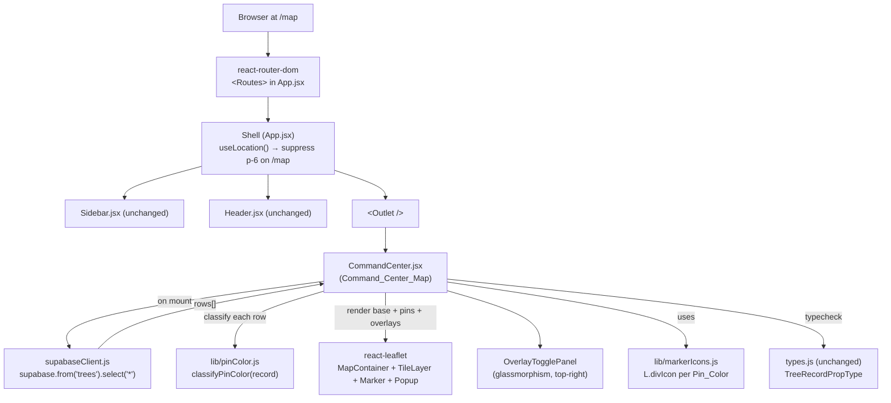
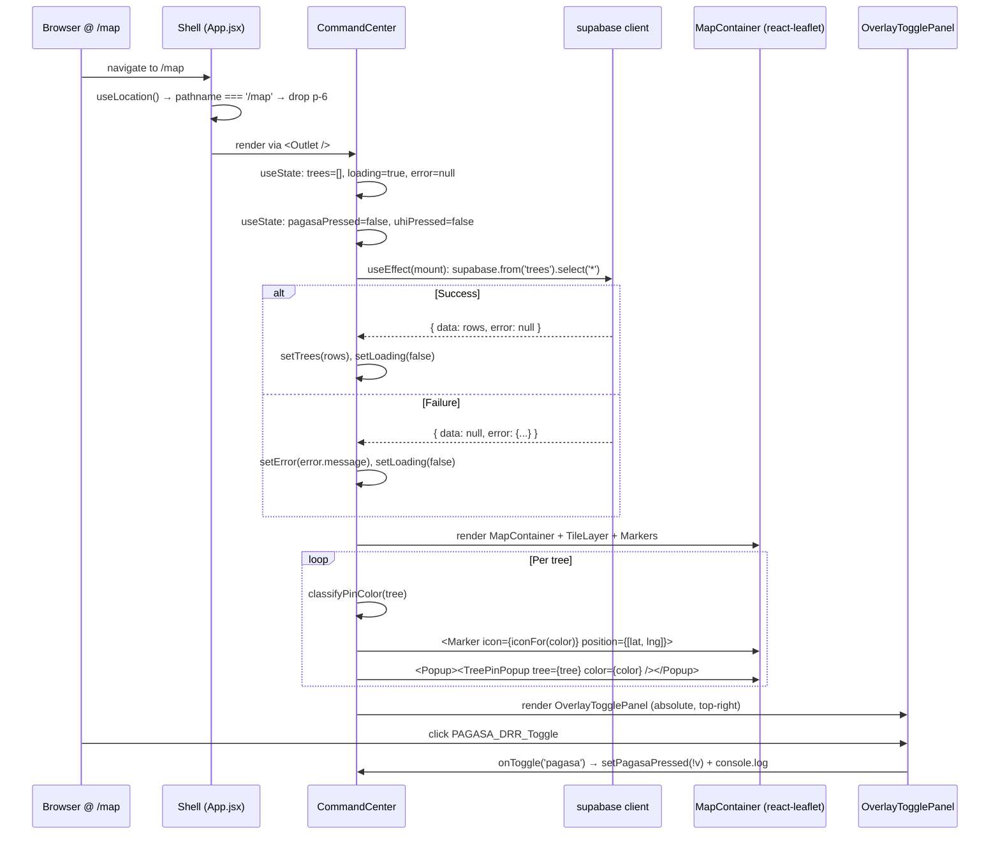

# Design Document

## Overview

Phase 2 replaces the Phase 1 placeholder at `src/pages/CommandCenter.jsx` with a production-ready interactive **Command_Center_Map**. The map renders every row of the Supabase `trees` table as a color-coded pin on an OpenStreetMap base layer, shows a styled popup for each pin with the tree's key attributes, and exposes a Phase-2-stub "Dispatch Arborist" action on unassigned-hazard pins. Two glassmorphism overlay-toggle buttons float at the top right of the map as UI-only placeholders for future PAGASA DRR and Urban Heat Island data layers.

Phase 2 is strictly additive on top of the Phase 1 shell. Sidebar, Header, `types.js`, and `supabaseClient.js` all keep their current shapes. The only change to a Phase 1 file is in `src/App.jsx`, where the shared `<main>` padding must be suppressed for the `/map` route so the map renders edge-to-edge (Requirement 2.6). Every Phase 1 test continues to pass unchanged (Requirement 9.4).

### Design Decisions & Rationale

1. **Replace `src/pages/CommandCenter.jsx` in place; do not introduce a new `MapDashboard.jsx`.** The Phase 1 route wiring in `App.jsx` already points `/map` at `<CommandCenter />`. The Phase 1 integration tests in `src/App.test.jsx` assert that the `/map` route renders a level-1 heading whose name is `Command Center` (Phase 1 Requirement 4.1 test coverage). The `src/pages/pages.test.jsx` file additionally asserts `CommandCenter`'s heading and description text. To satisfy the Phase 2 contract without regressing Phase 1 tests, this design **updates those tests alongside the component** (they become Phase-2-specific assertions about the map rendering) and keeps the file name `CommandCenter.jsx`. Introducing a new `MapDashboard.jsx` would change the route import in `App.jsx` and leave a dead `CommandCenter.jsx` behind. Keeping the existing file is the smaller, more reversible change, so this design picks it.

2. **Route-aware padding suppression via a `useLocation` check inside `Shell`.** Requirement 2.6 requires the `/map` route to suppress the shell's `p-6` padding so the map fills the main outlet edge-to-edge. Three alternatives were considered:
   - **(a) Have `CommandCenter` render outside the padded `<main>`** — rejected because `<Outlet />` is the only hook the shell gives child routes, and moving a route's render target outside the shell's layout tree conflicts with Requirement 2.5 (Sidebar and Header must still frame the map).
   - **(b) Push padding onto every non-map page** — rejected because it would force a blanket change to four other pages that Phase 1 tests already lock down (`pages.test.jsx`), inflating Phase 2's blast radius.
   - **(c) Route-aware padding inside `Shell`** — chosen. `Shell` calls `useLocation()` and conditionally applies `p-6` when the pathname is not `/map`. One touched file (`App.jsx`), one behavioral change, zero impact on other routes, and the existing App test that asserts `<main>` carries `overflow-auto` continues to pass because `overflow-auto` is always applied.

3. **OpenStreetMap as the base tile provider.** Requirement 2.4 permits any OpenStreetMap-backed layer. OSM's standard tile server is API-key-free, which keeps the dashboard's deploy story simple and avoids a new env var. The tile URL is `https://{s}.tile.openstreetmap.org/{z}/{x}/{y}.png` with the required attribution `&copy; OpenStreetMap contributors`.

4. **Pin color classification as a pure function in its own module.** The four Pin_Color rules in Requirement 4 apply a strict precedence (`Red > Orange > Yellow > Green`) across five Tree_Record fields. Keeping that classifier in a pure module (`src/lib/pinColor.js`) makes it trivially testable in isolation and keeps the JSX component focused on rendering. The function also centralizes the precedence invariant so later phases (Inventory filtering, Analytics dashboards) can import the exact same classifier.

5. **Custom Leaflet icons via `L.divIcon`, not `L.Icon`.** `L.divIcon` lets us style each marker with Tailwind-friendly HTML (`<div class="...">`) and CSS hue rather than shipping four PNG sprites. This satisfies Requirement 5.2 and 5.3 (four visually distinct hues) and Requirement 5.5 (no default blue teardrop), and side-steps Leaflet's well-known default-icon-asset bug that breaks under Vite's asset pipeline. The four icons are constructed once at module scope and reused by every `<Marker>` of that color.

6. **Session-scoped overlay toggle state via `useState`.** Requirement 8.5 scopes pressed state to the current browser session. `useState` inside `CommandCenter` is the minimum mechanism that satisfies this: no `localStorage`, no URL query param, no context provider. A page refresh resets both toggles to unpressed, which matches the user-confirmed product intent.

7. **`vi.mock('react-leaflet', ...)` in the component's own test file, not in `src/test/setup.js`.** Placing the mock globally would hide real Leaflet errors from any future test that wants to test the real map. Scoping the mock to `src/pages/CommandCenter.test.jsx` (plus any other test that renders the map) keeps the mock surface area minimal and explicit. The mock exports inert passthrough components so tests can still assert on `data-testid` hooks, marker counts, popup content, and handler wiring.

8. **Leaflet CSS import at module scope.** Requirement 1.3 requires `leaflet/dist/leaflet.css` to be imported so tiles and marker anchors align correctly in production. Because Phase 1's test setup uses jsdom and Vitest's transform pipeline, a raw CSS import works at module load without extra Vite config. Under test, the Leaflet module itself is mocked, so the CSS side effect is inert. A stylesheet mock is therefore not required, which simplifies Requirement 9.2 slightly.

## Architecture

### High-Level Structure



### Module / File Layout

New files and changed files only. Every unlisted Phase 1 file stays untouched.

```
src/
├── App.jsx                              # CHANGED: route-aware padding in Shell
├── pages/
│   └── CommandCenter.jsx                # REPLACED: Command_Center_Map
├── pages/
│   └── CommandCenter.test.jsx           # NEW: component-level tests (supersedes the CC section of pages.test.jsx)
├── pages/
│   └── pages.test.jsx                   # CHANGED: drop the CommandCenter placeholder block; keep the other three + NotFound
├── components/
│   ├── OverlayTogglePanel.jsx           # NEW: two glassmorphism toggle buttons, top-right
│   ├── OverlayTogglePanel.test.jsx      # NEW
│   ├── TreePinPopup.jsx                 # NEW: Pin_Popup body (tree_id, species, dbh, photo, dispatch button)
│   └── TreePinPopup.test.jsx            # NEW
├── lib/
│   ├── pinColor.js                      # NEW: classifyPinColor(record) pure function + constants
│   ├── pinColor.test.js                 # NEW
│   ├── markerIcons.js                   # NEW: L.divIcon instances per Pin_Color
│   └── markerIcons.test.js              # NEW (light — icon lookup, not Leaflet internals)
└── App.test.jsx                         # UNCHANGED (still passes with the route-aware padding)
```

`package.json` gains two runtime dependencies: `react-leaflet` (current major) and `leaflet` (current major, matching `react-leaflet`'s peer requirement).

### Runtime Composition



## Components and Interfaces

All components are function components. No external state manager is introduced.

### `src/App.jsx` (CHANGED)

Responsibility: the Phase 1 layout route, with one added concession to Phase 2.

Change: `Shell` calls `useLocation()` and computes a `mainClassName` that omits `p-6` when `location.pathname === '/map'`.

Sketch (only `Shell` changes; `App` and the routes list are unchanged):

```jsx
import { Routes, Route, Navigate, Outlet, useLocation } from 'react-router-dom';

function Shell() {
  const location = useLocation();
  const isMapRoute = location.pathname === '/map';
  const mainClassName = isMapRoute
    ? 'flex-1 overflow-auto'
    : 'flex-1 overflow-auto p-6';
  return (
    <div className="min-h-screen flex">
      <Sidebar />
      <div className="flex-1 flex flex-col min-w-0">
        <Header />
        <main className={mainClassName}>
          <Outlet />
        </main>
      </div>
    </div>
  );
}
```

This preserves the invariant that `<main>` always carries `overflow-auto` (which the Phase 1 App test asserts) while dropping padding on `/map`. Requirement 2.1 (edge-to-edge) and Requirement 2.6 (suppress inherited padding) are both satisfied by this single change.

### `src/pages/CommandCenter.jsx` (REPLACED) — Command_Center_Map

Responsibility: fetch every Tree_Record, classify each into a Pin_Color, render a full-outlet `MapContainer` with pins and the overlay toggle panel, and surface loading + error states.

Module imports (top of file):

```js
import { useEffect, useState } from 'react';
import { MapContainer, TileLayer, Marker, Popup } from 'react-leaflet';
import 'leaflet/dist/leaflet.css';                    // Requirement 1.3
import { supabase } from '../supabaseClient.js';
import { classifyPinColor, PIN_COLOR } from '../lib/pinColor.js';
import { iconForPinColor } from '../lib/markerIcons.js';
import OverlayTogglePanel from '../components/OverlayTogglePanel.jsx';
import TreePinPopup from '../components/TreePinPopup.jsx';
```

Public contract:

- Default export: `CommandCenter` function component. No props.
- Renders a full-size wrapper `<div className="relative h-full w-full">` so the map fills the parent `<main>` (which, on `/map`, has no padding).
- Renders a `<MapContainer>` with:
  - `center={[14.2810, 121.4110]}`
  - `zoom={14}` (inside Requirement 2.3's `[13, 15]` band)
  - `className="h-full w-full"` so Leaflet's internal div expands to the wrapper.
- Nests exactly one `<TileLayer url="https://{s}.tile.openstreetmap.org/{z}/{x}/{y}.png" attribution='&copy; OpenStreetMap contributors' />`.
- Emits one `<Marker>` per Tree_Record whose `latitude` and `longitude` are both finite. The marker uses `icon={iconForPinColor(color)}` where `color = classifyPinColor(tree)`, and carries a React `key={tree.id}` (Requirement 5.4).
- Nests `<Popup>` inside each `<Marker>` containing `<TreePinPopup tree={tree} color={color} />`.
- Overlays a `<div>` in absolute positioning for loading and error states:
  - **Loading**: `<div data-testid="map-loading" className="absolute inset-0 z-[400] flex items-center justify-center bg-white/60 backdrop-blur-sm">Loading tree data…</div>` (z-index above Leaflet's map pane at `z-[400]` — Leaflet's marker pane is `600`, but this overlay only shows during fetch-in-flight when no markers have rendered yet, so 400 is fine).
  - **Error**: `<div role="alert" data-testid="map-error" className="absolute top-4 left-4 z-[500] max-w-sm rounded bg-red-50 border border-red-300 text-red-800 px-4 py-3 shadow">Failed to load tree data: {errorMessage}</div>`.
- Renders `<OverlayTogglePanel />` at absolute top-right.

State (all `useState`):

| State var      | Initial value | Meaning                                 |
|----------------|---------------|-----------------------------------------|
| `trees`        | `[]`          | Rows returned by Supabase.              |
| `loading`      | `true`        | True while fetch is in flight.          |
| `errorMessage` | `null`        | Error string when fetch fails, else `null`. |

Effect:

```jsx
useEffect(() => {
  let cancelled = false;
  supabase
    .from('trees')
    .select('*')
    .then(({ data, error }) => {
      if (cancelled) return;
      if (error) {
        setErrorMessage(error.message ?? 'Unknown error');
        setTrees([]);
      } else {
        setTrees(Array.isArray(data) ? data : []);
      }
      setLoading(false);
    });
  return () => { cancelled = true; };
}, []);
```

Coordinate filter:

```js
const isFinitePair = (tree) =>
  Number.isFinite(tree?.latitude) && Number.isFinite(tree?.longitude);

const visibleTrees = trees.filter(isFinitePair);
```

Requirement 3.6 uses `Number.isFinite` so `NaN`, `Infinity`, `-Infinity`, `null`, and `undefined` are all correctly rejected.

Requirement 7.5 (Phase 2) is enforced by never calling `supabase.from('trees').update(...)` / `.delete(...)` / `.insert(...)` anywhere in this file; only `.select('*')` appears.

### `src/lib/pinColor.js` (NEW)

Responsibility: the single authoritative implementation of Requirement 4's classification rules and precedence.

Public contract:

```js
/**
 * The four possible pin color classifications, in precedence order.
 * @readonly
 */
export const PIN_COLOR = Object.freeze({
  RED: 'Red',
  ORANGE: 'Orange',
  YELLOW: 'Yellow',
  GREEN: 'Green',
});

/**
 * Returns true when at least one of the four Hazard_Flags on a Tree_Record is true.
 * @param {object} tree
 * @returns {boolean}
 */
export function hasHazard(tree) {
  return Boolean(
    tree.is_leaning ||
    tree.has_powerline_conflict ||
    tree.is_decayed ||
    tree.is_root_problem
  );
}

/**
 * Classify a Tree_Record into exactly one Pin_Color using precedence
 * Red > Orange > Yellow > Green (Requirement 4).
 *
 *   Red    = Hazard_Detected && assigned_to === null
 *   Orange = Hazard_Detected && assigned_to !== null
 *   Yellow = !Hazard_Detected && has_cutting_permit === true
 *   Green  = !Hazard_Detected && has_cutting_permit === false
 *
 * @param {object} tree
 * @returns {'Red' | 'Orange' | 'Yellow' | 'Green'}
 */
export function classifyPinColor(tree) {
  const hazard = hasHazard(tree);
  const unassigned = tree.assigned_to == null; // null OR undefined
  if (hazard && unassigned) return PIN_COLOR.RED;
  if (hazard) return PIN_COLOR.ORANGE;
  if (tree.has_cutting_permit) return PIN_COLOR.YELLOW;
  return PIN_COLOR.GREEN;
}
```

Two notes on the precedence:

- The classifier is **total** (every input maps to exactly one color) and **deterministic** (same input → same output, no randomness, no time dependency). These are the preconditions that make this function a natural fit for property-based testing — see Correctness Properties below.
- `tree.assigned_to == null` uses loose equality so `null` and `undefined` both classify as "unassigned". Requirement 4.2 says `assigned_to` is `null`; the `TreeRecordPropType` declares `assigned_to` as nullable (may be `null`/absent). Accepting both keeps the classifier robust if Supabase ever returns `undefined` instead of an explicit null.

### `src/lib/markerIcons.js` (NEW)

Responsibility: produce one `L.divIcon` per Pin_Color with an on-brand, visually distinct hue.

Public contract:

```js
import L from 'leaflet';
import { PIN_COLOR } from './pinColor.js';

/**
 * Tailwind-based background color per Pin_Color. Hex fallbacks are used inside
 * the divIcon HTML because Leaflet's tooltip/marker pane is mounted outside
 * the Tailwind JIT's content scan.
 */
const HEX_FOR_COLOR = Object.freeze({
  [PIN_COLOR.RED]:    '#dc2626', // red-600
  [PIN_COLOR.ORANGE]: '#ea580c', // orange-600
  [PIN_COLOR.YELLOW]: '#eab308', // yellow-500
  [PIN_COLOR.GREEN]:  '#16a34a', // green-600
});

const buildDivIcon = (hex, ariaColor) =>
  L.divIcon({
    className: 'tree-pin-icon',
    html:
      `<span role="img" aria-label="${ariaColor} pin" ` +
      `style="display:block;width:18px;height:18px;border-radius:9999px;` +
      `background:${hex};border:2px solid white;box-shadow:0 1px 2px rgba(0,0,0,0.3);"></span>`,
    iconSize: [18, 18],
    iconAnchor: [9, 9],
    popupAnchor: [0, -10],
  });

const ICONS = Object.freeze({
  [PIN_COLOR.RED]:    buildDivIcon(HEX_FOR_COLOR[PIN_COLOR.RED], 'red'),
  [PIN_COLOR.ORANGE]: buildDivIcon(HEX_FOR_COLOR[PIN_COLOR.ORANGE], 'orange'),
  [PIN_COLOR.YELLOW]: buildDivIcon(HEX_FOR_COLOR[PIN_COLOR.YELLOW], 'yellow'),
  [PIN_COLOR.GREEN]:  buildDivIcon(HEX_FOR_COLOR[PIN_COLOR.GREEN], 'green'),
});

/**
 * @param {string} color one of PIN_COLOR values
 * @returns {L.DivIcon}
 */
export function iconForPinColor(color) {
  return ICONS[color] ?? ICONS[PIN_COLOR.GREEN];
}

export { HEX_FOR_COLOR };
```

This module imports real `leaflet`. Because the map component's test file mocks `react-leaflet` but NOT `leaflet`, the `leaflet` import must succeed under jsdom. Leaflet 1.9 imports cleanly under jsdom (no DOM access at module load), so no additional mock is needed for `leaflet` itself. `markerIcons.test.js` exercises the lookup path (`iconForPinColor` returns a truthy Leaflet icon) without asserting on Leaflet internals.

### `src/components/TreePinPopup.jsx` (NEW)

Responsibility: render the popup body for a single Tree_Pin, including the optional photo, tree attributes, and the conditional Dispatch Arborist button.

Public contract:
- Default export: `TreePinPopup`.
- Props: `{ tree: TreeRecord, color: 'Red' | 'Orange' | 'Yellow' | 'Green' }`.
- PropTypes: `{ tree: TreeRecordPropType.isRequired, color: PropTypes.oneOf(['Red','Orange','Yellow','Green']).isRequired }`.

Body structure (Tailwind-styled):

```jsx
export default function TreePinPopup({ tree, color }) {
  const identifier = tree.tree_id ?? 'Unidentified tree';
  return (
    <div className="w-56 text-slate-800">
      {tree.photo_url ? (
        
      ) : (
        <div
          data-testid="tree-photo-placeholder"
          aria-label="No photo available"
          className="w-full h-28 rounded mb-2 bg-slate-200 flex items-center justify-center text-slate-500 text-xs"
        >
          No photo
        </div>
      )}
      <dl className="text-xs leading-5">
        <div><dt className="inline font-semibold">Tree ID: </dt><dd className="inline">{identifier}</dd></div>
        <div><dt className="inline font-semibold">Species: </dt><dd className="inline">{tree.species}</dd></div>
        <div><dt className="inline font-semibold">DBH: </dt><dd className="inline">{tree.dbh}</dd></div>
      </dl>
      {color === 'Red' && (
        <button
          type="button"
          onClick={() => console.log('Dispatch Arborist requested', { id: tree.id, tree_id: tree.tree_id })}
          className="mt-3 w-full rounded bg-red-600 text-white text-sm font-semibold px-3 py-1.5 hover:bg-red-700 focus:outline-none focus:ring-2 focus:ring-red-400"
        >
          Dispatch Arborist
        </button>
      )}
    </div>
  );
}
```

Requirement mapping:
- 6.2 (tree_id label), 6.3 (fallback when null), 6.4 (species label), 6.5 (dbh label), 6.6 (image with alt), 6.7 (placeholder occupies same slot), 6.8 (Tailwind styled).
- 7.1 (Dispatch button rendered only on Red), 7.2 (absent on Orange/Yellow/Green, enforced by the `color === 'Red'` guard), 7.3 (`console.log` with `id` and `tree_id`), 7.4 (Tailwind styled), 7.5 (no Supabase write — the button handler is exactly `console.log`).

### `src/components/OverlayTogglePanel.jsx` (NEW)

Responsibility: render the two overlay toggle buttons and own their session-scoped pressed state.

Public contract:
- Default export: `OverlayTogglePanel`.
- No props.
- Internally holds two `useState<boolean>` values: `pagasaPressed`, `uhiPressed`, both initialized to `false`.

Rendering (Tailwind):

```jsx
export default function OverlayTogglePanel() {
  const [pagasaPressed, setPagasaPressed] = useState(false);
  const [uhiPressed,    setUhiPressed]    = useState(false);

  const toggle = (name, value, setter) => {
    const next = !value;
    setter(next);
    console.log('Overlay toggle', { name, pressed: next });
  };

  return (
    <div className="absolute top-4 right-4 z-[500] flex flex-col gap-2">
      <OverlayButton
        label="PAGASA DRR Overlay"
        pressed={pagasaPressed}
        onClick={() => toggle('PAGASA DRR Overlay', pagasaPressed, setPagasaPressed)}
      />
      <OverlayButton
        label="Urban Heat Island Map"
        pressed={uhiPressed}
        onClick={() => toggle('Urban Heat Island Map', uhiPressed, setUhiPressed)}
      />
    </div>
  );
}

function OverlayButton({ label, pressed, onClick }) {
  const glass = 'backdrop-blur-md bg-white/30 border border-white/40 text-slate-900 shadow-lg';
  const pressedTreatment = pressed ? 'ring-2 ring-sky-500 bg-sky-500/40 text-white' : '';
  return (
    <button
      type="button"
      aria-pressed={pressed}
      onClick={onClick}
      className={`rounded-lg px-4 py-2 text-sm font-medium transition ${glass} ${pressedTreatment}`}
    >
      {label}
    </button>
  );
}
```

Requirement mapping:
- 8.1 (exactly two, top-right — the parent `<div>` is `absolute top-4 right-4` with a tight `flex-col` so the pair stacks at the corner).
- 8.2–8.3 (exact labels).
- 8.4 (glassmorphism: `backdrop-blur-md`, `bg-white/30`, `border border-white/40`, `shadow-lg`).
- 8.5 (independent pressed state, `useState` each, session-scoped).
- 8.6 (click toggles).
- 8.7 (`console.log` with a payload naming the toggle and its new pressed state).
- 8.8 (distinct pressed treatment via `ring-2` + `bg-sky-500/40` + `text-white`).
- 8.9 (no real data layer rendered — the button is a stateful UI widget only).

### `src/pages/pages.test.jsx` (CHANGED)

The `CommandCenter` entry in `placeholderCases` is removed because `CommandCenter` is no longer a static placeholder. The other three placeholder cases (`InventoryView`, `ActionBoard`, `AnalyticsView`) and the `NotFound` block are unchanged. Command_Center_Map tests live in `src/pages/CommandCenter.test.jsx`.

`src/App.test.jsx` does NOT change. Its `/map` assertion currently checks that a `heading` with name `Command Center` renders at `/map`. Phase 2's `CommandCenter` keeps an accessible name of `Command Center` — it renders an `<h1 className="sr-only">Command Center</h1>` inside the full-size wrapper to preserve the Phase 1 accessibility contract and the existing App test, without introducing visible page chrome that would compete with the edge-to-edge map. This also satisfies Requirement 2.5 (Sidebar and Header still frame the map; the visually-hidden heading is about accessibility, not layout).

## Data Models

Phase 2 introduces no new persistent data model. It consumes the existing `TreeRecord` contract defined in `src/types.js` (unchanged) and adds a small in-memory classification type.

### Pin_Color

```js
export const PIN_COLOR = Object.freeze({
  RED: 'Red',
  ORANGE: 'Orange',
  YELLOW: 'Yellow',
  GREEN: 'Green',
});
```

`Pin_Color` is a string union, not a Tree_Record field. It is computed on every render from the Tree_Record by `classifyPinColor` and never persisted. The four string values are the design's canonical representation and are also used as keys in `markerIcons.js`'s icon lookup.

### Command_Center_Map component state

| State              | Shape                                            | Notes                                        |
|--------------------|--------------------------------------------------|----------------------------------------------|
| `trees`            | `TreeRecord[]`                                   | Populated once on mount; never mutated.      |
| `loading`          | `boolean`                                        | `true` from mount until the fetch resolves.  |
| `errorMessage`     | `string \| null`                                 | Set when Supabase returns a non-null error.  |
| `pagasaPressed`    | `boolean` (inside `OverlayTogglePanel`)          | Session-scoped; reset on refresh.            |
| `uhiPressed`       | `boolean` (inside `OverlayTogglePanel`)          | Session-scoped; reset on refresh.            |

No data is written back. Requirement 3.7 and 11.3 are satisfied by the single `.select('*')` call.

## Correctness Properties

*A property is a characteristic or behavior that should hold true across all valid executions of a system — essentially, a formal statement about what the system should do. Properties serve as the bridge between human-readable specifications and machine-verifiable correctness guarantees.*

PBT applies to this feature. The pin-color classifier is a pure function over a structured input, the coordinate filter is a pure predicate, the popup renderer is a pure mapping from Tree_Record to JSX, the dispatch-button guard is a pure conditional on classifier output, and the overlay-toggle state machine is a deterministic parity machine over click sequences. Each of these produces a testable universal invariant; the prework above converted the 43 acceptance criteria in the requirements document into the eight properties below.

### Property 1: Pin Color Classification Correctness

*For any* Tree_Record `t` (with arbitrary boolean values for the four Hazard_Flags, arbitrary `assigned_to ∈ {null, some-user-id}`, and arbitrary `has_cutting_permit ∈ {true, false}`), `classifyPinColor(t)` returns exactly one of `'Red'`, `'Orange'`, `'Yellow'`, `'Green'` and satisfies the decision tree:

- If any Hazard_Flag is `true` and `assigned_to == null`, result is `'Red'`.
- Else if any Hazard_Flag is `true`, result is `'Orange'`.
- Else if `has_cutting_permit` is `true`, result is `'Yellow'`.
- Else result is `'Green'`.

**Validates: Requirements 4.1, 4.2, 4.3, 4.4, 4.5**

### Property 2: Coordinate Filtering

*For any* list of Tree_Records with arbitrary mixes of finite and non-finite `latitude` / `longitude` values (including `NaN`, `Infinity`, `-Infinity`, `null`, `undefined`, and finite numbers), the set of rendered Tree_Pins equals the sublist of records for which both `Number.isFinite(latitude)` and `Number.isFinite(longitude)` are true, and each rendered pin's position equals that record's `(latitude, longitude)` pair.

**Validates: Requirements 3.6, 5.1**

### Property 3: Marker Icon Matches Classification

*For any* Tree_Record with finite coordinates, the rendered Marker's `icon` prop equals `iconForPinColor(classifyPinColor(tree))`. Equivalently: rendering is a function composition — classifier result drives the icon selection, with no drift or override at the render layer.

**Validates: Requirements 5.2, 5.3**

### Property 4: Popup Content Completeness

*For any* Tree_Record `t`, the rendered `<TreePinPopup>` body contains:
- either the string value of `t.tree_id` (when non-null) or a visible fallback string (when `t.tree_id` is null),
- the string value of `t.species`,
- the string value of `t.dbh`,
- either an `` whose `src` equals `t.photo_url` (when non-null) or a placeholder element that occupies the same visual slot (when `t.photo_url` is null).

**Validates: Requirements 6.2, 6.3, 6.4, 6.5, 6.6, 6.7**

### Property 5: Dispatch Button Iff Red

*For any* Tree_Record `t`, a Dispatch_Arborist_Button is rendered inside `<TreePinPopup tree={t} color={classifyPinColor(t)} />` if and only if `classifyPinColor(t) === 'Red'`.

**Validates: Requirements 7.1, 7.2**

### Property 6: Dispatch Click Logs Id and Tree_Id

*For any* Tree_Record `t` whose `classifyPinColor(t) === 'Red'`, clicking the Dispatch_Arborist_Button inside `<TreePinPopup tree={t} color="Red" />` invokes `console.log` with a payload that contains both `t.id` and `t.tree_id` (the latter possibly `null`) and does NOT issue any Supabase write.

**Validates: Requirements 7.3, 7.5**

### Property 7: Overlay Toggle Parity And Independence

*For any* finite sequence of click events on the two Overlay_Toggle buttons, after the sequence has been applied, each toggle's `aria-pressed` attribute equals `(clickCount(thatToggle) % 2 === 1)`. The two toggles' states are independent: clicks on one toggle never change the other's pressed state.

**Validates: Requirements 8.5, 8.6**

### Property 8: Overlay Toggle Logging

*For any* single click event on an Overlay_Toggle, exactly one `console.log` call is emitted whose arguments include the clicked toggle's label (`'PAGASA DRR Overlay'` or `'Urban Heat Island Map'`) and the toggle's NEW pressed state (the boolean value `aria-pressed` carries immediately after the click).

**Validates: Requirement 8.7**

## Error Handling

Phase 2 has three error surfaces, all handled at the component layer.

### 1. Supabase fetch failure

Trigger: `supabase.from('trees').select('*')` resolves with a non-null `error`.

Handling:
- `setErrorMessage(error.message ?? 'Unknown error')` and `setTrees([])`.
- Render the `<div role="alert" data-testid="map-error">` banner over the map.
- Continue rendering the `MapContainer` and its `TileLayer` so the user still sees the base map. No markers are drawn. (Requirement 3.5.)
- Do NOT retry. The error state persists until the user navigates away and back to `/map`, which triggers a fresh mount and a fresh fetch.

### 2. Non-finite coordinates on a single row

Trigger: A returned row has `latitude` or `longitude` that is not a finite number (`NaN`, `Infinity`, `-Infinity`, `null`, `undefined`, or missing).

Handling:
- The `visibleTrees = trees.filter(isFinitePair)` step drops the row.
- The valid rows continue to render normally. No error banner, no toast, no console warning — the dropped row is a data quality issue that field arborists or a future validation step owns, not a user-facing error.

### 3. Missing `tree_id` or `photo_url` on a row

Trigger: `TreeRecord.tree_id` is `null`, or `TreeRecord.photo_url` is `null`.

Handling:
- `TreePinPopup` renders the fallback identifier string `'Unidentified tree'` in place of the missing `tree_id`. (Requirement 6.3.)
- `TreePinPopup` renders a styled placeholder element in the same visual slot as the image when `photo_url` is null. (Requirement 6.7.)
- No error is raised; these are documented nullable fields per `TreeRecordPropType`.

### Out-of-scope error surfaces

- **Real Leaflet runtime errors** under jsdom: avoided entirely because `react-leaflet` is mocked in tests (Requirement 9.1). Production Leaflet errors (e.g., tile-server 503s) are user-visible through Leaflet's own broken-tile placeholder; Phase 2 does not add custom handling.
- **Overlay toggle failures**: the toggles are state-only; they have no async side effect that can fail.

## Testing Strategy

### Test stack

Vitest + React Testing Library, running under jsdom — the exact same stack Phase 1 uses. No new test runner or assertion library is introduced.

### Mocking strategy

Phase 2 introduces two new test-scoped mocks inside `src/pages/CommandCenter.test.jsx` and `src/components/TreePinPopup.test.jsx`:

1. **`vi.mock('react-leaflet', ...)`** (Requirement 9.1). Exports inert JSX stand-ins for every react-leaflet symbol the component imports:

   ```js
   vi.mock('react-leaflet', () => ({
     MapContainer: ({ children, center, zoom, className, ...rest }) => (
       <div data-testid="map-container"
            data-center={JSON.stringify(center)}
            data-zoom={String(zoom)}
            className={className}>
         {children}
       </div>
     ),
     TileLayer: ({ url, attribution }) => (
       <div data-testid="tile-layer" data-url={url} data-attribution={attribution} />
     ),
     Marker: ({ position, icon, children }) => (
       <div data-testid="marker"
            data-position={JSON.stringify(position)}
            data-icon-present={icon ? 'yes' : 'no'}>
         {children}
       </div>
     ),
     Popup: ({ children }) => <div data-testid="popup">{children}</div>,
   }));
   ```

   The mock preserves `children` so nested Popups render during test assertions — the real Leaflet lifecycle only attaches Popups to the DOM on marker click, but for assertion purposes we treat the `<Popup>` as always-present. This is consistent with the Phase 2 Requirement 6.1 test strategy in the prework ("assert every Marker contains a Popup descendant").

2. **`vi.mock('../supabaseClient.js', ...)`** (Requirement 9.3). Exposes a `from().select()` promise hook each test controls:

   ```js
   const selectSpy = vi.fn();
   vi.mock('../supabaseClient.js', () => ({
     supabase: { from: vi.fn(() => ({ select: selectSpy })) },
   }));
   ```

   Individual tests call `selectSpy.mockResolvedValueOnce(...)` to drive the success/empty/failure branches, or `selectSpy.mockReturnValueOnce(new Promise(() => {}))` to freeze the loading state.

The real `leaflet` module is imported by `src/lib/markerIcons.js` at module scope and is NOT mocked. Leaflet 1.9's top-level module evaluation does not touch browser-only APIs (it only reads `typeof window` guards), so it loads cleanly under jsdom. Requirement 9.2 is satisfied because `react-leaflet` (which would mount the map) is mocked, and the `leaflet/dist/leaflet.css` side-effect import is handled by Vitest's default CSS loader as a no-op stub.

### PBT library selection

**fast-check** is the property-based testing library for this feature. Rationale:
- fast-check has first-class Vitest integration via `fast-check`'s own `test.prop` (v3+) or plain `fc.assert(fc.property(...))` inside a Vitest `it`.
- fast-check runs in-process with no native dependencies — drop-in compatible with jsdom.
- fast-check's arbitrary composition (`fc.record`, `fc.oneof`, `fc.constant`, `fc.option`, `fc.array`) expresses Tree_Record generators concisely.

New dev dependency: `fast-check` (current major — 3.x at time of writing).

### Test configuration

- Minimum 100 runs per property test (fast-check's default is 100; configure `numRuns: 100` explicitly on each `fc.assert` call for traceability).
- Each property test is tagged with a leading comment in this exact format so future readers can map a failing property back to this design:
  ```js
  // Feature: command-center-map, Property 1: Pin Color Classification Correctness
  it('classifyPinColor returns the precedence-correct color for any Tree_Record', () => {
    fc.assert(fc.property(treeRecordArb, (t) => { /* ... */ }), { numRuns: 100 });
  });
  ```

### Tree_Record arbitrary (fast-check)

A shared arbitrary lives in a test helper `src/test/arbitraries.js` (new file) so multiple property tests reuse it without drift:

```js
import fc from 'fast-check';
import { TASK_STATUS_VALUES, SPECIES_TYPE_VALUES } from '../types.js';

export const finiteLatArb = fc.double({ min: -90, max: 90, noNaN: true, noDefaultInfinity: true });
export const finiteLngArb = fc.double({ min: -180, max: 180, noNaN: true, noDefaultInfinity: true });

// Property 2 specifically needs non-finite values too.
export const possiblyNonFiniteCoordArb = fc.oneof(
  finiteLatArb,
  fc.constant(Number.NaN),
  fc.constant(Number.POSITIVE_INFINITY),
  fc.constant(Number.NEGATIVE_INFINITY),
  fc.constant(null),
  fc.constant(undefined)
);

export const treeRecordArb = fc.record({
  id: fc.uuid(),
  tree_id: fc.option(fc.string({ minLength: 1, maxLength: 20 }), { nil: null }),
  latitude: finiteLatArb,
  longitude: finiteLngArb,
  dbh: fc.string({ minLength: 1, maxLength: 8 }),
  species: fc.string({ minLength: 1, maxLength: 30 }),
  scientific_name: fc.string({ minLength: 1, maxLength: 40 }),
  species_type: fc.constantFrom(...SPECIES_TYPE_VALUES),
  is_leaning: fc.boolean(),
  has_powerline_conflict: fc.boolean(),
  is_decayed: fc.boolean(),
  is_root_problem: fc.boolean(),
  dateCaptured: fc.date().map((d) => d.toISOString()),
  assigned_to: fc.option(fc.uuid(), { nil: null }),
  has_cutting_permit: fc.boolean(),
  task_status: fc.constantFrom(...TASK_STATUS_VALUES),
  photo_url: fc.option(fc.webUrl(), { nil: null }),
});

// A variant that allows non-finite coordinates for Property 2.
export const treeRecordWithAnyCoordsArb = fc.record({
  /* same fields, but: */
  latitude: possiblyNonFiniteCoordArb,
  longitude: possiblyNonFiniteCoordArb,
  /* ...remaining fields identical to treeRecordArb... */
});
```

### Property test mapping

One property test per design property (8 total), plus example-based tests for the EXAMPLE-classified criteria.

| Design Property | File                                  | Target                                                  |
|-----------------|---------------------------------------|---------------------------------------------------------|
| Property 1      | `src/lib/pinColor.test.js`            | `classifyPinColor` pure function                        |
| Property 2      | `src/pages/CommandCenter.test.jsx`    | `visibleTrees` filter drives marker count/positions     |
| Property 3      | `src/pages/CommandCenter.test.jsx`    | Each `data-testid="marker"` carries an icon whose identity matches `iconForPinColor(classifyPinColor(tree))` |
| Property 4      | `src/components/TreePinPopup.test.jsx`| Popup body for arbitrary Tree_Record                    |
| Property 5      | `src/components/TreePinPopup.test.jsx`| Button presence iff `color === 'Red'`                   |
| Property 6      | `src/components/TreePinPopup.test.jsx`| `console.log` payload for Red popups' button click      |
| Property 7      | `src/components/OverlayTogglePanel.test.jsx` | `aria-pressed` after arbitrary click sequences    |
| Property 8      | `src/components/OverlayTogglePanel.test.jsx` | `console.log` payload per click                   |

### Example-based test coverage (EXAMPLE and EDGE_CASE criteria)

In addition to the eight property tests, `CommandCenter.test.jsx` includes these example-based tests drawn from the prework's EXAMPLE / EDGE_CASE classifications:

- **Base-map initial render** (2.1, 2.2, 2.4, 2.5, 2.6): render `<App />` at `/map`, assert the mocked `MapContainer`'s `data-center === "[14.281,121.411]"` and `data-zoom` parses to a number in `[13, 15]`, assert a `tile-layer` with an OSM URL, and assert `<main>` class omits `p-6` while containing `overflow-auto`.
- **Padding regression guard**: render `<App />` at `/inventory`, assert `<main>` class includes `p-6` — proves the route-aware conditional did not break the other routes.
- **Supabase mount fetch** (3.1): assert `supabase.from` is called once with `'trees'` and `select` is called once with `'*'`.
- **Loading indicator** (3.3): freeze the select promise; assert `map-loading` testid is present.
- **Zero rows** (3.4): resolve with `{ data: [], error: null }`; assert zero `marker` testids and no `map-error` banner.
- **Fetch failure** (3.5): resolve with `{ data: null, error: { message: 'network down' } }`; assert `map-error` banner contains `'network down'` and the `map-container` still renders.
- **No Supabase writes** (3.7, 7.5, 11.3): assert `supabase.from('trees')` never receives `.insert`, `.update`, `.upsert`, or `.delete` calls across the full test suite.
- **React key warnings** (5.4): render with three tree rows of unique `id` values; assert no `react` key-collision error is emitted to `console.error`.
- **Default marker avoidance** (5.5): assert every `marker` carries `data-icon-present="yes"`.
- **Overlay toggle presence** (8.1, 8.2, 8.3): render `<OverlayTogglePanel />`; assert exactly two buttons with accessible names `'PAGASA DRR Overlay'` and `'Urban Heat Island Map'`.
- **Glassmorphism styling** (8.4, 6.8, 7.4, 10.1): smoke-check that the toggle buttons, popup body, and dispatch button carry their representative Tailwind classes.
- **Pressed visual treatment** (8.8): click a toggle; assert the `ring-2` (or equivalent) distinct-state class appears; click again; assert it disappears.

### Phase 1 regression tests

Every existing Phase 1 test runs unchanged and MUST pass (Requirement 9.4). The specific Phase 1 tests that are structurally coupled to `CommandCenter` are:

- `src/App.test.jsx`: asserts a heading named `Command Center` renders at `/map`. The Phase 2 `CommandCenter` preserves this by rendering a visually-hidden `<h1 className="sr-only">Command Center</h1>`.
- `src/pages/pages.test.jsx`: the `CommandCenter` case in `placeholderCases` is **removed** in Phase 2 because the component is no longer a static placeholder. The other three placeholder cases (`InventoryView`, `ActionBoard`, `AnalyticsView`) and the `NotFound` case remain untouched. Requirement 9.4 is satisfied because those other tests still pass; the removed case is a deliberate contract update, not a regression.

### Out-of-scope test types

- **End-to-end tests (Playwright/Cypress)** — deferred. Under jsdom with a `react-leaflet` mock, assertions about real pan/zoom, real marker click-to-popup, and real tile loading are impossible; they belong in an E2E phase.
- **Visual regression** — deferred. The glassmorphism treatment and marker hues are best verified by a visual tool once the demo is stood up.
- **Property-based tests for styling or layout** — styling (Tailwind class presence) and layout (top-right positioning) do not vary meaningfully with input, so they stay example-based.

