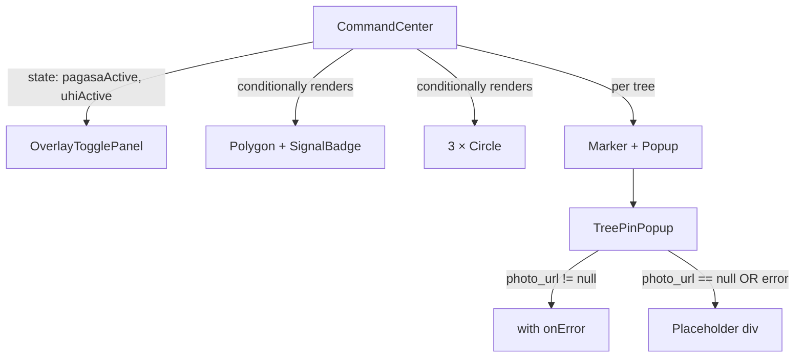

# Design Document: External Integrations

## Overview

This design covers Phase 8 of the Tree Inventory Web App — integrating external data sources into the existing Command Center map. Three capabilities are added:

1. **Cloudinary Image Rendering** — TreePinPopup renders the tree's `photo_url` as an `` with an `onError` fallback to a grey placeholder.
2. **PAGASA DRR Overlay** — A mock typhoon cone of probability rendered as a semi-transparent red `Polygon` plus a floating Signal Badge, toggled from the existing OverlayTogglePanel.
3. **Urban Heat Island (UHI) Overlay** — Three `Circle` components at hardcoded positions with heat-intensity colors, toggled independently.

All changes use existing dependencies only (`react-leaflet` Polygon/Circle, standard ``). The OverlayTogglePanel is refactored from internal state to controlled props so CommandCenter can conditionally mount/unmount overlay geometry.

## Architecture



**State flow:**

- `CommandCenter` owns two boolean states: `pagasaActive` (default `false`) and `uhiActive` (default `false`).
- `OverlayTogglePanel` becomes a **controlled component** — it receives `pagasaPressed`, `uhiPressed`, `onPagasaToggle`, and `onUhiToggle` as props.
- When `pagasaActive` is `true`, CommandCenter renders the `<Polygon>` and `<SignalBadge>`.
- When `uhiActive` is `true`, CommandCenter renders three `<Circle>` components.

## Components and Interfaces

### TreePinPopup (modified)

**Current behavior:** Renders `` when `photo_url` is non-null, placeholder `div` when null.

**Changes:**
1. Update `` classes from `"w-full h-28 object-cover rounded mb-2"` to `"object-cover w-full h-32 rounded-md mb-2"`.
2. Add local state `const [imgError, setImgError] = useState(false)`.
3. Attach `onError={() => setImgError(true)}` to the ``.
4. Render placeholder when `!photo_url || imgError`.
5. Update placeholder classes to match new height: `h-32 rounded-md` (instead of `h-28 rounded`).

```jsx
// Pseudocode for the photo block
const [imgError, setImgError] = useState(false);
const showImage = tree.photo_url && !imgError;

{showImage ? (
   setImgError(true)}
  />
) : (
  <div
    data-testid="tree-photo-placeholder"
    aria-label="No photo available"
    className="w-full h-32 rounded-md mb-2 bg-slate-200 flex items-center justify-center text-slate-500 text-xs"
  >
    No photo
  </div>
)}
```

### OverlayTogglePanel (refactored to controlled)

**Current interface:** No props — internal `useState` for both toggles.

**New interface:**

| Prop | Type | Description |
|------|------|-------------|
| `pagasaPressed` | `boolean` | Current pressed state for PAGASA toggle |
| `uhiPressed` | `boolean` | Current pressed state for UHI toggle |
| `onPagasaToggle` | `(next: boolean) => void` | Callback when PAGASA is toggled |
| `onUhiToggle` | `(next: boolean) => void` | Callback when UHI is toggled |

The component removes its internal `useState` calls and instead derives pressed state from props. The `console.log` side-effect is preserved inside the callbacks for backward compatibility with existing tests (the parent passes callbacks that include the log).

```jsx
export default function OverlayTogglePanel({
  pagasaPressed,
  uhiPressed,
  onPagasaToggle,
  onUhiToggle,
}) {
  return (
    <div className="absolute top-4 right-4 z-[500] flex flex-col gap-2">
      <OverlayButton
        label={PAGASA_LABEL}
        pressed={pagasaPressed}
        onClick={() => onPagasaToggle(!pagasaPressed)}
      />
      <OverlayButton
        label={UHI_LABEL}
        pressed={uhiPressed}
        onClick={() => onUhiToggle(!uhiPressed)}
      />
    </div>
  );
}
```

### CommandCenter (modified)

**New imports:**
```jsx
import { MapContainer, TileLayer, Marker, Popup, Polygon, Circle } from 'react-leaflet';
```

**New state:**
```jsx
const [pagasaActive, setPagasaActive] = useState(false);
const [uhiActive, setUhiActive] = useState(false);
```

**Toggle callbacks (include console.log for test compatibility):**
```jsx
const handlePagasaToggle = (next) => {
  setPagasaActive(next);
  console.log('Overlay toggle', { name: 'PAGASA DRR Overlay', pressed: next });
};
const handleUhiToggle = (next) => {
  setUhiActive(next);
  console.log('Overlay toggle', { name: 'Urban Heat Island Map', pressed: next });
};
```

**OverlayTogglePanel usage:**
```jsx
<OverlayTogglePanel
  pagasaPressed={pagasaActive}
  uhiPressed={uhiActive}
  onPagasaToggle={handlePagasaToggle}
  onUhiToggle={handleUhiToggle}
/>
```

**Conditional overlay rendering (inside MapContainer, after TileLayer + Markers):**
```jsx
{pagasaActive && (
  <Polygon
    positions={PAGASA_POLYGON_COORDS}
    pathOptions={{ color: 'red', fillColor: 'red', fillOpacity: 0.2, interactive: false }}
  />
)}
{uhiActive && UHI_CIRCLES.map((c) => (
  <Circle
    key={c.id}
    center={c.center}
    radius={c.radius}
    pathOptions={{ color: c.color, fillColor: c.color, fillOpacity: 0.35 }}
  />
))}
```

**Signal Badge (outside MapContainer, sibling to OverlayTogglePanel):**
```jsx
{pagasaActive && (
  <div
    data-testid="signal-badge"
    className="absolute top-4 left-4 z-[500] bg-red-600 text-white text-sm font-bold px-4 py-2 rounded-lg shadow-lg"
  >
    ⚠️ PAGASA SIGNAL NO. 2 ACTIVE
  </div>
)}
```

### PAGASA DRR Polygon Coordinates

A rectangular area covering the default viewport (centered on MAP_CENTER [14.281, 121.411] at zoom 14). The polygon spans approximately ±0.03° lat and ±0.04° lng:

```js
const PAGASA_POLYGON_COORDS = [
  [14.311, 121.371],  // NW corner
  [14.311, 121.451],  // NE corner
  [14.251, 121.451],  // SE corner
  [14.251, 121.371],  // SW corner
];
```

- Fill: red, opacity 0.2
- `interactive: false` ensures markers beneath remain clickable (Requirement 4.7)

### UHI Circle Definitions

Three circles at distinct positions within the municipality bounds, each representing a heat intensity level:

```js
const UHI_CIRCLES = [
  { id: 'uhi-high',     center: [14.285, 121.415], radius: 400, color: '#dc2626' },  // high heat (red)
  { id: 'uhi-moderate', center: [14.278, 121.405], radius: 550, color: '#f97316' },  // moderate (orange)
  { id: 'uhi-low',      center: [14.275, 121.420], radius: 700, color: '#eab308' },  // low heat (yellow)
];
```

- Radii range 400–700m (within the 300–800m requirement)
- Colors: Tailwind red-600, orange-500, yellow-500 hex equivalents
- Fill opacity: 0.35

## Data Models

No new database tables or Supabase schema changes. All data is hardcoded constants or derived from the existing `trees` table.

**Existing model used:** `Tree_Record` (Supabase `trees` table row) — specifically the `photo_url` field.

**New constants (module-level in CommandCenter.jsx):**

| Constant | Type | Purpose |
|----------|------|---------|
| `PAGASA_POLYGON_COORDS` | `number[][]` | Lat/lng pairs for the typhoon cone polygon |
| `UHI_CIRCLES` | `Array<{id, center, radius, color}>` | Circle definitions for heat island overlay |

## Correctness Properties

*A property is a characteristic or behavior that should hold true across all valid executions of a system — essentially, a formal statement about what the system should do. Properties serve as the bridge between human-readable specifications and machine-verifiable correctness guarantees.*

### Property 1: Image error fallback preserves popup integrity

*For any* Tree_Record with a non-null `photo_url`, when the rendered `` element fires an `error` event, the TreePinPopup SHALL replace the image with the grey placeholder (identified by `data-testid="tree-photo-placeholder"`) AND continue to display the tree identifier, species, dbh, and (if the pin color is Red) the Dispatch Arborist button without modification.

**Validates: Requirements 3.2, 3.4**

### Property 2: Controlled toggle callback correctness

*For any* sequence of clicks on the PAGASA and UHI toggle buttons within OverlayTogglePanel (when rendered as a controlled component), the `onPagasaToggle` callback SHALL be invoked with the negation of the current `pagasaPressed` prop each time the PAGASA button is clicked, and the `onUhiToggle` callback SHALL be invoked with the negation of the current `uhiPressed` prop each time the UHI button is clicked, with each callback invocation being independent of the other toggle's state.

**Validates: Requirements 6.1**

## Error Handling

### Image Load Failures (TreePinPopup)

- **Trigger:** The `` element's `error` event fires (broken URL, 404, network failure, CORS block).
- **Handling:** Local state `imgError` flips to `true`, causing a re-render that swaps the `` for the placeholder `div`.
- **Recovery:** None needed — the placeholder is the final state for that popup instance. If the user closes and re-opens the popup, a new component instance is mounted with `imgError = false`, retrying the image load.
- **No propagation:** The error is contained within the photo block; the rest of the popup (tree data, dispatch button) is unaffected.

### Supabase Fetch Errors (existing, unchanged)

- The existing error banner (`data-testid="map-error"`) continues to handle Supabase failures.
- Overlay toggles remain functional even when tree data fails to load.

### Invalid Overlay Data (defensive)

- `PAGASA_POLYGON_COORDS` and `UHI_CIRCLES` are hardcoded constants — no runtime validation needed.
- If react-leaflet receives invalid coordinates, it silently renders nothing (no crash).

## Testing Strategy

### Approach

The testing strategy uses a **dual approach**:
- **Property-based tests** (fast-check, 100+ iterations) for universal behaviors that vary with input.
- **Example-based tests** for specific interactions, static configurations, and UI state transitions.

### Property-Based Tests

Library: `fast-check` (already in devDependencies)
Configuration: Minimum 100 iterations per property test.

**Property 1 implementation:**
- Generator: `treeRecordArb` filtered to trees with non-null `photo_url`
- Steps: Render TreePinPopup → find `` → fire `error` event → assert placeholder appears, img is gone, tree_id/species/dbh still in text content, dispatch button present iff color is Red
- Tag: `Feature: external-integrations, Property 1: Image error fallback preserves popup integrity`

**Property 2 implementation:**
- Generator: `fc.array(fc.constantFrom('pagasa', 'uhi'), { maxLength: 20 })` for click sequences, plus `fc.record({ pagasaPressed: fc.boolean(), uhiPressed: fc.boolean() })` for initial state
- Steps: Render OverlayTogglePanel with controlled props and mock callbacks → replay click sequence → verify each callback was called with the correct negated value
- Tag: `Feature: external-integrations, Property 2: Controlled toggle callback correctness`

### Example-Based Tests

**TreePinPopup.test.jsx (new tests):**
1. Renders img with correct classes (`object-cover w-full h-32 rounded-md`) when photo_url is non-null
2. After img error event, placeholder appears with `data-testid="tree-photo-placeholder"`
3. Placeholder from error has same dimensions/classes as placeholder from null photo_url

**CommandCenter.test.jsx (new tests):**
1. Add `Polygon` and `Circle` to the react-leaflet mock (render `data-testid="polygon"` and `data-testid="circle"`)
2. Initial render: no polygon, no circle, no signal-badge
3. Click PAGASA toggle: polygon and signal-badge appear
4. Click PAGASA toggle again: polygon and signal-badge disappear
5. Click UHI toggle: exactly 3 circles appear
6. Click UHI toggle again: all circles disappear
7. Both toggles active simultaneously: polygon + badge + 3 circles all present
8. PAGASA polygon has `interactive: false` (via data attribute in mock)

**OverlayTogglePanel.test.jsx (updated tests):**
- Existing tests need updating to pass props instead of relying on internal state
- The property test for toggle parity (Property 7) is adapted to the controlled interface

### Test Infrastructure Changes

- `CommandCenter.test.jsx` mock block adds:
  ```jsx
  Polygon: ({ positions, pathOptions, children }) => (
    <div data-testid="polygon" data-positions={JSON.stringify(positions)} data-interactive={String(pathOptions?.interactive ?? true)}>
      {children}
    </div>
  ),
  Circle: ({ center, radius, pathOptions }) => (
    <div data-testid="circle" data-center={JSON.stringify(center)} data-radius={String(radius)} data-color={pathOptions?.fillColor} />
  ),
  ```

### Test Count Impact

- Existing baseline: 206 tests passing
- New tests added: ~12–15 (2 property tests + 10–13 example tests)
- Expected final count: ≥218 tests, zero failures, zero skipped

