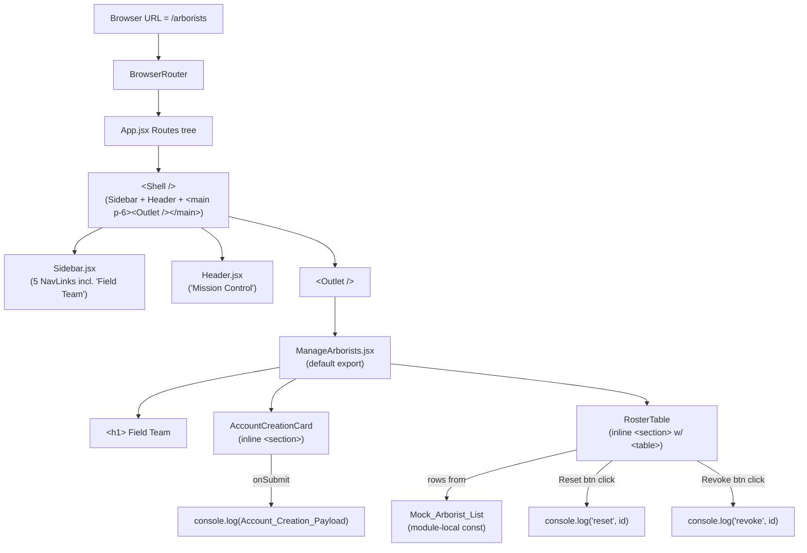
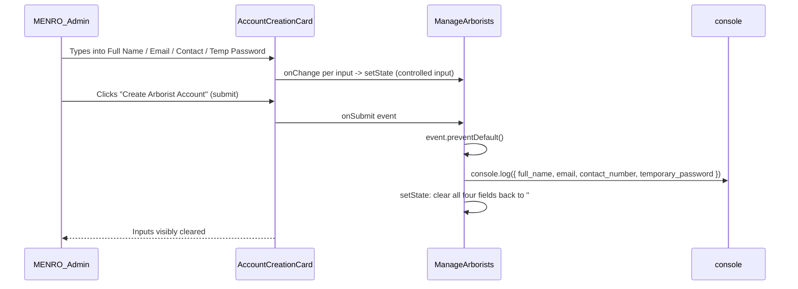
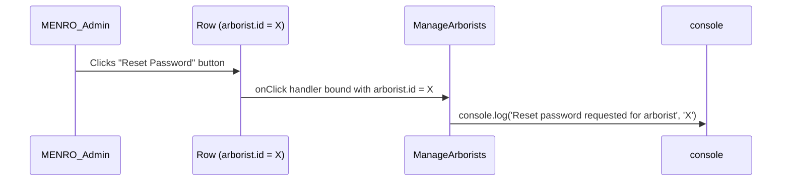

# Design Document

## Overview

Phase 3 — the Field_Team_Roster — adds the MENRO_Admin's "manage arborists" portal to the Mission Control Dashboard. It extends the App_Shell's navigation from four items to five, registers one new route (`/arborists`), and ships a single new page component (`src/pages/ManageArborists.jsx`) containing an Account_Creation_Form and a Roster_Table. See `.kiro/specs/field-team-roster/requirements.md` for the full acceptance-criteria catalogue.

Phase 3 is deliberately a UI-and-plumbing phase. Every backend-adjacent behaviour the page implies is explicitly stubbed at the client: the form's submit handler, the table's data source, and both per-row action buttons short-circuit to `console.log` instead of invoking Supabase. Three facts drive the stub posture:

1. **`supabase.auth.signUp` is the wrong tool for admin-led onboarding.** Calling it from the currently authenticated admin's browser signs *that admin* out of the dashboard and authenticates the browser as the newly-created arborist. A multi-arborist onboarding workflow is unusable against that behaviour. The correct replacement is a server-side admin creation path (Supabase service-role key, Edge Function, or equivalent) that a later phase will add. Phase 3 explicitly carries a source-level comment flagging this (Requirement 6.5).
2. **The real `arborists` table and `profiles` join strategy have not yet been designed.** Hardcoding a Mock_Arborist_List inside the page module lets the table markup, styling, and per-row action wiring land now, while a later phase swaps the data source for a Supabase query without restructuring the JSX.
3. **Password-reset and access-revocation are workflow questions, not UI questions.** Phase 3 ships the UI entry points so a later phase can wire them into whatever admin-side mechanism is chosen (Supabase admin API, email trigger, RLS-gated soft-delete, etc.) without further UI churn.

Phase 3 introduces no new runtime dependencies (Requirement 1.1). The `Users` icon is imported from the already-installed `lucide-react` package (Requirement 1.2). No new devDependencies are needed either — the existing Vitest + React Testing Library + jsdom stack covers everything below. Phase 3 also hard-commits to preserving the 89 passing tests across 11 files from the Phase 1 + Phase 2 baseline (Requirement 10.1).

### Design Decisions & Rationale

1. **Hardcode Mock_Arborist_List inside `ManageArborists.jsx`, not a separate module.** Phase 3 is a stub; a later phase will replace this with a Supabase fetch. Extracting the mock into `src/data/arborists.js` or similar would create an artificial seam that the real fetch replacement must then tear down. Keeping the array in-module makes the swap a single-file diff. This satisfies Requirement 7.2 and Requirement 7.4.

2. **Keep the Arborist_Record shape local to `ManageArborists.jsx`; do NOT add it to `src/types.js`.** Requirement 7.4 explicitly mandates this. `src/types.js` currently carries the Tree_Record schema (a real Supabase table) plus the `task_status` and `species_type` enums. Publishing an Arborist_Record type when no component outside the page consumes it, and when the real schema will be defined in a later phase, would commit the project to a guess. The page-local JSDoc `@typedef` is enough for Phase 3.

3. **Controlled inputs via `useState` per field, not uncontrolled refs.** Requirement 6.4 requires clearing all four inputs after submit. Controlled inputs make that a one-line state reset; uncontrolled refs would require imperative DOM manipulation that fights React's rendering model. Controlled inputs also make the eventual server-integration phase (loading/error states, server-validation echo) a natural extension.

4. **Source-level stub comment lives directly above the `handleSubmit` function.** Requirement 6.5 mandates an explicit comment identifying the handler as a Phase 3 stub. The comment names the root-cause constraint (`supabase.auth.signUp` would sign the admin out) and the replacement direction (a server-side admin account-creation call). Proposed comment text:

   > `// PHASE 3 STUB: This submit handler only console.logs the form payload.` <br/>
   > `// It intentionally does NOT call supabase.auth.signUp, because that client-side` <br/>
   > `// call signs the currently-authenticated MENRO_Admin out of the dashboard and` <br/>
   > `// authenticates the browser as the newly-created arborist instead — which is` <br/>
   > `// unacceptable for a multi-arborist onboarding workflow. A later phase MUST` <br/>
   > `// replace this with a server-side admin account-creation path (e.g., a Supabase` <br/>
   > `// Edge Function invoking supabase.auth.admin.createUser with the service-role key)` <br/>
   > `// that creates the arborist account without disturbing the admin's session.`

5. **No route-level padding suppression.** `src/App.jsx` currently special-cases `/map` to drop the shared `p-6` padding because the Leaflet map needs edge-to-edge real estate. The `/arborists` route has no such need; the Manage_Arborists_Page should render within the shared `p-6` container, matching Inventory, Action Board, and Analytics (Requirement 2.3, Requirement 11.2). The `Shell` component's existing `isMapRoute` predicate stays unchanged — the new route just falls through to the default branch.

6. **Extend `NAV_ITEMS` by INSERTING at index 3, not appending.** Requirement 3.4 pins the final order as `Command Center, Inventory, Action Board, Field Team, Analytics`. The Field Team entry must sit *between* Action Board (currently index 2) and Analytics (currently index 3), so the new entry is inserted at index 3 and Analytics shifts to index 4. Appending would place Field Team after Analytics and violate Requirement 3.4.

7. **Single page component; no child-component extraction for Phase 3.** The Account_Creation_Form and Roster_Table are tempting extraction targets, but both are <60 lines of JSX each and share no reusable surface with the rest of the dashboard. Keeping them inline inside `ManageArborists.jsx` keeps Phase 3 reviewable as a single file; a later phase can extract if and when the form or table is reused.

8. **Reset and Revoke buttons carry distinct visual treatments.** Requirement 9.7 requires the two actions be visually distinguishable. The design uses a neutral/outline treatment for Reset Password (safe, reversible) and a red/destructive-accent treatment for Revoke Access (high-consequence, admin-intent). Concrete class strings are given in the Components section below; the important contract is that the classes differ so a reviewer can tell the two apart at a glance.

9. **Status cell renders as a coloured pill/chip, not raw text.** Requirement 8.6 requires the exact strings `Active` and `Offline` to be rendered in the Status cell. This design wraps those strings in a styled `<span>` with colour variants (green tint for `Active`, slate tint for `Offline`) so the cell reads at a glance. The exact string remains inside the span for Requirement 8.6 compliance; the span's background/text colours are the visual polish required by Requirement 8.8 and Requirement 11.1.

10. **Use `fireEvent.change` (not `user-event`) in tests.** React Testing Library's `user-event` package is not installed, and Requirement 1.1 prohibits adding it. `fireEvent.change(input, { target: { value: '...' } })` is sufficient for controlled inputs and is already the pattern used elsewhere in the existing test suite.

## Architecture

### High-Level Structure



The diagram makes three claims the implementation must preserve:
- The Manage_Arborists_Page is the *only* new consumer of `<Outlet />`; the existing four routes are unchanged.
- Mock_Arborist_List is module-local inside `ManageArborists.jsx` (Requirement 7.4).
- All three "backend" arrows — form submit, reset button, revoke button — terminate at `console.log`, not at Supabase (Requirement 6.3, Requirement 9.6, Requirement 12.1–12.4).

### Module / File Layout (Phase 3 delta only)

Phase 3 changes two existing files and adds one new file. Every other file from Phase 1 + Phase 2 is untouched.

```
src/
├── App.jsx                        # CHANGED: add one <Route path="arborists" ... />
├── components/
│   └── Sidebar.jsx                # CHANGED: add Users import, insert Field_Team_Nav_Entry at index 3
└── pages/
    └── ManageArborists.jsx        # NEW: page component for /arborists
```

Test-file delta:

```
src/
├── App.test.jsx                   # UNCHANGED in substance (see analysis below)
├── components/
│   └── Sidebar.test.jsx           # CHANGED: 4→5, add Field Team expectation, preserve order
└── pages/
    └── ManageArborists.test.jsx   # NEW: component tests for the page
```

**Does `src/App.test.jsx` need to change?** Reading the current file shows it asserts `expect(screen.getByRole('navigation')).toBeInTheDocument()` — this queries for the `<nav>` existence, not the count of links inside it. It does not call `getAllByRole('link')` or `toHaveLength` against navigation links anywhere. Therefore Requirement 10.3 is vacuously satisfied for `App.test.jsx`: no link-counting assertion exists to update. The file stays as-is; the 5-link contract is enforced by `Sidebar.test.jsx` alone. (Requirement 10.1 still requires `App.test.jsx` to keep passing.)

### Runtime Composition

Form submit sequence:



Row action sequence (Reset Password; Revoke Access is symmetric):



The handlers are synchronous, do not touch state, do not call Supabase, and do not await anything (Requirement 9.4–9.6).

## Components and Interfaces

### `src/components/Sidebar.jsx` (CHANGED — Requirement 3)

**Current state** (reading `src/components/Sidebar.jsx`): four-entry `NAV_ITEMS` array; imports `Map`, `TreePine`, `ClipboardList`, `BarChart3` from `lucide-react`.

**Phase 3 change, as a targeted diff:**

1. Add `Users` to the `lucide-react` import (Requirement 3.1).
2. Insert the Field_Team_Nav_Entry at array index 3 (between `/action-board` and `/analytics`) (Requirement 3.2, 3.3, 3.4).

```diff
- import { Map, TreePine, ClipboardList, BarChart3 } from 'lucide-react';
+ import { Map, TreePine, ClipboardList, Users, BarChart3 } from 'lucide-react';

  export const NAV_ITEMS = [
    { to: '/map', label: 'Command Center', Icon: Map },
    { to: '/inventory', label: 'Inventory', Icon: TreePine },
    { to: '/action-board', label: 'Action Board', Icon: ClipboardList },
+   { to: '/arborists', label: 'Field Team', Icon: Users },
    { to: '/analytics', label: 'Analytics', Icon: BarChart3 },
  ];
```

The `Sidebar` function body — the `.map(...)` that renders one `NavLink` per entry — does not change. Because the rendering is data-driven, adding one entry to the array automatically yields a fifth `NavLink` with the same active/inactive styling applied to the existing four (Requirement 3.5).

### `src/App.jsx` (CHANGED — Requirement 2)

**Current state** (reading `src/App.jsx`): a `Shell` layout route wraps five inner routes (`index` redirect, `map`, `inventory`, `action-board`, `analytics`, and `*` not-found). The `Shell` uses `useLocation()` to strip `p-6` padding on `/map` and keep it everywhere else.

**Phase 3 change, as a targeted diff:**

1. Import `ManageArborists`.
2. Register one new child route at `path="arborists"` between the existing `action-board` and `analytics` routes (ordering is not semantically required by react-router-dom, but inserting between them matches the Sidebar ordering and aids readability).

```diff
  import AnalyticsView from './pages/AnalyticsView.jsx';
+ import ManageArborists from './pages/ManageArborists.jsx';
  import NotFound from './pages/NotFound.jsx';

  ...

      <Route element={<Shell />}>
        <Route index element={<Navigate to="/map" replace />} />
        <Route path="map" element={<CommandCenter />} />
        <Route path="inventory" element={<InventoryView />} />
        <Route path="action-board" element={<ActionBoard />} />
+       <Route path="arborists" element={<ManageArborists />} />
        <Route path="analytics" element={<AnalyticsView />} />
        <Route path="*" element={<NotFound />} />
      </Route>
```

The `Shell` component is untouched. Because the `isMapRoute` predicate only removes padding on `/map`, the `/arborists` route inherits the shared `p-6` padding (Requirement 2.3, Requirement 11.2). The Sidebar and Header remain visible because the route is nested inside the `Shell` layout route (Requirement 2.4).

### `src/pages/ManageArborists.jsx` (NEW — Requirements 4–9, 11)

Responsibility: render the Field_Team_Roster page — heading, Account_Creation_Form card, and Roster_Table. No child components are extracted; everything lives in this file.

Public contract:
- Default export: `ManageArborists` function component taking no props.
- Uses `useState` four times — one per form field — for controlled inputs.
- Declares a module-local `MOCK_ARBORIST_LIST` constant (not exported) satisfying Requirement 7.2 and 7.3.
- Carries the source-level stub comment from Design Decision #4 directly above `handleSubmit`.
- Does not import `supabaseClient.js` (Requirement 1.3, Requirement 6.3, Requirement 7.5).

**Full file sketch:**

```jsx
// src/pages/ManageArborists.jsx
import { useState } from 'react';

/**
 * Phase-3-local arborist record shape. Intentionally NOT exported from
 * src/types.js — see design Decision #2. A later phase will replace this
 * JSDoc with a real Supabase-row-backed type.
 *
 * @typedef {Object} ArboristRecord
 * @property {string} id
 * @property {string} full_name
 * @property {string} email
 * @property {string} contact_number
 * @property {('Active'|'Offline')} status
 */

/** @type {ArboristRecord[]} */
const MOCK_ARBORIST_LIST = [
  { id: 'arb-001', full_name: 'Maria Santos',    email: 'maria.santos@menro.local',    contact_number: '+63 917 555 0142', status: 'Active'  },
  { id: 'arb-002', full_name: 'Juan Dela Cruz',  email: 'juan.delacruz@menro.local',   contact_number: '+63 917 555 0188', status: 'Offline' },
  { id: 'arb-003', full_name: 'Liza Reyes',      email: 'liza.reyes@menro.local',      contact_number: '+63 917 555 0203', status: 'Active'  },
];

export default function ManageArborists() {
  const [fullName, setFullName] = useState('');
  const [email, setEmail] = useState('');
  const [contactNumber, setContactNumber] = useState('');
  const [temporaryPassword, setTemporaryPassword] = useState('');

  // PHASE 3 STUB: This submit handler only console.logs the form payload.
  // It intentionally does NOT call supabase.auth.signUp, because that client-side
  // call signs the currently-authenticated MENRO_Admin out of the dashboard and
  // authenticates the browser as the newly-created arborist instead — which is
  // unacceptable for a multi-arborist onboarding workflow. A later phase MUST
  // replace this with a server-side admin account-creation path (e.g., a Supabase
  // Edge Function invoking supabase.auth.admin.createUser with the service-role key)
  // that creates the arborist account without disturbing the admin's session.
  function handleSubmit(event) {
    event.preventDefault();
    const payload = {
      full_name: fullName,
      email,
      contact_number: contactNumber,
      temporary_password: temporaryPassword,
    };
    console.log(payload);
    setFullName('');
    setEmail('');
    setContactNumber('');
    setTemporaryPassword('');
  }

  function handleResetPassword(arboristId) {
    // PHASE 3 STUB: real password-reset workflow lands in a later phase.
    console.log('Reset password requested for arborist', arboristId);
  }

  function handleRevokeAccess(arboristId) {
    // PHASE 3 STUB: real access-revocation workflow lands in a later phase.
    console.log('Revoke access requested for arborist', arboristId);
  }

  return (
    <section>
      <h1 className="text-2xl font-semibold text-slate-900">Field Team</h1>
      <p className="mt-2 text-slate-600">
        Onboard new arborists and manage existing field team access.
      </p>

      {/* Account_Creation_Form — card-style container */}
      <section className="mt-6 bg-white rounded-lg shadow-sm border border-slate-200 p-6">
        <h2 className="text-lg font-semibold text-slate-900">Create Arborist Account</h2>
        <form className="mt-4 grid grid-cols-1 md:grid-cols-2 gap-4" onSubmit={handleSubmit}>
          <label className="block">
            <span className="text-sm font-medium text-slate-700">Full Name</span>
            <input
              type="text"
              value={fullName}
              onChange={(e) => setFullName(e.target.value)}
              className="mt-1 block w-full rounded border border-slate-300 px-3 py-2 focus:border-slate-500 focus:outline-none"
            />
          </label>
          <label className="block">
            <span className="text-sm font-medium text-slate-700">Email Address</span>
            <input
              type="email"
              value={email}
              onChange={(e) => setEmail(e.target.value)}
              className="mt-1 block w-full rounded border border-slate-300 px-3 py-2 focus:border-slate-500 focus:outline-none"
            />
          </label>
          <label className="block">
            <span className="text-sm font-medium text-slate-700">Contact Number</span>
            <input
              type="text"
              value={contactNumber}
              onChange={(e) => setContactNumber(e.target.value)}
              className="mt-1 block w-full rounded border border-slate-300 px-3 py-2 focus:border-slate-500 focus:outline-none"
            />
          </label>
          <label className="block">
            <span className="text-sm font-medium text-slate-700">Temporary Password</span>
            <input
              type="password"
              value={temporaryPassword}
              onChange={(e) => setTemporaryPassword(e.target.value)}
              className="mt-1 block w-full rounded border border-slate-300 px-3 py-2 focus:border-slate-500 focus:outline-none"
            />
          </label>
          <div className="md:col-span-2">
            <button
              type="submit"
              className="inline-flex items-center rounded bg-slate-900 px-4 py-2 text-sm font-medium text-white hover:bg-slate-800"
            >
              Create Arborist Account
            </button>
          </div>
        </form>
      </section>

      {/* Roster_Table */}
      <section className="mt-6 bg-white rounded-lg shadow-sm border border-slate-200 overflow-hidden">
        <table className="min-w-full divide-y divide-slate-200">
          <thead className="bg-slate-50">
            <tr>
              <th scope="col" className="px-4 py-3 text-left text-xs font-semibold uppercase tracking-wide text-slate-600">Name</th>
              <th scope="col" className="px-4 py-3 text-left text-xs font-semibold uppercase tracking-wide text-slate-600">Email</th>
              <th scope="col" className="px-4 py-3 text-left text-xs font-semibold uppercase tracking-wide text-slate-600">Contact Number</th>
              <th scope="col" className="px-4 py-3 text-left text-xs font-semibold uppercase tracking-wide text-slate-600">Status</th>
              <th scope="col" className="px-4 py-3 text-left text-xs font-semibold uppercase tracking-wide text-slate-600">Actions</th>
            </tr>
          </thead>
          <tbody className="divide-y divide-slate-200">
            {MOCK_ARBORIST_LIST.map((arborist) => (
              <tr key={arborist.id}>
                <td className="px-4 py-3 text-sm text-slate-900">{arborist.full_name}</td>
                <td className="px-4 py-3 text-sm text-slate-700">{arborist.email}</td>
                <td className="px-4 py-3 text-sm text-slate-700">{arborist.contact_number}</td>
                <td className="px-4 py-3 text-sm">
                  <span
                    className={
                      arborist.status === 'Active'
                        ? 'inline-flex items-center rounded-full bg-emerald-50 px-2 py-0.5 text-xs font-medium text-emerald-700'
                        : 'inline-flex items-center rounded-full bg-slate-100 px-2 py-0.5 text-xs font-medium text-slate-600'
                    }
                  >
                    {arborist.status}
                  </span>
                </td>
                <td className="px-4 py-3 text-sm">
                  <div className="flex gap-2">
                    <button
                      type="button"
                      onClick={() => handleResetPassword(arborist.id)}
                      className="inline-flex items-center rounded border border-slate-300 bg-white px-3 py-1.5 text-xs font-medium text-slate-700 hover:bg-slate-50"
                    >
                      Reset Password
                    </button>
                    <button
                      type="button"
                      onClick={() => handleRevokeAccess(arborist.id)}
                      className="inline-flex items-center rounded bg-red-600 px-3 py-1.5 text-xs font-medium text-white hover:bg-red-700"
                    >
                      Revoke Access
                    </button>
                  </div>
                </td>
              </tr>
            ))}
          </tbody>
        </table>
      </section>
    </section>
  );
}
```

Requirement traceability for the sketch:

| Requirement | Location in sketch |
|---|---|
| 4.1 — file at `src/pages/ManageArborists.jsx` default-exports page | top-level `export default function ManageArborists` |
| 4.2 — top-level heading names the feature | `<h1>Field Team</h1>` |
| 4.3, 4.4 — form above table, table below form, each in its own section | two sibling `<section>` blocks inside the page section |
| 5.1–5.4 — labeled inputs with correct types | four `<label><span>...<input type=...></label>` groups |
| 5.5 — submit button text exactly `Create Arborist Account` | `<button type="submit">Create Arborist Account</button>` |
| 5.6 — card-style container | `bg-white rounded-lg shadow-sm border border-slate-200 p-6` wrapper |
| 5.7 — labels associated with inputs for accessible-name lookup | `<label>` wraps `<span>` label text + `<input>` child (native label-wraps-control association) |
| 6.1 — `preventDefault` on submit | `event.preventDefault()` in `handleSubmit` |
| 6.2 — `console.log` once with payload | single `console.log(payload)` call |
| 6.3 — no Supabase call | file has no `supabaseClient` import |
| 6.4 — clear all four inputs after submit | four `setXxx('')` calls at the end of `handleSubmit` |
| 6.5 — source-level stub comment | multi-line comment directly above `handleSubmit` |
| 7.1 — Arborist_Record shape | JSDoc `@typedef {Object} ArboristRecord` with all five fields and `status` union |
| 7.2, 7.3 — Mock_Arborist_List with 2–3 records, distinct `id`, at least one Active and one Offline | three-entry `MOCK_ARBORIST_LIST` with `arb-001/002/003`, statuses Active/Offline/Active |
| 7.4 — shape local to module, not in `src/types.js` | `@typedef` lives in this file; no edit to `src/types.js` |
| 8.1 — exactly five column headers in order | `<thead>` has five `<th>` in the exact order |
| 8.2–8.6 — one body row per record with correct cells | `MOCK_ARBORIST_LIST.map(...)` renders `<tr>` with five `<td>` each |
| 8.7 — stable React key from `id` | `<tr key={arborist.id}>` |
| 8.8 — Tailwind table styling | `divide-y`, `bg-slate-50`, `rounded-lg`, `shadow-sm`, `border` |
| 9.1 — both buttons in every Actions cell | `<button>Reset Password</button>` and `<button>Revoke Access</button>` inside each row's last `<td>` |
| 9.2, 9.3 — visible button text | literal text nodes `Reset Password` and `Revoke Access` |
| 9.4 — Reset button `console.log`s once including the row's `id` | `handleResetPassword(arborist.id)` → `console.log('Reset password requested for arborist', arborist.id)` |
| 9.5 — Revoke button `console.log`s once including the row's `id` | symmetric `handleRevokeAccess` |
| 9.6 — no Supabase call, no real workflow | stub comments, no imports |
| 9.7 — visually distinguishable | outline/neutral Reset vs red/solid Revoke |
| 11.1 — coherent enterprise aesthetic | consistent Tailwind utilities across heading, card, table, buttons |
| 11.2 — content inside App_Shell's `p-6` | `App.jsx` `Shell` retains its default `p-6` branch for non-map routes |

## Data Models

Phase 3 defines one local type and one local constant. Neither is exported from the module.

### Arborist_Record (local JSDoc `@typedef` in `ManageArborists.jsx`)

| Field            | Type                       | Nullable | Notes                                                                 |
|------------------|----------------------------|----------|-----------------------------------------------------------------------|
| `id`             | string                     | no       | Distinct per record; used as React `key` on the body `<tr>`.          |
| `full_name`      | string                     | no       | Rendered in the Name cell.                                            |
| `email`          | string                     | no       | Rendered in the Email cell.                                           |
| `contact_number` | string                     | no       | Rendered in the Contact Number cell.                                  |
| `status`         | `'Active'` \| `'Offline'`  | no       | Exact string union; rendered inside a coloured pill in the Status cell. |

The `status` field is a two-valued union. There is no `ARBORIST_STATUS` enum constant in `src/types.js` — the union is inlined in the page-local JSDoc per Requirement 7.4.

### Account_Creation_Payload (assembled inline inside `handleSubmit`)

| Field                 | Type   | Source                                              |
|-----------------------|--------|-----------------------------------------------------|
| `full_name`           | string | `fullName` state (Full Name input)                  |
| `email`               | string | `email` state (Email Address input)                 |
| `contact_number`      | string | `contactNumber` state (Contact Number input)        |
| `temporary_password`  | string | `temporaryPassword` state (Temporary Password input)|

The payload field names use the snake_case convention already established by Tree_Record in `src/types.js`. This keeps a single naming convention across the codebase so the later server-side replacement can forward the payload to Supabase without rekeying.

### Mock_Arborist_List (concrete Phase 3 contents)

Three records, three distinct `id`s, status mix of two `Active` + one `Offline` (satisfies Requirement 7.2's "between 2 and 3" and Requirement 7.3's "at least one Active and at least one Offline"):

| `id`      | `full_name`       | `email`                         | `contact_number`      | `status`  |
|-----------|-------------------|----------------------------------|-----------------------|-----------|
| `arb-001` | Maria Santos      | maria.santos@menro.local         | +63 917 555 0142      | `Active`  |
| `arb-002` | Juan Dela Cruz    | juan.delacruz@menro.local        | +63 917 555 0188      | `Offline` |
| `arb-003` | Liza Reyes        | liza.reyes@menro.local           | +63 917 555 0203      | `Active`  |

The `@menro.local` domain is deliberately non-routable so tests and demo screenshots do not accidentally target a real mailbox. The `+63` country code matches the MENRO context established in prior phases.

## Correctness Properties

### PBT applicability assessment

Property-based testing is **not appropriate** for Phase 3. See `.kiro/specs/field-team-roster/requirements.md` for the full acceptance-criteria set; here is the per-surface breakdown that drives the conclusion:

1. **Account_Creation_Form submit handler.** The handler is a pure function over its four state variables: it reads four strings, builds one payload object, calls `console.log` once, then clears the four strings back to `''`. The behaviour does not vary meaningfully with input — the payload object's field values are just passed through. There is no universal "for all" property here that example-based tests with a handful of representative strings would not already cover. Requirement 6 is fully specified by two or three concrete examples.

2. **Roster_Table rendering.** The table is a pure `.map()` over a compile-time-constant array of three records. The input space is a single value. There is no universe of inputs to quantify over. A snapshot-style example test against the rendered cells is the correct tool.

3. **Row action handlers.** `handleResetPassword` and `handleRevokeAccess` are one-line `console.log` wrappers. Testing them with 100 generated IDs would find zero bugs that three concrete IDs (one per Mock_Arborist_List row) would not also find.

4. **Sidebar `NAV_ITEMS` ordering.** The array is a module-scope constant of length 5 with fixed contents. Properties of a constant are not properties at all — they are assertions.

5. **Route registration.** `/arborists` either resolves to `ManageArborists` or it does not. One example test covers it.

No acceptance criterion in Requirement 1 through Requirement 12 describes behaviour that varies meaningfully across a large input space, nor any behaviour where 100 iterations would find bugs that 2–3 representative examples would miss. Phase 3 is UI plumbing over static data with stubbed side effects — the archetypal case where the workflow guidance calls for example-based tests, not property tests.

Consequently this design document **omits a detailed Correctness Properties catalogue**. When a later phase replaces the stubs with real Supabase-backed logic (server-side account creation, roster filter/search, status derivation from activity timestamps, etc.), that phase SHOULD revisit PBT applicability — status derivation from an activity timestamp, in particular, is a natural fit for property tests.

## Error Handling

Phase 3 is stubs-only, so the error surface is deliberately minimal.

### 1. Empty or whitespace-only form submission

Trigger: The MENRO_Admin clicks `Create Arborist Account` with one or more fields empty (or containing only whitespace).

Handling: Phase 3 intentionally performs **no client-side validation**. `handleSubmit` runs unconditionally — it `console.log`s whatever payload the state currently holds (possibly with empty strings) and clears the inputs. Requirements 6.1–6.5 do not require validation, and Requirement 12.1 expressly bars Phase 3 from implementing real account-creation logic that validation would feed into. A later phase that introduces the server-side admin creation path SHOULD add client-side validation (required fields, email format, minimum password length) alongside the real submit. This design explicitly defers that work.

Test coverage: `ManageArborists.test.jsx` asserts the happy-path behaviour (submitting with all four fields populated). It does not assert validation behaviour because there is none to assert.

### 2. Authentication errors

Trigger: n/a. Phase 3 makes no auth calls (Requirement 6.3, Requirement 12.1).

Handling: nothing to handle. Deferred.

### 3. Network errors

Trigger: n/a. Phase 3 makes no network calls (Requirement 1.3, Requirement 7.5, Requirement 12.2).

Handling: nothing to handle. Deferred.

### 4. React key-collision warnings

Trigger: Two `<tr>` elements share the same React `key` prop.

Handling prevented by design: Requirement 7.2 mandates distinct `id` values across Mock_Arborist_List, and Requirement 8.7 mandates deriving each row's key from `id`. The Mock_Arborist_List in the Data Models section uses `arb-001`, `arb-002`, `arb-003` — three distinct ids — so React never emits a key warning. Tests that spy on `console.log` (see Testing Strategy) will incidentally surface any regression here because React key warnings go to `console.error`, not `console.log`; to catch that specifically, one test additionally spies on `console.error` and asserts it is not called during the initial render.

### 5. Missing `Users` icon export

Trigger: `lucide-react` does not export a `Users` component.

Handling: This is a compile/import error that surfaces immediately in `npm test` or `npm run dev`. `lucide-react@^0.445.0` (already pinned in `package.json`) does export `Users`, so this is a non-risk — flagged only so the test plan explicitly imports `Users` from `lucide-react` as a smoke check.

## Testing Strategy

### Stack

- **Vitest** + **@testing-library/react** + **@testing-library/jest-dom** + **jsdom** — already installed and configured. No new devDependencies.
- Interaction driver: **`fireEvent`** from `@testing-library/react`. `user-event` is not installed and Requirement 1.1 prohibits adding it.
- Router driver: **`MemoryRouter`** from `react-router-dom`, same pattern as `App.test.jsx` and `Sidebar.test.jsx`.

### Testing approach

Phase 3 uses example-based tests exclusively. See the PBT applicability assessment in the Correctness Properties section above for the justification.

Each test below references the acceptance criterion it validates. All test files sit beside their production counterparts (`*.test.jsx` next to `*.jsx`).

### Spying on `console.log` cleanly (Requirement 10.7)

The Phase 3 suite spies on `console.log` in multiple tests. To avoid cross-test pollution:

```js
let logSpy;
beforeEach(() => {
  logSpy = vi.spyOn(console, 'log').mockImplementation(() => {});
});
afterEach(() => {
  logSpy.mockRestore();
});
```

`mockImplementation(() => {})` silences the log so it does not clutter test output. `mockRestore()` in `afterEach` reinstates the original `console.log` so subsequent tests see a clean `console` object. The `logSpy` variable is scoped to the `describe` block so individual `it` blocks use `logSpy` directly inside their assertions.

### Updates to existing test files

#### `src/components/Sidebar.test.jsx` (CHANGED — Requirement 10.2, 10.4)

The current file pins four items via a module-scope `EXPECTED_ITEMS` array and asserts `NAV_ITEMS.toHaveLength(4)`, `getAllByRole('link').toHaveLength(4)`, and a `describe.each(EXPECTED_ITEMS)` that iterates the four routes to check active-state highlighting. Phase 3 changes:

1. Grow `EXPECTED_ITEMS` to five entries, inserting `{ to: '/arborists', label: 'Field Team' }` at index 3 — between Action Board and Analytics.
2. Update the length assertions from `4` to `5`.
3. Add a dedicated assertion (satisfying Requirement 10.4 explicitly) that `NAV_ITEMS[3]` is `{ to: '/arborists', label: 'Field Team', ... }` and `NAV_ITEMS[4].to === '/analytics'`.
4. The existing active-state `describe.each` loop automatically picks up the new fifth route because it iterates `EXPECTED_ITEMS`.
5. The existing "icon + label" loop likewise grows to five cases automatically.
6. The `ShimSidebar` re-export assertion at the bottom is unchanged.

#### `src/App.test.jsx` (UNCHANGED — Requirement 10.1, 10.3 by vacuous satisfaction)

The current `App.test.jsx` asserts `screen.getByRole('navigation')` (single-node existence) and does not call `getAllByRole('link')` anywhere. Requirement 10.3 says "update any App routing test that previously counted navigation links" — there is no such test to update. The file stays bit-identical and continues to pass. A new `/arborists` round-trip test lives in `ManageArborists.test.jsx` (below), not in `App.test.jsx`.

This reading has been verified against the current file contents; no edit to `App.test.jsx` is required by Phase 3.

### New test file: `src/pages/ManageArborists.test.jsx`

Structured as one `describe('ManageArborists', ...)` block containing several nested `describe` blocks plus top-level `beforeEach`/`afterEach` for the `console.log` spy lifecycle.

**Test plan** (each test names the acceptance criteria it validates):

1. **Routing round-trip** — *Validates 2.1, 2.2, 2.4, 10.5, 11.2.*
   Render `<App />` inside `<MemoryRouter initialEntries={['/arborists']}>`; assert the `Field Team` `<h1>` is present; assert `screen.getByRole('navigation')` (Sidebar) and `screen.getByRole('banner')` (Header) are both present. As a byproduct, assert the `<main>` element's className contains `p-6` to confirm Requirement 11.2 and 2.3.

2. **Page heading and structure** — *Validates 4.2, 4.3, 4.4.*
   Render `<ManageArborists />` directly (no Router needed; the component doesn't use routing hooks). Assert a level-1 heading named `Field Team`; assert a level-2 heading `Create Arborist Account` appears in the document *before* the `<table>` in DOM order (checked via `compareDocumentPosition` or `getAllByRole` index comparison).

3. **Account_Creation_Form inputs are present and labeled** — *Validates 5.1, 5.2, 5.3, 5.4, 5.7.*
   Render `<ManageArborists />`. Use `getByLabelText('Full Name')`, `getByLabelText('Email Address')`, `getByLabelText('Contact Number')`, `getByLabelText('Temporary Password')`. Assert each returned node is an `<input>` and that the email input's `type` attribute is `email` and the password input's `type` attribute is `password`.

4. **Submit button has exact label** — *Validates 5.5.*
   Render `<ManageArborists />`. Assert `getByRole('button', { name: 'Create Arborist Account' })` is present.

5. **Form inputs are controlled and update on change** — *Supports 6.2, 6.4.*
   Render `<ManageArborists />`. Fire `change` events into each input with distinct values and assert the input's `.value` reflects the new value after each change. This confirms the controlled-input wiring before the submit test depends on it.

6. **Submit calls `console.log` once with the full payload AND clears all four inputs** — *Validates 6.1, 6.2, 6.4.*
   Render `<ManageArborists />`. Populate each input with a distinct value via `fireEvent.change`. Click the `Create Arborist Account` button. Assert `logSpy` was called exactly once with `{ full_name: 'Maria', email: 'maria@x.test', contact_number: '+63000', temporary_password: 'secret' }`. Assert the four inputs all have `.value === ''` after submission. Assert the form's `submit` event did not cause navigation (verified implicitly by `preventDefault` — the test still sees the same `<form>` node afterwards).

7. **Submit handler does not import or invoke Supabase** — *Validates 1.3, 6.3, 7.5, 9.6, 12.1, 12.2.*
   Two-part check: (a) `vi.mock('../supabaseClient.js', () => { throw new Error('Supabase must not be imported by ManageArborists'); })` at the top of the file; the test file's subsequent imports of `ManageArborists` will fail loudly if the page module imports Supabase. (b) Within the submit test, additionally spy on the `supabase` client as defense-in-depth by asserting `logSpy` was called but no `fetch` / no network side effect occurred (the spy-on-import-throw is the primary guard; the in-test assertion is redundant and may be omitted).

8. **Roster_Table renders five column headers in exact order** — *Validates 8.1.*
   Render `<ManageArborists />`. Assert `getAllByRole('columnheader').map(th => th.textContent)` equals `['Name', 'Email', 'Contact Number', 'Status', 'Actions']`.

9. **Roster_Table renders one body row per Mock_Arborist_List entry with populated cells** — *Validates 7.2, 7.3, 8.2, 8.3, 8.4, 8.5, 8.6.*
   Render `<ManageArborists />`. Assert `screen.getAllByRole('row')` has length 4 (one header row + three body rows). For each of the three known mock records, assert their `full_name`, `email`, `contact_number`, and `status` strings are all present in the rendered document. Assert at least one row renders the string `Active` and at least one row renders the string `Offline`.

10. **Roster_Table rows use stable keys** — *Validates 8.7.*
    Render `<ManageArborists />`; capture `console.error` via `vi.spyOn(console, 'error')`; assert `console.error` was not called with any message containing `'key'` during the render. (React emits key warnings through `console.error`.)

11. **Reset Password button presence and click behaviour** — *Validates 9.1, 9.2, 9.4.*
    Render `<ManageArborists />`. Assert `getAllByRole('button', { name: 'Reset Password' })` has length 3 (one per row). Click the first Reset Password button; assert `logSpy` was called exactly once and the call's arguments include the string `'arb-001'` (the first mock row's `id`). Restore the spy via the `afterEach` hook so the next test starts clean.

12. **Revoke Access button presence and click behaviour** — *Validates 9.1, 9.3, 9.5.*
    Symmetric to test 11. Click the second Revoke Access button; assert `logSpy` was called once and the call's arguments include the string `'arb-002'`.

13. **Reset and Revoke buttons are visually distinguishable** — *Validates 9.7.*
    Render `<ManageArborists />`. Get the first Reset Password button and the first Revoke Access button. Assert their `className` attributes are not equal to each other. (The design uses `border border-slate-300 bg-white` for Reset vs `bg-red-600` for Revoke; a non-equality assertion is robust to class-string tweaks.)

14. **Users icon import smoke check** — *Validates 1.2, 3.1.*
    Covered indirectly by test 1 (routing round-trip) because the Sidebar mounts and renders the `Users` icon as an SVG inside the Field Team link; if `Users` were not exported by `lucide-react`, the Sidebar module would fail to load and the routing test would explode. No dedicated test needed.

### Test coverage matrix (requirements → tests)

| Requirement | Covered by test(s) |
|---|---|
| 1.1 (no new deps) | Static — verified by `package.json` review |
| 1.2 (Users from lucide-react) | 14 (indirect via test 1) |
| 1.3 (no Supabase import) | 7 |
| 2.1 (route registered) | 1 |
| 2.2 (route renders page) | 1 |
| 2.3 (shared `p-6` applied) | 1 |
| 2.4 (Sidebar + Header visible) | 1 |
| 3.1 (Users imported in Sidebar.jsx) | Sidebar.test.jsx length + order assertions |
| 3.2, 3.3, 3.4 | Sidebar.test.jsx (updated) |
| 3.5 (same NavLink styling) | Sidebar.test.jsx existing active-state `describe.each` (auto-expanded) |
| 4.1 (page file exists) | 1 (import succeeds) |
| 4.2 (top-level heading) | 1, 2 |
| 4.3, 4.4 (form above, table below) | 2 |
| 5.1–5.4 (labeled inputs w/ types) | 3 |
| 5.5 (exact submit button text) | 4 |
| 5.6 (card styling) | Visually verified; enforced by DOM structure in tests 3, 6 |
| 5.7 (label → input association) | 3 (via `getByLabelText`) |
| 6.1 (preventDefault) | 6 (no navigation occurs) |
| 6.2 (console.log once with payload) | 6 |
| 6.3 (no Supabase call) | 7 |
| 6.4 (inputs cleared) | 6 |
| 6.5 (source-level stub comment) | Code-review enforced; comment is part of the production file |
| 7.1 (Arborist_Record shape) | 9 (field values render correctly) |
| 7.2, 7.3 (Mock_Arborist_List shape, status mix) | 9 |
| 7.4 (shape local, not in types.js) | Enforced by `src/types.js` being untouched; verified by the preserved `types.test.js` suite |
| 7.5 (no Supabase read) | 7 |
| 8.1 (five column headers in order) | 8 |
| 8.2–8.6 (body rows with correct cells) | 9 |
| 8.7 (stable React keys) | 10 |
| 8.8 (Tailwind styling) | Visually verified; enforced by presence of styled elements in tests 1, 8, 9 |
| 9.1 (both buttons per row) | 11, 12 |
| 9.2, 9.3 (visible text) | 11, 12 (via `getAllByRole('button', { name: ... })`) |
| 9.4 (Reset logs with id) | 11 |
| 9.5 (Revoke logs with id) | 12 |
| 9.6 (no real workflow, no Supabase) | 7 |
| 9.7 (visually distinguishable) | 13 |
| 10.1 (baseline 89 tests pass) | Verified by `npm test` after implementation |
| 10.2 (Sidebar 4→5) | Sidebar.test.jsx (updated) |
| 10.3 (App routing link count) | Vacuously satisfied; `App.test.jsx` has no link-count assertion |
| 10.4 (NAV_ITEMS[3] = Field Team, NAV_ITEMS[4] = Analytics) | Sidebar.test.jsx new assertion |
| 10.5 (navigation to /arborists renders page) | 1 |
| 10.6 (manage-arborists component tests) | 3–12 |
| 10.7 (console.log spy restored per test) | `beforeEach`/`afterEach` pattern |
| 11.1, 11.2 (visual quality, `p-6`) | 1 (p-6 assertion); visually verified elsewhere |
| 12.1–12.6 (out-of-scope confirmations) | 7 (Supabase not imported); others enforced by absence of code |
