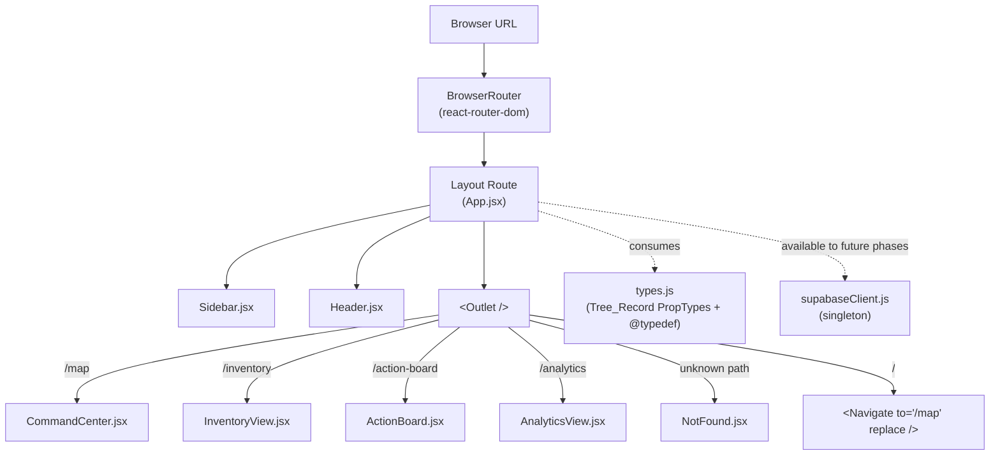
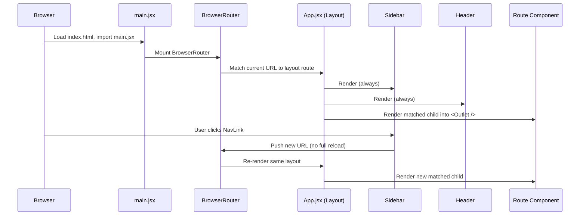

# Design Document

## Overview

The Mission Control Dashboard (Phase 1) stands up the web-side counterpart to an existing offline-first mobile arborist app. Phase 1 delivers only the project toolchain and a persistent App Shell (Sidebar + Header + routed main outlet) with four placeholder routes, a shared Tree_Record type module, and a pre-wired Supabase client singleton. No domain logic, no data fetching, no charts, no map rendering.

The design deliberately favors the smallest viable structure that future phases can extend without touching the shell:

- **Vite + React (JavaScript, not TypeScript)** as the build/runtime stack. JavaScript-only keeps the project aligned with the existing mobile app's toolchain, and leaves room for PropTypes + JSDoc `@typedef` to carry schema contracts instead of `.d.ts` files.
- **Tailwind CSS** for layout styling so the shell can be described in markup without a separate stylesheet per component.
- **`react-router-dom` v6** for client-side routing with a single layout route that owns the App_Shell and renders child routes into an `<Outlet />`.
- **`@supabase/supabase-js`** exported as a lazily-initialized singleton so later phases (inventory queries, action board mutations, analytics aggregates) import one module and never re-instantiate.
- **`lucide-react`** for the four sidebar icons.

Later phases will replace the placeholder route bodies in place. The Sidebar, Header, `App.jsx` layout, router configuration, `types.js`, `supabaseClient.js`, and `.env.example` are the only files Phase 1 should freeze for those later phases to build on.

### Design Decisions & Rationale

1. **Layout route over per-page shell duplication.** Using a `react-router-dom` layout route with `<Outlet />` means Sidebar and Header mount once and stay mounted across navigation. This directly satisfies Requirement 2.2 and Requirement 4.7 and avoids per-page layout drift in later phases.
2. **Singleton Supabase client with a module-load-time warning, not a throw.** Throwing on missing env vars would block the dev server on a clean checkout before `.env` is configured. A descriptive `console.warn` satisfies Requirement 8.4 while keeping Requirement 1.6 (`npm run dev` starts cleanly) achievable.
3. **PropTypes + JSDoc `@typedef` for Tree_Record instead of TypeScript.** The mobile app is JavaScript; mirroring that choice keeps a single shared mental model of the `trees` schema. PropTypes provides runtime validation at component boundaries; `@typedef` drives editor tooling. This satisfies Requirement 7.8.
4. **Route-specific placeholder files under `src/pages/`.** Keeps Phase 1's route code isolated from shared shell code so later phases edit `src/pages/CommandCenter.jsx` without risk to `App.jsx` or `Sidebar.jsx`.
5. **Redirect `/` to `/map` via `<Navigate replace />`.** The `replace` flag avoids polluting browser history with the root path, which matters for back-button behavior in later phases (Requirement 4.5).
6. **Not Found placeholder rendered inside the layout route.** Rendering the 404 inside the App_Shell (not as a top-level sibling) keeps the Sidebar and Header visible on unknown paths, directly satisfying Requirement 4.6.

## Architecture

### High-Level Structure



### Module / File Layout

```
mission-control-dashboard/
├── .env.example                 # VITE_SUPABASE_URL, VITE_SUPABASE_ANON_KEY (empty)
├── index.html                   # Vite entry HTML
├── package.json
├── postcss.config.js
├── tailwind.config.js           # content globs: index.html + src/**/*.{js,jsx,ts,tsx}
├── vite.config.js
└── src/
    ├── main.jsx                 # ReactDOM.createRoot, BrowserRouter, <App />
    ├── App.jsx                  # Layout route: Sidebar + Header + <Outlet />, <Routes>
    ├── index.css                # @tailwind base/components/utilities
    ├── supabaseClient.js        # Singleton Supabase client + missing-env-var warning
    ├── types.js                 # Tree_Record PropTypes + JSDoc @typedef
    ├── components/
    │   ├── Sidebar.jsx          # Left nav with 4 Lucide-icon NavLinks
    │   └── Header.jsx           # Top bar with "Mission Control" title
    └── pages/
        ├── CommandCenter.jsx    # Placeholder for /map
        ├── InventoryView.jsx    # Placeholder for /inventory
        ├── ActionBoard.jsx      # Placeholder for /action-board
        ├── AnalyticsView.jsx    # Placeholder for /analytics
        └── NotFound.jsx         # Placeholder for unknown paths
```

Requirement 2.5 pins `App.jsx` directly under `src/`. Requirement 3.7 pins `Sidebar.jsx` directly under `src/` in spirit; this design places it under `src/components/` for colocation with `Header.jsx`. If strict adherence to "`src/Sidebar.jsx`" is required, a one-line re-export from `src/Sidebar.jsx` into `src/components/Sidebar.jsx` keeps both paths valid; the implementation plan should choose one. Requirement 6.5 allows `src/pages/` or `src/routes/`; this design uses `src/pages/`.

### Runtime Composition

`src/main.jsx` is the only top-level `ReactDOM.createRoot` call. It wraps `<App />` in a `<BrowserRouter>` so `App.jsx` itself can own the `<Routes>` block. This keeps routing private to `App.jsx` and testable by re-wrapping `<App />` in a `<MemoryRouter>` at any starting path.



## Components and Interfaces

All components are function components. No hooks are used beyond what `react-router-dom` provides (`useLocation`, `NavLink`'s built-in active state).

### `src/main.jsx`

Responsibility: application bootstrap.

```js
// Pseudocode
import { StrictMode } from 'react';
import { createRoot } from 'react-dom/client';
import { BrowserRouter } from 'react-router-dom';
import App from './App.jsx';
import './index.css';

createRoot(document.getElementById('root')).render(
  <StrictMode>
    <BrowserRouter>
      <App />
    </BrowserRouter>
  </StrictMode>
);
```

### `src/App.jsx` — Layout Route (Requirement 2, 4)

Responsibility: define the persistent layout and the `<Routes>` tree.

Public contract:
- Default export: `App` function component taking no props.
- Renders Sidebar (always), Header (always), and a main content region containing `<Outlet />`.
- Declares five routes under a single layout route:
  - `/` → `<Navigate to="/map" replace />`
  - `/map` → `<CommandCenter />`
  - `/inventory` → `<InventoryView />`
  - `/action-board` → `<ActionBoard />`
  - `/analytics` → `<AnalyticsView />`
  - `*` → `<NotFound />`

Sketch:

```jsx
// Pseudocode — final naming to match file layout above
function App() {
  return (
    <Routes>
      <Route element={<Shell />}>
        <Route index element={<Navigate to="/map" replace />} />
        <Route path="map" element={<CommandCenter />} />
        <Route path="inventory" element={<InventoryView />} />
        <Route path="action-board" element={<ActionBoard />} />
        <Route path="analytics" element={<AnalyticsView />} />
        <Route path="*" element={<NotFound />} />
      </Route>
    </Routes>
  );
}

function Shell() {
  return (
    <div className="min-h-screen flex">
      <Sidebar />
      <div className="flex-1 flex flex-col min-w-0">
        <Header />
        <main className="flex-1 overflow-auto p-6">
          <Outlet />
        </main>
      </div>
    </div>
  );
}
```

Layout rationale:
- `flex` row at the outer div places Sidebar left and a flex-column (Header + main) right (Requirement 2.1).
- `min-w-0` on the right column prevents the main region from forcing horizontal overflow when a child renders long content (Requirement 2.4).
- `overflow-auto` on `<main>` keeps the Header visually fixed as the user scrolls route content (Requirement 5.3).
- `min-h-screen` guarantees the Sidebar fills the viewport at `>= 768px` without JS (Requirement 2.3). A `hidden md:flex` class on the Sidebar keeps it visible at that breakpoint and hides it on narrower screens (Phase 1 does not deliver a mobile drawer; narrower viewports simply hide the nav, which is acceptable because Requirement 2.3 only constrains the `>= 768px` case).

### `src/components/Sidebar.jsx` (Requirement 3)

Responsibility: render a persistent, static 4-item navigation with icons and active-route highlighting.

Public contract:
- Default export: `Sidebar` function component taking no props.
- Renders a `<nav>` containing exactly four `<NavLink>` entries in this fixed order: Command Center (`/map`), Inventory (`/inventory`), Action Board (`/action-board`), Analytics (`/analytics`).
- Each entry renders one Lucide icon and one text label.
- Active styling is driven by `NavLink`'s `isActive` argument so the visual distinction is derived from the router state, not local state.

Fixed item table (this exact shape is the contract):

| Order | Label          | Path            | Lucide Icon  |
|-------|----------------|-----------------|--------------|
| 1     | Command Center | `/map`          | `Map`        |
| 2     | Inventory      | `/inventory`    | `TreePine`   |
| 3     | Action Board   | `/action-board` | `ClipboardList` |
| 4     | Analytics      | `/analytics`    | `BarChart3`  |

Sketch:

```jsx
// Pseudocode
const NAV_ITEMS = [
  { to: '/map',          label: 'Command Center', Icon: Map },
  { to: '/inventory',    label: 'Inventory',      Icon: TreePine },
  { to: '/action-board', label: 'Action Board',   Icon: ClipboardList },
  { to: '/analytics',    label: 'Analytics',      Icon: BarChart3 },
];

function Sidebar() {
  return (
    <nav className="hidden md:flex md:flex-col w-60 bg-slate-900 text-slate-100 p-4 gap-1">
      {NAV_ITEMS.map(({ to, label, Icon }) => (
        <NavLink
          key={to}
          to={to}
          className={({ isActive }) =>
            `flex items-center gap-3 px-3 py-2 rounded ${
              isActive ? 'bg-slate-700 text-white' : 'hover:bg-slate-800'
            }`
          }
        >
          <Icon size={18} aria-hidden="true" />
          <span>{label}</span>
        </NavLink>
      ))}
    </nav>
  );
}
```

The `NAV_ITEMS` array is module-scoped and exported for tests. Tests assert ordering, path mapping, and the invariant that exactly one item is active at any time.

### `src/components/Header.jsx` (Requirement 5)

Responsibility: render the top bar with the application title `Mission Control`.

Public contract:
- Default export: `Header` function component taking no props.
- Renders a `<header>` containing the text `Mission Control` as a level-1 or level-2 heading (level-1 preferred so route-level headings in pages can remain `<h1>` within their own section — but since each page renders its own `<h1>`, the header title should be an `<h1>` of the app frame only if no page `<h1>` conflicts semantically; this design uses a visually-prominent `<span>` inside the header to avoid multi-`<h1>` concerns and keeps the page-level `<h1>` authoritative for each route).
- Does not render any interactive widgets in Phase 1.

Sketch:

```jsx
function Header() {
  return (
    <header className="h-14 flex items-center px-6 bg-white border-b border-slate-200">
      <span className="text-lg font-semibold text-slate-900">Mission Control</span>
    </header>
  );
}
```

### `src/pages/CommandCenter.jsx`, `InventoryView.jsx`, `ActionBoard.jsx`, `AnalyticsView.jsx` (Requirement 6)

Responsibility: render a minimal placeholder for each route.

Each file exports a default function component that renders:
1. An `<h1>` with the exact text from Requirement 6.1–6.4.
2. A single descriptive sentence that names the future phase (Requirement 9.5).

No hooks, no data fetching, no interactivity beyond the heading and description.

Text content contract:

| Component       | Heading          | Description sentence                                                                                   |
|-----------------|------------------|--------------------------------------------------------------------------------------------------------|
| CommandCenter   | `Command Center` | `The interactive tree map will be implemented in the Command Center phase.`                            |
| InventoryView   | `Inventory`      | `The filterable tree inventory data grid will be implemented in the Inventory phase.`                  |
| ActionBoard     | `Action Board`   | `Task assignment and workflow management will be implemented in the Action Board phase.`               |
| AnalyticsView   | `Analytics`      | `Carbon sequestration charts and reports will be implemented in the Analytics phase.`                  |

Sketch (identical structure across the four):

```jsx
export default function CommandCenter() {
  return (
    <section>
      <h1 className="text-2xl font-semibold text-slate-900">Command Center</h1>
      <p className="mt-2 text-slate-600">
        The interactive tree map will be implemented in the Command Center phase.
      </p>
    </section>
  );
}
```

### `src/pages/NotFound.jsx` (Requirement 4.6)

Responsibility: render a clearly-labeled 404 placeholder inside the App_Shell.

Sketch:

```jsx
export default function NotFound() {
  return (
    <section>
      <h1 className="text-2xl font-semibold text-slate-900">Page Not Found</h1>
      <p className="mt-2 text-slate-600">
        The page you requested does not exist. Use the sidebar to navigate.
      </p>
    </section>
  );
}
```

### `src/supabaseClient.js` (Requirement 8)

Responsibility: construct and export a singleton Supabase client; warn on missing env vars.

Public contract:
- Named export `supabase`: the singleton `SupabaseClient` instance created by `createClient(url, anonKey)`.
- At module load, reads `import.meta.env.VITE_SUPABASE_URL` and `import.meta.env.VITE_SUPABASE_ANON_KEY`.
- If either value is missing (undefined or empty string), emits a single `console.warn` that explicitly names each missing variable.
- Passes whatever values are present (possibly empty strings) to `createClient` so that `import` never throws. Later phases that actually call Supabase will surface auth/network errors at call time rather than at module load time.

Sketch:

```js
import { createClient } from '@supabase/supabase-js';

const url = import.meta.env.VITE_SUPABASE_URL;
const anonKey = import.meta.env.VITE_SUPABASE_ANON_KEY;

const missing = [];
if (!url) missing.push('VITE_SUPABASE_URL');
if (!anonKey) missing.push('VITE_SUPABASE_ANON_KEY');
if (missing.length > 0) {
  console.warn(
    `[supabaseClient] Missing environment variable(s): ${missing.join(', ')}. ` +
    `Set them in .env (see .env.example) before making Supabase calls.`
  );
}

export const supabase = createClient(url ?? '', anonKey ?? '');
```

### `.env.example` (Requirement 8.3)

```
VITE_SUPABASE_URL=
VITE_SUPABASE_ANON_KEY=
```

## Data Models

Phase 1 introduces no data flow. It only defines a shared contract for the Supabase `trees` row shape that later phases will consume.

### Tree_Record (`src/types.js`) — Requirement 7

The `trees` table schema mirrors the offline-first mobile app. The `photo_url` field is notable: it holds a Cloudinary URL, not a Supabase Storage URL, because the mobile app uploads imagery to Cloudinary directly and stores only the resulting URL in Supabase.

#### Field table

| Field                     | Type      | Nullable | Notes                                                                 |
|---------------------------|-----------|----------|-----------------------------------------------------------------------|
| `id`                      | string    | no       | Supabase row primary key (UUID string).                               |
| `tree_id`                 | string    | yes      | Mobile-assigned local identifier; may be null on older rows.          |
| `latitude`                | number    | no       | Decimal degrees.                                                      |
| `longitude`               | number    | no       | Decimal degrees.                                                      |
| `dbh`                     | string    | no       | Diameter at breast height, stored as a string by the mobile app.      |
| `species`                 | string    | no       | Common name.                                                          |
| `scientific_name`         | string    | no       | Latin binomial.                                                       |
| `species_type`            | string    | no       | One of `Endemic`, `Invasive`.                                         |
| `is_leaning`              | boolean   | no       |                                                                       |
| `has_powerline_conflict`  | boolean   | no       |                                                                       |
| `is_decayed`              | boolean   | no       |                                                                       |
| `is_root_problem`         | boolean   | no       |                                                                       |
| `dateCaptured`            | string    | no       | ISO-8601 timestamp.                                                   |
| `assigned_to`             | string    | yes      | User id of assigned arborist, or null.                                |
| `has_cutting_permit`      | boolean   | no       |                                                                       |
| `task_status`             | string    | no       | One of `Pending`, `Acknowledged`, `Executed`, `Cancelled`.            |
| `photo_url`               | string    | yes      | **Cloudinary URL, not Supabase Storage.**                             |

#### Enum constants

`types.js` exports two frozen enum objects so later phases import named constants instead of string-literal-typing:

```js
export const TASK_STATUS = Object.freeze({
  PENDING: 'Pending',
  ACKNOWLEDGED: 'Acknowledged',
  EXECUTED: 'Executed',
  CANCELLED: 'Cancelled',
});

export const SPECIES_TYPE = Object.freeze({
  ENDEMIC: 'Endemic',
  INVASIVE: 'Invasive',
});

export const TASK_STATUS_VALUES = Object.values(TASK_STATUS);
export const SPECIES_TYPE_VALUES = Object.values(SPECIES_TYPE);
```

#### PropTypes + JSDoc @typedef

```js
import PropTypes from 'prop-types';

/**
 * @typedef {Object} TreeRecord
 * @property {string}  id
 * @property {?string} tree_id
 * @property {number}  latitude
 * @property {number}  longitude
 * @property {string}  dbh
 * @property {string}  species
 * @property {string}  scientific_name
 * @property {('Endemic'|'Invasive')} species_type
 * @property {boolean} is_leaning
 * @property {boolean} has_powerline_conflict
 * @property {boolean} is_decayed
 * @property {boolean} is_root_problem
 * @property {string}  dateCaptured        ISO-8601 timestamp.
 * @property {?string} assigned_to
 * @property {boolean} has_cutting_permit
 * @property {('Pending'|'Acknowledged'|'Executed'|'Cancelled')} task_status
 * @property {?string} photo_url           Cloudinary URL (not Supabase Storage).
 */

export const TreeRecordPropType = PropTypes.shape({
  id: PropTypes.string.isRequired,
  tree_id: PropTypes.string,               // nullable
  latitude: PropTypes.number.isRequired,
  longitude: PropTypes.number.isRequired,
  dbh: PropTypes.string.isRequired,
  species: PropTypes.string.isRequired,
  scientific_name: PropTypes.string.isRequired,
  species_type: PropTypes.oneOf(SPECIES_TYPE_VALUES).isRequired,
  is_leaning: PropTypes.bool.isRequired,
  has_powerline_conflict: PropTypes.bool.isRequired,
  is_decayed: PropTypes.bool.isRequired,
  is_root_problem: PropTypes.bool.isRequired,
  dateCaptured: PropTypes.string.isRequired,
  assigned_to: PropTypes.string,           // nullable
  has_cutting_permit: PropTypes.bool.isRequired,
  task_status: PropTypes.oneOf(TASK_STATUS_VALUES).isRequired,
  photo_url: PropTypes.string,             // nullable Cloudinary URL
});
```

Nullable fields (`tree_id`, `assigned_to`, `photo_url`) are declared without `.isRequired`, which is how PropTypes expresses "optional or null" (Requirement 7.4). The enum fields use `PropTypes.oneOf(...).isRequired` to enforce Requirement 7.5 and 7.6 at runtime boundaries.

No Tree_Record is constructed, rendered, or persisted in Phase 1. The module exists solely as the contract future phases import.


## Error Handling

Phase 1 exposes only four places where errors can originate. Each is handled at the lowest reasonable layer so later phases inherit a clean baseline.

### 1. Missing Supabase environment variables

Trigger: `VITE_SUPABASE_URL` or `VITE_SUPABASE_ANON_KEY` is undefined or empty when `src/supabaseClient.js` is imported.

Handling:
- Emit a single `console.warn` that names each missing variable explicitly (Requirement 8.4).
- Do NOT throw. Throwing at import time would prevent `npm run dev` from starting on a clean checkout and would block Requirement 1.6.
- Call `createClient` with empty strings as a fallback so the module export stays a valid `SupabaseClient` instance. Any actual network call will fail later at call time with a descriptive error from `@supabase/supabase-js`; that is the correct layer for those errors to surface.

### 2. Unknown route paths

Trigger: The user navigates to any path the Router does not recognize.

Handling:
- A catch-all route `<Route path="*" element={<NotFound />} />` lives inside the layout route so the Sidebar and Header remain visible (Requirement 4.6 + 4.7).
- `NotFound.jsx` renders a visible heading and a short recovery instruction pointing at the Sidebar.

### 3. Invalid Tree_Record shapes passed to future components

Trigger: A future phase passes a malformed object where a `TreeRecordPropType`-validated component expects a Tree_Record.

Handling:
- PropTypes validation emits a `console.error` in development and is a no-op in production. This is the framework default and sufficient for Phase 1.
- No Phase 1 component consumes `TreeRecordPropType`; the module is defined but not yet wired into a component boundary. This is intentional — Phase 1 only publishes the contract.

### 4. Unexpected render errors inside a route

Trigger: A future phase introduces a bug that throws inside `CommandCenter`, `InventoryView`, etc.

Handling:
- Phase 1 does not add an error boundary because no route renders logic that can throw. Each placeholder is static JSX. The first phase that introduces data fetching or interactivity should add a route-level error boundary inside the `<main>` region; this design leaves that insertion point clean.

## Testing Strategy

### PBT applicability assessment

Property-based testing is **not appropriate** for this feature. Phase 1 consists entirely of:

- **UI rendering and layout** (App_Shell, Sidebar, Header, placeholder pages) — the workflow guidance explicitly calls for snapshot and example-based tests here.
- **Static routing configuration** over a fixed 4-item navigation set plus a redirect and a catch-all — a finite set of cases, not a universally-quantified input space.
- **Configuration validation** (Supabase env-var warning) — the workflow guidance explicitly calls for example-based tests here, with four total cases (both set, only URL set, only key set, neither set).
- **Schema/type definitions** (Tree_Record PropTypes + `@typedef`) — a contract for future phases to consume, not a function whose behavior varies with input.

There is no acceptance criterion in this phase whose behavior meaningfully varies across a large input space, and none where running 100 iterations would find bugs that 2–3 representative examples would miss. Consequently this design document omits a Correctness Properties section. When later phases introduce pure logic (e.g., filtering the inventory data grid, computing analytics aggregates, validating task state transitions), those phases SHOULD include correctness properties.

### Test layers for Phase 1

Use **Vitest + React Testing Library** as the example-based test stack. Vitest integrates natively with Vite, shares the same transform pipeline, and runs in jsdom for component tests.

Dev dependencies to add:
- `vitest`
- `@testing-library/react`
- `@testing-library/jest-dom`
- `jsdom`

Test configuration:
- `vitest.config.js` (or `test` block inside `vite.config.js`) with `environment: 'jsdom'` and a setup file that imports `@testing-library/jest-dom`.
- Tests colocated under `src/**/*.test.jsx` or `src/**/*.test.js`.

#### Unit + integration tests

Each test below is an **example-based** test, not a property-based test. Tests wrap `<App />` in a `<MemoryRouter initialEntries={[...]}>` to drive specific URLs.

1. **App Shell layout (Requirements 2.1, 2.2, 2.4, 5.2)**
   - Render `<App />` at `/map`; assert Sidebar, Header, and main outlet are all present.
   - Repeat at `/inventory`, `/action-board`, `/analytics`, and an unknown path; assert Sidebar and Header remain present on every path.

2. **Sidebar navigation items (Requirements 3.1, 3.2, 3.3, 3.4, 3.7)**
   - Render Sidebar; assert exactly four nav links render in the order: Command Center, Inventory, Action Board, Analytics.
   - Assert each link's `href` matches the fixed item table.
   - Assert each link renders a Lucide icon element and a text label.

3. **Sidebar active-route highlight (Requirement 3.6)**
   - For each of the four routes, render `<App />` at that route; assert only that route's NavLink carries the active class (derived from `NavLink`'s `isActive`).

4. **Sidebar navigation does not full-reload (Requirement 3.5)**
   - Render `<App />` at `/map`; click the Inventory NavLink; assert the `InventoryView` heading appears and the Sidebar DOM node has the same reference as before (proves no remount).

5. **Routing: path → component mapping (Requirements 4.1–4.4)**
   - For each route, render `<App />` at that path and assert the corresponding heading renders.

6. **Routing: root redirect (Requirement 4.5)**
   - Render `<App />` at `/`; assert the `Command Center` heading renders (redirect target).

7. **Routing: unknown path (Requirement 4.6)**
   - Render `<App />` at `/does-not-exist`; assert the `Page Not Found` heading renders AND the Sidebar and Header are still present.

8. **Header (Requirements 5.1, 5.3)**
   - Render Header; assert the text `Mission Control` is visible.
   - Render `<App />`; inspect the computed layout — assert `<main>` has `overflow-auto` (the scroll region) and the Header is a sibling above it (visual stickiness by layout rather than `position: sticky`).

9. **Placeholder route components (Requirements 6.1–6.6, 9.5)**
   - For each of the four placeholder pages, assert the heading text exactly matches Requirement 6.1–6.4.
   - Assert each placeholder renders the description sentence from the text content contract table.
   - Assert each placeholder renders no `<input>`, `<button>`, `<table>`, `<canvas>`, or `<svg>` beyond what the heading and description contain (Requirement 6.6 + Requirement 9.1–9.4).

10. **Tree_Record PropTypes contract (Requirement 7)**
    - Construct a valid example Tree_Record with every field populated; pass it through `PropTypes.checkPropTypes` with `TreeRecordPropType`; assert no console error is emitted.
    - Construct a valid record with `tree_id`, `assigned_to`, and `photo_url` set to `null`; assert no console error (Requirement 7.4).
    - Construct a record with `task_status: 'Bogus'`; assert a console error is emitted (Requirement 7.5).
    - Construct a record with `species_type: 'Bogus'`; assert a console error is emitted (Requirement 7.6).
    - Assert `TASK_STATUS_VALUES` equals `['Pending', 'Acknowledged', 'Executed', 'Cancelled']` exactly.
    - Assert `SPECIES_TYPE_VALUES` equals `['Endemic', 'Invasive']` exactly.

11. **Supabase client singleton + env-var warning (Requirement 8)**
    - With both env vars set (via `vi.stubEnv`), import `supabase` fresh and assert `console.warn` is NOT called and the export is a truthy Supabase client.
    - With `VITE_SUPABASE_URL` unset, re-import and assert `console.warn` is called with a message containing `VITE_SUPABASE_URL`.
    - With `VITE_SUPABASE_ANON_KEY` unset, re-import and assert `console.warn` is called with a message containing `VITE_SUPABASE_ANON_KEY`.
    - With both unset, assert a single `console.warn` call mentions both variable names.
    - Assert the module export is referentially stable across two imports in the same test (singleton behavior — Requirement 8.1).

12. **`.env.example` contents (Requirement 8.3)**
    - Read `.env.example` from disk; assert it contains `VITE_SUPABASE_URL=` and `VITE_SUPABASE_ANON_KEY=` lines with empty values.

### Smoke tests

One smoke test covers Requirement 1.6 manually: on a clean checkout, `npm install && npm run dev` must start the dev server without error. This is documented in the README and verified as part of the Phase 1 acceptance walkthrough; it is not automated in Vitest because it exercises the Vite toolchain itself.

### Out-of-scope test types

- **Property-based tests** — not applicable this phase (see assessment above).
- **End-to-end tests (Playwright/Cypress)** — deferred. Phase 1's behavior is fully covered by jsdom component tests plus one manual smoke walkthrough.
- **Visual regression tests** — deferred. Styling is minimal Tailwind utility classes; visual regression becomes valuable once real content lands in later phases.
