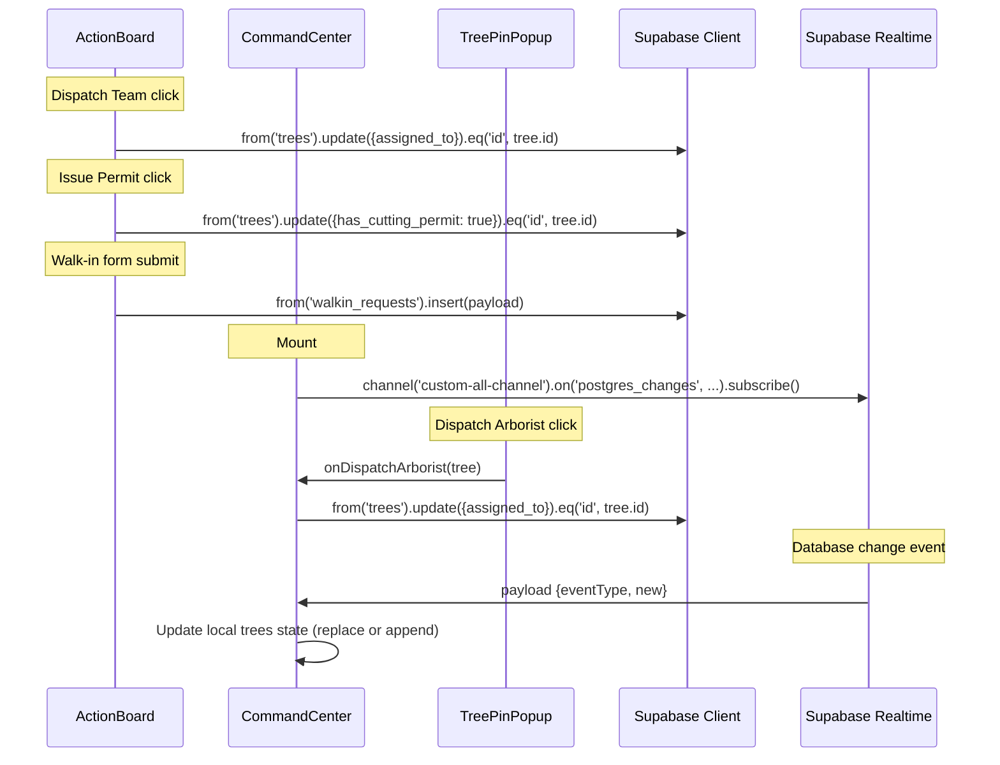

# Design Document: Realtime Handshake

## Overview

Phase 9 replaces the three `console.log` stubs in ActionBoard.jsx and the one in TreePinPopup.jsx with live Supabase mutations, and adds a Supabase Realtime WebSocket subscription in CommandCenter.jsx so the map reflects database changes without a page reload.

The implementation touches four files:
1. **ActionBoard.jsx** — `handleDispatchTeam`, `handleIssuePermit`, and `handleSubmitWalkin` become real Supabase calls.
2. **CommandCenter.jsx** — adds a dispatch handler, passes it to TreePinPopup, and subscribes to Realtime.
3. **TreePinPopup.jsx** — accepts and invokes a new `onDispatchArborist` prop instead of `console.log`.
4. **Test files** — mock updates for `update().eq()` chaining and `channel().on().subscribe()` chain.

No new dependencies are introduced. The existing `@supabase/supabase-js` singleton is the sole integration surface.

## Architecture



## Components and Interfaces

### ActionBoard.jsx — Mutation Handlers

**handleDispatchTeam(tree)**
- Replaces `console.log('Dispatch Team', tree.tree_id)`
- Calls `supabase.from('trees').update({ assigned_to: 'Juan Dela Cruz' }).eq('id', tree.id)`
- Fire-and-forget (no await, no error handling in V1)

**handleIssuePermit(tree)**
- Replaces `console.log('Issue Permit', tree.tree_id)`
- Calls `supabase.from('trees').update({ has_cutting_permit: true }).eq('id', tree.id)`
- Fire-and-forget

**handleSubmitWalkin(event)**
- Replaces `console.log(payload)`
- Calls `supabase.from('walkin_requests').insert(payload)`
- Retains existing behavior: sets `submissionConfirmed = true` and resets form to `INITIAL_FORM_STATE`
- The insert is fire-and-forget; confirmation shows immediately (optimistic)

### CommandCenter.jsx — Dispatch Handler + Realtime

**handleDispatchArborist(tree)**
- New function defined inside CommandCenter
- Calls `supabase.from('trees').update({ assigned_to: 'Juan Dela Cruz' }).eq('id', tree.id)`
- Passed to `<TreePinPopup>` as the `onDispatchArborist` prop

**Realtime Subscription (useEffect)**
- Added as a second `useEffect` (separate from the fetch effect)
- On mount: `const channel = supabase.channel('custom-all-channel').on('postgres_changes', { event: '*', schema: 'public', table: 'trees' }, handleRealtimePayload).subscribe()`
- On unmount: `supabase.removeChannel(channel)`

**handleRealtimePayload(payload)**
- `payload.eventType === 'UPDATE'`: find tree by `payload.new.id`, replace with `payload.new`
- `payload.eventType === 'INSERT'`: append `payload.new` to trees array
- Other event types (DELETE): ignored in V1

### TreePinPopup.jsx — Interface Change

**New prop: `onDispatchArborist`**
- Type: `PropTypes.func`
- Added to `TreePinPopup.propTypes`
- The "Dispatch Arborist" button's `onClick` changes from `console.log(...)` to `onDispatchArborist(tree)`
- The prop is optional (not `.isRequired`) so existing renders without it don't break during transition

### Test Mock Architecture

**ActionBoard.test.jsx — update().eq() chaining**
```javascript
const eqSpy = vi.fn();
updateSpy.mockReturnValue({ eq: eqSpy });
```
The `updateSpy` must return an object with an `eq` method so the chained `.eq('id', tree.id)` call doesn't throw.

**CommandCenter.test.jsx — channel().on().subscribe() chain**
```javascript
const subscribeSpy = vi.fn();
const onSpy = vi.fn(() => ({ subscribe: subscribeSpy }));
const channelSpy = vi.fn(() => ({ on: onSpy }));
const removeChannelSpy = vi.fn();

// Added to the supabase mock:
supabase: { from: fromSpy, channel: channelSpy, removeChannel: removeChannelSpy }
```
The `channelSpy` returns an object with `on`, which returns an object with `subscribe`. The `subscribeSpy` returns the channel reference so cleanup can call `removeChannel` with it.

## Data Models

### Tree_Record (existing — no changes)

| Field | Type | Notes |
|-------|------|-------|
| id | UUID string | Primary key |
| tree_id | string \| null | Mobile-assigned identifier |
| latitude | number | Decimal degrees |
| longitude | number | Decimal degrees |
| dbh | string | Diameter at breast height |
| species | string | Common name |
| scientific_name | string | Latin binomial |
| species_type | 'Endemic' \| 'Invasive' | |
| is_leaning | boolean | Hazard flag |
| has_powerline_conflict | boolean | Hazard flag |
| is_decayed | boolean | Hazard flag |
| is_root_problem | boolean | Hazard flag |
| dateCaptured | string (ISO-8601) | |
| assigned_to | string \| null | Arborist UUID or name |
| has_cutting_permit | boolean | |
| task_status | 'Pending' \| 'Acknowledged' \| 'Executed' \| 'Cancelled' | |
| photo_url | string \| null | Cloudinary URL |

### Walkin_Payload (existing shape — no changes)

| Field | Type |
|-------|------|
| client_name | string |
| contact_info | string |
| reason | string |
| latitude | string |
| longitude | string |

### Realtime Payload Shape (from Supabase)

| Field | Type | Notes |
|-------|------|-------|
| eventType | 'INSERT' \| 'UPDATE' \| 'DELETE' | Event discriminator |
| new | Tree_Record | The new/updated row |
| old | Tree_Record \| {} | Previous row (UPDATE/DELETE) |
| schema | string | Always 'public' |
| table | string | Always 'trees' |

## Correctness Properties

*A property is a characteristic or behavior that should hold true across all valid executions of a system — essentially, a formal statement about what the system should do. Properties serve as the bridge between human-readable specifications and machine-verifiable correctness guarantees.*

### Property 1: Dispatch Team mutation targets the correct tree

*For any* valid Tree_Record, when the Dispatch_Team_Handler is invoked with that record, the Supabase `update` call SHALL receive `{ assigned_to: 'Juan Dela Cruz' }` and the chained `.eq` call SHALL receive `('id', tree.id)` where `tree.id` matches the input record's `id` field.

**Validates: Requirements 1.1, 1.2, 1.3**

### Property 2: Issue Permit mutation targets the correct tree

*For any* valid Tree_Record, when the Issue_Permit_Handler is invoked with that record, the Supabase `update` call SHALL receive `{ has_cutting_permit: true }` and the chained `.eq` call SHALL receive `('id', tree.id)` where `tree.id` matches the input record's `id` field.

**Validates: Requirements 2.1, 2.2, 2.3**

### Property 3: Walk-in insert payload matches form fields

*For any* combination of form field values (client_name, contact_info, reason, latitude, longitude), when the Submit_Walkin_Handler is invoked, the Supabase `insert` call SHALL receive a payload object with exactly those five keys mapped to the corresponding form field values.

**Validates: Requirements 3.1, 3.2**

### Property 4: Dispatch Arborist from map targets the correct tree

*For any* valid Tree_Record rendered as a Red pin in the CommandCenter, when the "Dispatch Arborist" button is clicked, the TreePinPopup SHALL invoke the `onDispatchArborist` callback with that tree, and the resulting Supabase `update` call SHALL receive `{ assigned_to: 'Juan Dela Cruz' }` with `.eq('id', tree.id)` matching the tree's `id` field.

**Validates: Requirements 4.1, 4.2, 4.3**

### Property 5: Realtime UPDATE replaces the matching tree in state

*For any* initial array of Tree_Records and any UPDATE payload whose `payload.new.id` matches a tree in that array, after the realtime callback fires, the local state SHALL contain `payload.new` in place of the original tree with that id, and all other trees SHALL remain unchanged.

**Validates: Requirements 5.2**

### Property 6: Realtime INSERT appends the new tree to state

*For any* initial array of Tree_Records and any INSERT payload, after the realtime callback fires, the local state SHALL contain all original trees plus `payload.new` appended at the end, and the array length SHALL increase by exactly one.

**Validates: Requirements 5.3**

## Error Handling

### Mutation Handlers (V1 — Fire-and-Forget)

All four mutation handlers (`handleDispatchTeam`, `handleIssuePermit`, `handleSubmitWalkin`, `handleDispatchArborist`) are fire-and-forget in V1:
- No `await` on the Supabase call
- No try/catch or `.then()` error branch
- No user-facing error toast or rollback

**Rationale:** The requirements specify the exact Supabase calls but do not specify error handling behavior. The walk-in form already shows "Request Logged" optimistically (existing behavior preserved). Future phases can add error toasts and optimistic-update rollback.

### Realtime Subscription

- If the channel fails to connect, Supabase Realtime silently retries (built-in behavior of `@supabase/supabase-js`)
- Malformed payloads (missing `payload.new.id`) are handled defensively:
  - UPDATE with no matching id in state: no-op (state unchanged)
  - INSERT with a missing or null `payload.new`: guarded with an early return

### Cleanup

- The realtime subscription cleanup (`supabase.removeChannel(channel)`) runs on unmount via the useEffect return function
- The existing fetch effect's `cancelled` flag pattern is preserved unchanged

## Testing Strategy

### Approach

The testing strategy uses a **dual approach**:
- **Property-based tests** (fast-check): Verify universal properties across generated inputs for mutation correctness and realtime state transitions
- **Example-based tests**: Verify specific wiring (subscription setup, cleanup, prop passing) and UI state changes (confirmation message, form reset)

### Property-Based Testing Configuration

- Library: `fast-check` (already in devDependencies)
- Minimum iterations: 100 per property test
- Tag format: `Feature: realtime-handshake, Property {number}: {property_text}`
- Each correctness property maps to a single `fc.assert(fc.asyncProperty(...))` test

### Test Mock Updates Required

**ActionBoard.test.jsx:**
1. `updateSpy` must return `{ eq: eqSpy }` so `.update(...).eq(...)` chaining works
2. `insertSpy` must return a resolved promise (or at minimum not throw)
3. Add `eqSpy` to the hoisted spy block

**CommandCenter.test.jsx:**
1. Add `channelSpy`, `onSpy`, `subscribeSpy`, `removeChannelSpy` to hoisted spies
2. Expand the supabase mock to include `channel` and `removeChannel`
3. The `onSpy` must capture the callback argument so tests can invoke it to simulate realtime events
4. `updateSpy` must return `{ eq: eqSpy }` for the dispatch handler tests

### Test Categories

| Property | Test Type | Component | Iterations |
|----------|-----------|-----------|------------|
| Property 1 | PBT | ActionBoard | 100 |
| Property 2 | PBT | ActionBoard | 100 |
| Property 3 | PBT | ActionBoard | 100 |
| Property 4 | PBT | CommandCenter | 100 |
| Property 5 | PBT | CommandCenter | 100 |
| Property 6 | PBT | CommandCenter | 100 |
| Subscription setup | Example | CommandCenter | 1 |
| Subscription cleanup | Example | CommandCenter | 1 |
| Confirmation message | Example | ActionBoard | 1 |
| Form reset | Example | ActionBoard | 1 |
| PropTypes acceptance | Example | TreePinPopup | 1 |

### Existing Test Preservation

All 213 existing tests must remain green. The mock updates are additive:
- Adding `eq` return to `updateSpy` doesn't affect tests that don't call `update`
- Adding `channel`/`removeChannel` to the supabase mock doesn't affect tests that only use `from`
- TreePinPopup's `onDispatchArborist` prop is optional, so existing renders without it continue to work
