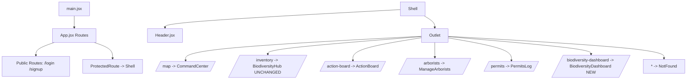

# Design Document

## Overview

Phase 1 of the UI/UX overhaul replaces the existing global header with a MENRO-branded layout and introduces a stub `BiodiversityDashboard` page wired into the protected `Shell` route tree. The change is intentionally narrow: only `src/components/Header.jsx`, `src/App.jsx`, and a new file `src/pages/BiodiversityDashboard.jsx` are touched. No data binding, analytics, or styling work beyond what is needed to land the navigation skeleton.

The design preserves all pre-existing routes byte-identically except for the additive change of registering `biodiversity-dashboard` inside the existing `ProtectedRoute` outlet. The `Sidebar` component (`src/components/Sidebar.jsx` and the `src/Sidebar.jsx` re-export) remains dead code and is not touched. The existing `BiodiversityHub` page at `/inventory` remains exactly as-is — the new dashboard is a separate component at a separate path.

This is a Cowboy Mode MVP. No tests are added or modified. Verification is manual smoke testing plus a clean `npm run build`.

### Goals

- Replace the green branded header with a white header showing two logos and a single bold title.
- Reduce navigation to exactly five entries: `Biodiversity Dashboard`, `Map`, `Action Board`, `Arborist`, `Logout`.
- Add a `/biodiversity-dashboard` protected route that mounts a placeholder shell component inside the existing `Shell` layout.
- Preserve `/inventory`, `/map`, `/action-board`, `/arborists`, `/permits`, `/login`, `/signup`, and the catch-all route unchanged.

### Non-Goals

- No analytics, charts, tables, or data fetching inside the new dashboard.
- No changes to `BiodiversityHub.jsx`, `Sidebar.jsx`, or any other page component.
- No new tests, no test edits, no test deletions (Cowboy Mode).
- No styling polish beyond what is required to satisfy layout acceptance criteria.

## Architecture

The application keeps its existing top-level shape:



The only structural changes are:

1. `Header.jsx` is rewritten in place. Public API (default export, no props) is unchanged so `Shell` does not need to know.
2. `App.jsx` gains one additional `<Route path="biodiversity-dashboard" element={<BiodiversityDashboard />} />` line inside the existing `ProtectedRoute` block, plus an import for the new page. Every other route line is left byte-identical.
3. `src/pages/BiodiversityDashboard.jsx` is created as a pure presentational component with no imports beyond React.

### Why these boundaries

- The header rewrite is local because only `Shell` mounts `Header`, and the header's only consumers of its internals are its own `NavLink` and logout button. Replacing the file body without changing the export surface is the lowest-blast-radius change.
- Routing changes are additive and live entirely inside the existing `ProtectedRoute` outlet, so authentication semantics (redirect to `/login` when no session) flow to the new route automatically without new guard code.
- The new dashboard component is import-isolated: it does not transitively load Supabase, Recharts, Leaflet, or any other heavy dependency. This keeps the placeholder cheap and prevents Phase 1 from accidentally bundling work that belongs in later phases.

## Components and Interfaces

### `Header.jsx` (rewritten)

```
Header (default export)
  Props: none
  Internal state: none (purely derived)
  Hooks used: useNavigate (react-router-dom)
  Imports:
    - React (implicit JSX)
    - { NavLink, useNavigate } from 'react-router-dom'
    - { supabase } from '../supabaseClient.js'
    - santaCruzLogo from '../assets/Santa Cruz Logo.png'
    - menroLogo   from '../assets/MENRO Santa Cruz logo.png'
  Optional: a useState for a transient logout-error flag (only added if needed
            to satisfy the visible-error-on-failure requirement)
```

Layout (single horizontal row, viewport >= 1024px stays unwrapped):

```
+---------------------------------------------------------------------------+
| [SC logo] [MENRO logo] Tree Inventory System of MENRO Santa Cruz          |
|                              [Biodiversity Dashboard | Map | Action Board |
|                               Arborist | Logout]                          |
+---------------------------------------------------------------------------+
```

Implementation outline:

```jsx
const NAV_ITEMS = [
  { to: '/biodiversity-dashboard', label: 'Biodiversity Dashboard' },
  { to: '/map',                    label: 'Map' },
  { to: '/action-board',           label: 'Action Board' },
  { to: '/arborists',              label: 'Arborist' },
];

export default function Header() {
  const navigate = useNavigate();
  const [logoutError, setLogoutError] = useState(false);
  const [busy, setBusy] = useState(false);

  async function handleLogout() {
    setLogoutError(false);
    setBusy(true);
    try {
      const signOut = supabase.auth.signOut();
      const timeout = new Promise((_, reject) =>
        setTimeout(() => reject(new Error('logout-timeout')), 5000)
      );
      const result = await Promise.race([signOut, timeout]);
      if (result && result.error) throw result.error;
      navigate('/login');
    } catch (e) {
      setLogoutError(true);
    } finally {
      setBusy(false);
    }
  }

  return (
    <header className="bg-white text-slate-900 w-full px-6 py-3 border-b border-slate-200">
      <div className="flex items-center justify-between gap-6">
        <div className="flex items-center gap-3">
          
          
          <span className="font-bold text-lg whitespace-nowrap">
            Tree Inventory System of MENRO Santa Cruz
          </span>
        </div>

        <nav className="flex items-center gap-2">
          {NAV_ITEMS.map(({ to, label }) => (
            <NavLink
              key={to}
              to={to}
              end={false}
              className={({ isActive }) =>
                isActive
                  ? 'px-3 py-1.5 rounded text-sm font-semibold text-emerald-700 underline'
                  : 'px-3 py-1.5 rounded text-sm text-slate-700 hover:bg-slate-100'
              }
            >
              {label}
            </NavLink>
          ))}
          <button
            type="button"
            onClick={handleLogout}
            disabled={busy}
            aria-label="Logout"
            className="px-3 py-1.5 rounded text-sm text-slate-700 hover:bg-slate-100 disabled:opacity-50"
          >
            Logout
          </button>
        </nav>
      </div>

      {logoutError && (
        <div role="alert" className="mt-2 text-sm text-red-700">
          Logout failed. Please try again.
        </div>
      )}
    </header>
  );
}
```

Design decisions:

- **Two `` elements at fixed `h-10` (40px)** lands inside the required 32–64px range and `w-auto` preserves aspect ratio for both logos.
- **`whitespace-nowrap` on the title** prevents wrap at >=1024px while flexbox handles the gap-3 spacing.
- **`NavLink`'s `isActive` prop** is supplied by react-router. It returns true when the current pathname matches `to`, including descendant matches (since `end` is omitted/false), which corresponds to the "exactly matches OR begins with followed by `/`" criterion.
- **Logout uses `Promise.race`** to enforce the 5s deadline. On timeout or error, we surface a visible `role="alert"` message and re-enable the button. The control is keyboard-activatable for free because it is a native `<button>` (Enter and Space both dispatch click).
- **The `Logout` control is a `<button>` inside the `<nav>`**, satisfying "fifth and final navigation entry, immediately to the right of `Arborist`."
- **No persistent state** beyond transient UI flags. No Supabase data calls. No router state writes other than the post-logout `navigate('/login')`.

### `BiodiversityDashboard.jsx` (new)

```
BiodiversityDashboard (default export)
  Props: none
  State: none
  Imports: none beyond what JSX requires (React is auto-imported by Vite's
           react plugin in the project; if needed, a single
           `import React from 'react'` is added — but no other imports).
  Output: <div className="bg-gray-50 ..."><h1>Biodiversity Analytics</h1></div>
```

Implementation:

```jsx
export default function BiodiversityDashboard() {
  return (
    <div className="bg-gray-50 p-6">
      <h1>Biodiversity Analytics</h1>
    </div>
  );
}
```

Design decisions:

- **Zero imports of `supabaseClient`, `fetch`, `axios`, or any I/O module** by construction — the file only contains a default-exported function returning JSX.
- **Exactly one `<h1>` as the only direct child of the root `<div>`.** No sibling elements, no extra text nodes at the root level. Whitespace inside the JSX literal between the `<div>` and `<h1>` is collapsed by JSX into nothing because there is no other text content.
- **`bg-gray-50` is in the className token list.** Additional utility classes (`p-6`) are allowed because the requirement only mandates that the token `bg-gray-50` is *included*.

### `App.jsx` (minimal additive edit)

Two and only two diff lines (plus an import):

```jsx
import BiodiversityDashboard from './pages/BiodiversityDashboard.jsx'; // NEW
...
<Route element={<ProtectedRoute session={session} />}>
  <Route index element={<Navigate to="/map" replace />} />
  <Route path="map"            element={<CommandCenter />} />
  <Route path="inventory"      element={<BiodiversityHub />} />
  <Route path="action-board"   element={<ActionBoard />} />
  <Route path="arborists"      element={<ManageArborists />} />
  <Route path="permits"        element={<PermitsLog />} />
  <Route path="biodiversity-dashboard" element={<BiodiversityDashboard />} /> {/* NEW */}
  <Route path="*"              element={<NotFound />} />
</Route>
```

Notes:

- `path="biodiversity-dashboard"` is a relative path with no leading or trailing slash, matching the requirement exactly.
- Inserted before the catch-all `*` so React Router resolves it before falling through.
- The `Shell` and `ProtectedRoute` wrappers are unchanged, so unauthenticated access redirects to `/login` automatically.
- The `index` redirect to `/map` is left in place — landing on `/` still goes to Map, not the new dashboard, because the requirements do not ask for a default-route change.

## Data Models

This phase has no persistent data model. The only in-memory shapes involved are:

### `NAV_ITEMS` (constant array, defined inside `Header.jsx`)

```ts
type NavItem = {
  to: string;     // absolute route path beginning with '/'
  label: string;  // human-visible label, exact text as required
};

const NAV_ITEMS: ReadonlyArray<NavItem> = [
  { to: '/biodiversity-dashboard', label: 'Biodiversity Dashboard' },
  { to: '/map',                    label: 'Map' },
  { to: '/action-board',           label: 'Action Board' },
  { to: '/arborists',              label: 'Arborist' },
];
```

The `Logout` control is intentionally not in `NAV_ITEMS` because it is a `<button>`, not a `<NavLink>`. It is rendered as a sibling immediately after the mapped nav links so that it is the fifth and final navigation entry.

### Logo asset bindings (module-level imports)

```ts
import santaCruzLogo from '../assets/Santa Cruz Logo.png';   // string URL
import menroLogo     from '../assets/MENRO Santa Cruz logo.png'; // string URL
```

Vite resolves these to URL strings at build time. If either file is missing, the Vite/Rollup build fails with an unresolved-import error and produces no `dist/` output, which satisfies the build-failure-on-missing-asset criteria for free.

### Header transient UI state

```ts
type HeaderUiState = {
  busy: boolean;        // true while signOut() is in flight
  logoutError: boolean; // true if signOut rejected, errored, or timed out
};
```

Both default to `false`. Neither is persisted across renders of other pages; the header is mounted by `Shell` for the duration of the authenticated session.


## Correctness Properties

*A property is a characteristic or behavior that should hold true across all valid executions of a system — essentially, a formal statement about what the system should do. Properties serve as the bridge between human-readable specifications and machine-verifiable correctness guarantees.*

### Applicability note

Phase 1 is a UI shell and routing wiring change. Per the workflow guidance, property-based testing is generally not appropriate for UI rendering, simple routing, and stub components. Most acceptance criteria in this spec are concrete, fixed-input EXAMPLE or SMOKE checks (see prework analysis) and are best validated by manual smoke testing under Cowboy Mode.

A handful of acceptance criteria do express genuine universal claims. Those are recorded below as correctness properties for design fidelity and to seed later phases when this feature exits Cowboy Mode. **No automated property-based tests are written in Phase 1.** Each property below is tagged `Phase 1 verification: manual` to make this explicit.

### Property 1: Logout failure handling preserves route and surfaces an error

*For any* failure shape returned by `supabase.auth.signOut()` — including a thrown exception, a returned `{ error }` object, or a promise that does not resolve within 5 seconds — the Header SHALL (a) not invoke `navigate('/login')`, (b) render a visible error indication informing the user that logout failed, and (c) leave the Logout control in an enabled state suitable for retry.

**Validates: Requirements 2.8**

Phase 1 verification: manual fault injection (e.g., temporarily replace `supabase.auth.signOut` with a rejecting stub in DevTools) and visual confirmation.

### Property 2: NavLink active state matches the prefix predicate

*For any* pair of strings `(currentPath, linkPath)`, the `NavLink` whose `to` equals `linkPath` SHALL be rendered with the active style if and only if `currentPath === linkPath` OR `currentPath.startsWith(linkPath + '/')`, and all other `NavLink` elements in the Header SHALL be rendered with the inactive style. The active style differs from the inactive style in at least one of: text color, background color, font weight, or underline.

**Validates: Requirements 2.9**

Phase 1 verification: manual click-through across the four nav links plus any descendant URL the dashboard later introduces.

### Property 3: Scope preservation of routes and files

*For any* route `R` in the preserved set `{map, inventory, action-board, arborists, permits, login, signup, *}`, the `<Route>` registration in `App.jsx` after Phase 1 SHALL have the same `path` string and the same `element` target component as before Phase 1. Additionally, *for any* file `F` in the out-of-scope set `{src/pages/BiodiversityHub.jsx, src/components/Sidebar.jsx, src/Sidebar.jsx}`, `F` SHALL be byte-identical to its pre-Phase-1 contents in the Phase 1 commit set.

**Validates: Requirements 4.6, 5.1, 5.2, 5.3**

Phase 1 verification: `git diff` review of the Phase 1 commit; the only changes permitted are an additive route line and import in `App.jsx`, a full rewrite of `Header.jsx`, and the addition of `src/pages/BiodiversityDashboard.jsx`.

### Property 4: Unknown paths fall through to NotFound and never mount the dashboard

*For any* URL path `P` that is not in the registered protected route set `{/map, /inventory, /action-board, /arborists, /permits, /biodiversity-dashboard}` and is not a public route (`/login`, `/signup`), navigation to `P` while authenticated SHALL resolve to the catch-all `*` route (`NotFound`) and SHALL NOT mount the `BiodiversityDashboard` component. This explicitly covers case-variants such as `/Biodiversity-Dashboard` and `/biodiversitydashboard`.

**Validates: Requirements 4.7**

Phase 1 verification: manual address-bar entry of two or three case-variant URLs.

### Property 5: Cowboy Mode test-file invariant

*For any* file `F` in the Phase 1 commit set, `F`'s path SHALL NOT match the test-file glob set `{**/*.test.js, **/*.test.jsx, src/test/**}`. No test file is added, renamed, moved, modified, or deleted by Phase 1.

**Validates: Requirements 5.5**

Phase 1 verification: `git diff --name-only` against `main` filtered through the test-file globs returns an empty list.

## Error Handling

### Logout flow

The Logout button is the only place in Phase 1 that performs an effectful operation. The handler must tolerate three failure shapes from `supabase.auth.signOut()`:

1. **Thrown exception or rejected promise.** Caught by the surrounding `try/catch`. Set `logoutError = true`, set `busy = false`, do not navigate.
2. **Returned `{ error }` object** (Supabase v2 convention). Detected by inspecting the resolved value; treated identically to a rejection.
3. **Unresolved promise (timeout).** A `Promise.race` against a 5-second timeout converts a hung call into a rejection so it lands in case 1.

In all three cases:

- The current route is preserved (no `navigate` call).
- A visible `role="alert"` element appears below the header with the message "Logout failed. Please try again." This satisfies the visible-error-indication requirement and is announced by assistive tech.
- The Logout button is re-enabled (`busy = false`), allowing the user to retry.

The error indication is dismissed implicitly on the next successful logout attempt (`setLogoutError(false)` at the start of `handleLogout`).

### Asset import failure

If either logo file is missing at build time, the Vite/Rollup resolver throws an unresolved-import error during `vite build`. This produces a non-zero exit code and prevents `dist/` from being written. No application-level error handling is needed because the failure occurs before runtime.

### Routing failures

- **Unauthenticated access to `/biodiversity-dashboard`**: handled by the existing `ProtectedRoute` wrapper, which calls `<Navigate to="/login" replace />`. No new code path.
- **Case-variant or unknown URLs**: handled by the existing catch-all `*` route mapping to `NotFound`. The new dashboard route is registered before `*`, so router specificity ensures the dashboard only matches the exact lowercase path.
- **Render failure inside `BiodiversityDashboard`**: the component has no logic that can throw at render time (no hooks, no conditionals, no imports beyond JSX). If it ever does throw, no error boundary is added by Phase 1; the failure would surface as a React console error and the existing top-level error behavior of the app would apply.

### What is intentionally NOT handled

- Network failure of the post-logout `/login` page render. This is covered by the existing `Login` page, not Phase 1.
- Header layout overflow at viewport widths below 1024px. Requirements only constrain >=1024px behavior; smaller widths are out of scope for Phase 1.
- Telemetry of logout errors. Phase 1 surfaces the error to the user but does not log it.

## Testing Strategy

### Cowboy Mode policy

This phase is a Cowboy Mode MVP. The model and the implementer SHALL NOT add, rename, move, modify, or delete any file matching `**/*.test.js`, `**/*.test.jsx`, or anything in `src/test/`. This is a hard scope rule encoded as Property 5 above.

If an existing test fails as a side effect of Phase 1 changes (the most likely culprit is `src/components/Header.test.jsx`, which currently asserts the old "Mission Control" branding and the presence of six links), the failing test file SHALL be left byte-for-byte unchanged. The failure SHALL be recorded in Phase 1 implementation notes as: test file path, test name, observed failure mode.

### Manual verification checklist

The following manual smoke checks are run before merging Phase 1:

1. **Build**: `npm run build` exits 0 in under 120 seconds and produces `dist/index.html` plus at least one `.js` bundle. (Requirements 6.1, 6.2)
2. **Authenticated load**: Sign in. The header shows two logos and the title "Tree Inventory System of MENRO Santa Cruz" in bold. The nav shows exactly five entries in order: Biodiversity Dashboard, Map, Action Board, Arborist, Logout. No console errors. (Requirements 1.1–1.10, 2.1–2.6, 6.3)
3. **Active-state behavior**: Click each NavLink in turn. The clicked link gains the active style; all others lose it. Direct URL navigation to a descendant path (when one exists in later phases) also activates the parent link. (Requirements 2.9, 2.10)
4. **Logout happy path**: Click Logout while signed in. Within 2 seconds the app navigates to `/login`. (Requirement 2.7)
5. **Logout failure path**: In DevTools, replace `supabase.auth.signOut` with a function that returns `Promise.reject(new Error('test'))`. Click Logout. The route does not change. A visible alert appears. The Logout button is re-enabled. (Requirement 2.8 / Property 1)
6. **Dashboard navigation**: Click Biodiversity Dashboard. The URL becomes `/biodiversity-dashboard`. The page renders with `<h1>Biodiversity Analytics</h1>` on a `bg-gray-50` background. The Header remains mounted. No console errors. (Requirements 3.3–3.6, 3.8, 4.1, 4.2, 6.4)
7. **Unauthenticated guard**: Sign out, then enter `/biodiversity-dashboard` in the address bar. The browser is redirected to `/login`. No dashboard content appears in the DOM. (Requirements 4.3, 4.4)
8. **Inventory preservation**: Navigate to `/inventory`. The existing `BiodiversityHub` page renders unchanged with its inventory and analytics tabs. (Requirement 4.5)
9. **Other route preservation**: Navigate to `/map`, `/action-board`, `/arborists`, `/permits`. Each renders the same component as before Phase 1, with no console errors. (Requirements 4.6, 6.5, 6.6 / Property 3)
10. **Catch-all**: Enter `/Biodiversity-Dashboard` and `/biodiversitydashboard` in the address bar. Both resolve to `NotFound`. The dashboard does not mount. (Requirement 4.7 / Property 4)
11. **Scope diff**: Run `git diff --stat` against `main`. Confirm modified files are only `src/components/Header.jsx`, `src/App.jsx`, and the new `src/pages/BiodiversityDashboard.jsx`. No test files in the diff. (Requirements 5.1, 5.2, 5.5 / Properties 3, 5)

### Unit and property tests

None added in Phase 1. The correctness properties above are documented for design fidelity and as seeds for later phases that may exit Cowboy Mode and add automated coverage. When that happens, the recommended testing setup is:

- **Unit tests** (Vitest + Testing Library, already configured in this repo): single render assertions for the EXAMPLE-classified criteria — header DOM structure, nav order and labels, dashboard root element shape and text content, NavLink `href` values.
- **Property tests** (fast-check, already a dev dependency): one test per documented property. Configure each to run at least 100 iterations and tag with `// Feature: ui-overhaul-phase-1-navbar-dashboard-shell, Property N: <property text>`. Mock `supabase.auth.signOut` for Property 1; use `MemoryRouter` with parameterized initial entries for Properties 2 and 4.
- **Integration / smoke**: a single `vite build` run in CI to satisfy Requirement 6.1.

### Out of scope for testing

- Visual regression of the header layout (no snapshot tooling is configured).
- Performance benchmarks of the 2-second and 5-second navigation/logout latency requirements (verified by manual observation only in Phase 1).
- Accessibility audit beyond the keyboard-activation check, which is satisfied by using a native `<button>` element.
